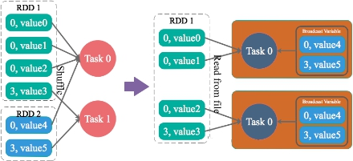

###   1 尽量避免数据源的数据倾斜

####   比如数据源是Kafka

以Spark Stream通过DirectStream方式读取Kafka数据为例。由于Kafka的每一个Partition对应Spark的一个Task（Partition），所以Kafka内相关Topic的各Partition之间数据是否平衡，直接决定Spark处理该数据时是否会产生数据倾斜。

Kafka某一Topic内消息在不同Partition之间的分布，主要由Producer端所使用的Partition实现类决定。如果使用随机Partitioner，则每条消息会随机发送到一个Partition中，从而从概率上来讲，各Partition间的数据会达到平衡。此时源Stage（直接读取Kafka数据的Stage）不会产生数据倾斜。

但很多时候，业务场景可能会要求将具备同一特征的数据顺序消费，此时就需要将具有相同特征的数据放于同一个Partition中。一个典型的场景是，需要将同一个用户相关的PV信息置于同一个Partition中。此时，如果产生了数据倾斜，则需要通过其它方式处理。

####    比如数据源是Hive  

导致数据倾斜的是Hive表。如果该Hive表中的数据本身很不均匀（比如某个key对应了100万数据，其他key才对应了10条数据），而且业务场景需要频繁使用Spark对Hive表执行某个分析操作，那么比较适合使用这种技术方案。

方案实现思路：此时可以评估一下，是否可以通过Hive来进行数据预处理（即通过Hive ETL预先对数据按照key进行聚合，或者是预先和其他表进行join），然后在Spark作业中针对的数据源就不是原来的Hive表了，而是预处理后的Hive表。此时由于数据已经预先进行过聚合或join操作了，那么在Spark作业中也就不需要使用原先的shuffle类算子执行这类操作了。

方案实现原理：这种方案从根源上解决了数据倾斜，因为彻底避免了在Spark中执行shuffle类算子，那么肯定就不会有数据倾斜的问题了。但是这里也要提醒一下大家，这种方式属于治标不治本。因为毕竟数据本身就存在分布不均匀的问题，所以Hive ETL中进行group by或者join等shuffle操作时，还是会出现数据倾斜，导致Hive ETL的速度很慢。我们只是把数据倾斜的发生提前到了Hive ETL中，避免Spark程序发生数据倾斜而已。

方案优点：实现起来简单便捷，效果还非常好，完全规避掉了数据倾斜，Spark作业的性能会大幅度提升。

方案缺点：治标不治本，Hive ETL中还是会发生数据倾斜。

方案实践经验：在一些Java系统与Spark结合使用的项目中，会出现Java代码频繁调用Spark作业的场景，而且对Spark作业的执行性能要求很高，就比较适合使用这种方案。将数据倾斜提前到上游的Hive ETL，每天仅执行一次，只有那一次是比较慢的，而之后每次Java调用Spark作业时，执行速度都会很快，能够提供更好的用户体验。

项目实践经验：在美团·点评的交互式用户行为分析系统中使用了这种方案，该系统主要是允许用户通过Java Web系统提交数据分析统计任务，后端通过Java提交Spark作业进行数据分析统计。要求Spark作业速度必须要快，尽量在10分钟以内，否则速度太慢，用户体验会很差。所以我们将有些Spark作业的shuffle操作提前到了Hive ETL中，从而让Spark直接使用预处理的Hive中间表，尽可能地减少Spark的shuffle操作，大幅度提升了性能，将部分作业的性能提升了6倍以上。

###   2 调整并行度分散同一个Task的不同Key

方案适用场景：如果我们必须要对数据倾斜迎难而上，那么建议优先使用这种方案，因为这是处理数据倾斜最简单的一种方案。

方案实现思路：在对RDD执行shuffle算子时，给shuffle算子传入一个参数，比如reduceByKey(1000)，该参数就设置了这个shuffle算子执行时shuffle read task的数量。对于Spark SQL中的shuffle类语句，比如group by、join等，需要设置一个参数，即spark.sql.shuffle.partitions，该参数代表了shuffle read task的并行度，该值默认是200，对于很多场景来说都有点过小。

方案实现原理：增加shuffle read task的数量，可以让原本分配给一个task的多个key分配给多个task，从而让每个task处理比原来更少的数据。举例来说，如果原本有5个key，每个key对应10条数据，这5个key都是分配给一个task的，那么这个task就要处理50条数据。而增加了shuffle read task以后，每个task就分配到一个key，即每个task就处理10条数据，那么自然每个task的执行时间都会变短了。具体原理如下图所示。

方案优点：实现起来比较简单，可以有效缓解和减轻数据倾斜的影响。

方案缺点：只是缓解了数据倾斜而已，没有彻底根除问题，根据实践经验来看，其效果有限。

方案实践经验：该方案通常无法彻底解决数据倾斜，因为如果出现一些极端情况，比如某个key对应的数据量有100万，那么无论你的task数量增加到多少，这个对应着100万数据的key肯定还是会分配到一个task中去处理，因此注定还是会发生数据倾斜的。所以这种方案只能说是在发现数据倾斜时尝试使用的第一种手段，尝试去用最简单的方法缓解数据倾斜而已，或者是和其他方案结合起来使用。

 

原理

Spark在做Shuffle时，默认使用HashPartitioner（非Hash Shuffle）对数据进行分区。如果并行度设置的不合适，可能造成大量不相同的Key对应的数据被分配到了同一个Task上，造成该Task所处理的数据远大于其它Task，从而造成数据倾斜。

如果调整Shuffle时的并行度，使得原本被分配到同一Task的不同Key发配到不同Task上处理，则可降低原Task所需处理的数据量，从而缓解数据倾斜问题造成的短板效应。


案例

现有一张测试数据集，内有100万条数据，每条数据有一个唯一的id值。现通过一些处理，使得id为90万之下的所有数据对12取模后余数为8（即在Shuffle并行度为12时该数据集全部被HashPartition分配到第8个Task），其它数据集id不变，从而使得id大于90万的数据在Shuffle时可被均匀分配到所有Task中，而id小于90万的数据全部分配到同一个Task中。处理过程如下

```
 scala> val sourceRdd = sc.textFile("hdfs://master01:9000/source_index")sourceRdd: org.apache.spark.rdd.RDD[String] = hdfs://master01:9000/source_index MapPartitionsRDD[1] at textFile at <console>:24 scala> case class brower(id:Int, time:Long, uid:String, keyword:String, url_rank:Int, click_num:Int, click_url:String) extends Serializabledefined class brower scala> val ds = sourceRdd.map(.split("\t")).map(attr => brower(attr(0).toInt, attr(1).toLong, attr(2), attr(3), attr(4).toInt, attr(5).toInt, attr(6))).toDSds: org.apache.spark.sql.Dataset[brower] = [id: int, time: bigint ... 5 more fields] scala> ds.createOrReplaceTempView("sourceTable") scala> val newSource = spark.sql("SELECT CASE WHEN id < 900000 THEN (8  + (CAST (RAND()   50000 AS bigint))   12 ) ELSE id END, time, uid, keyword, url_rank, click_num, click_url  FROM sourceTable")newSource: org.apache.spark.sql.DataFrame = [CASE WHEN (id < 900000) THEN (CAST(8 AS BIGINT) + (CAST((rand(-5486683549522524104)   CAST(50000 AS DOUBLE)) AS BIGINT)   CAST(12 AS BIGINT))) ELSE CAST(id AS BIGINT) END: bigint, time: bigint ... 5 more fields] scala> newSource.rdd.map(.mkString("\t")).saveAsTextFile("hdfs://master01:9000/test_data") 
```


 

通过上述处理，一份可能造成后续数据倾斜的测试数据即以准备好。接下来，使用Spark读取该测试数据，并通过groupByKey(12)对id分组处理，且Shuffle并行度为12。代码如下

scala> val sourceRdd = sc.textFile("hdfs://master01:9000/test_data/p ")sourceRdd: org.apache.spark.rdd.RDD[String] = hdfs://master01:9000/test_data/p  MapPartitionsRDD[1] at textFile at <console>:24 scala> val kvRdd = sourceRdd.map(x =>{ val parm=x.split("\t");(parm(0).trim().toInt,parm(1).trim()) })kvRdd: org.apache.spark.rdd.RDD[(Int, String)] = MapPartitionsRDD[2] at map at <console>:26 scala> kvRdd.groupByKey(12).countres0: Long = 150000                                scala> :quit 

 

本次实验所使用集群节点数为3，每个节点可被Yarn使用的CPU核数为3，内存为2GB。在Spark-shell中进行提交

GroupBy Stage的Task状态如下图所示，Task 8处理的记录数为90万，远大于（9倍于）其它11个Task处理的10万记录。而Task 8所耗费的时间为1秒，远高于其它11个Task的平均时间。整个Stage的时间也为1秒，该时间主要由最慢的Task 8决定。数据之间处理的比例最大为105倍。

 

在这种情况下，可以通过调整Shuffle并行度，使得原来被分配到同一个Task（即该例中的Task 8）的不同Key分配到不同Task，从而降低Task 8所需处理的数据量，缓解数据倾斜。

通过groupByKey(17)将Shuffle并行度调整为17，重新提交到Spark。新的Job的GroupBy Stage所有Task状态如下图所示。

scala> val sourceRdd = sc.textFile("hdfs://master01:9000/test_data/p ")sourceRdd: org.apache.spark.rdd.RDD[String] = hdfs://master01:9000/test_data/p  MapPartitionsRDD[1] at textFile at <console>:24 scala> val kvRdd = sourceRdd.map(x =>{ val parm=x.split("\t");(parm(0).trim().toInt,parm(1).trim()) })kvRdd: org.apache.spark.rdd.RDD[(Int, String)] = MapPartitionsRDD[2] at map at <console>:26 scala> kvRdd.groupByKey(17).countres0: Long = 150000                                scala> :quit 

 

 

从上图可知，相比以上次一计算，目前每一个计算的数据都比较平均，数据之间的最大比例基本为1:1，总体时间降到了0.8秒。

在这种场景下，调整并行度，并不意味着一定要增加并行度，也可能是减小并行度。如果通过groupByKey(7)将Shuffle并行度调整为7，重新提交到Spark。新Job的GroupBy Stage的所有Task状态如下图所示。

 

从上图可见，处理记录数都比较平均。

总结

适用场景

大量不同的Key被分配到了相同的Task造成该Task数据量过大。

解决方案

调整并行度。一般是增大并行度，但有时如本例减小并行度也可达到效果。

优势

实现简单，可在需要Shuffle的操作算子上直接设置并行度或者使用spark.default.parallelism设置。如果是Spark SQL，还可通过SET spark.sql.shuffle.partitions=[num_tasks]设置并行度。可用最小的代价解决问题。一般如果出现数据倾斜，都可以通过这种方法先试验几次，如果问题未解决，再尝试其它方法。

劣势

适用场景少，只能将分配到同一Task的不同Key分散开，但对于同一Key倾斜严重的情况该方法并不适用。并且该方法一般只能缓解数据倾斜，没有彻底消除问题。从实践经验来看，其效果一般。

####   1.1.1.3       \ 自定义Partitioner\    

原理

使用自定义的Partitioner（默认为HashPartitioner），将原本被分配到同一个Task的不同Key分配到不同Task。

案例

以上述数据集为例，继续将并发度设置为12，但是在groupByKey算子上，使用自定义的Partitioner（实现如下）

 class CustomerPartitioner(numParts:Int) extends org.apache.spark.Partitioner {   //覆盖分区数  override def numPartitions: Int = numParts   //覆盖分区号获取函数  override def getPartition(key: Any): Int = {   val id: Int = key.toString.toInt   if (id <= 900000)    return new java.util.Random().nextInt(100) % 12   else    return id % 12  } } 

 

执行如下代码：

scala> :paste// Entering paste mode (ctrl-D to finish)class CustomerPartitioner(numParts:Int) extends org.apache.spark.Partitioner { //覆盖分区数 override def numPartitions: Int = numParts //覆盖分区号获取函数 override def getPartition(key: Any): Int = {  val id: Int = key.toString.toInt  if (id <= 900000)   return new java.util.Random().nextInt(100) % 12  else   return id % 12 }}// Exiting paste mode, now interpreting.defined class CustomerPartitionerscala> val sourceRdd = sc.textFile("hdfs://master01:9000/test_data/p ")sourceRdd: org.apache.spark.rdd.RDD[String] = hdfs://master01:9000/test_data/p  MapPartitionsRDD[1] at textFile at <console>:24 scala> val kvRdd = sourceRdd.map(x =>{ val parm=x.split("\t");(parm(0).trim().toInt,parm(1).trim()) })kvRdd: org.apache.spark.rdd.RDD[(Int, String)] = MapPartitionsRDD[2] at map at <console>:26 scala> kvRdd.groupByKey(new CustomerPartitioner(12)).countres0: Long = 565312                                scala> :quit

 

由下图可见，使用自定义Partition后，各Task所处理的数据集大小相当。

总结

适用场景

大量不同的Key被分配到了相同的Task造成该Task数据量过大。

解决方案

使用自定义的Partitioner实现类代替默认的HashPartitioner，尽量将所有不同的Key均匀分配到不同的Task中。

优势

不影响原有的并行度设计。如果改变并行度，后续Stage的并行度也会默认改变，可能会影响后续Stage。

劣势

适用场景有限，只能将不同Key分散开，对于同一Key对应数据集非常大的场景不适用。效果与调整并行度类似，只能缓解数据倾斜而不能完全消除数据倾斜。而且需要根据数据特点自定义专用的Partitioner，不够灵活。

###   3  将Reduce side Join转变为Map side Join 

方案适用场景：在对RDD使用join类操作，或者是在Spark SQL中使用join语句时，而且join操作中的一个RDD或表的数据量比较小（比如几百M或者一两G），比较适用此方案。

方案实现思路：不使用join算子进行连接操作，而使用Broadcast变量与map类算子实现join操作，进而完全规避掉shuffle类的操作，彻底避免数据倾斜的发生和出现。将较小RDD中的数据直接通过collect算子拉取到Driver端的内存中来，然后对其创建一个Broadcast变量；接着对另外一个RDD执行map类算子，在算子函数内，从Broadcast变量中获取较小RDD的全量数据，与当前RDD的每一条数据按照连接key进行比对，如果连接key相同的话，那么就将两个RDD的数据用你需要的方式连接起来。

方案实现原理：普通的join是会走shuffle过程的，而一旦shuffle，就相当于会将相同key的数据拉取到一个shuffle read task中再进行join，此时就是reduce join。但是如果一个RDD是比较小的，则可以采用广播小RDD全量数据+map算子来实现与join同样的效果，也就是map join，此时就不会发生shuffle操作，也就不会发生数据倾斜。具体原理如下图所示。

 

方案优点：对join操作导致的数据倾斜，效果非常好，因为根本就不会发生shuffle，也就根本不会发生数据倾斜。

方案缺点：适用场景较少，因为这个方案只适用于一个大表和一个小表的情况。毕竟我们需要将小表进行广播，此时会比较消耗内存资源，driver和每个Executor内存中都会驻留一份小RDD的全量数据。如果我们广播出去的RDD数据比较大，比如10G以上，那么就可能发生内存溢出了。因此并不适合两个都是大表的情况。

通过Spark的Broadcast机制，将Reduce侧Join转化为Map侧Join，避免Shuffle从而完全消除Shuffle带来的数据倾斜。

 

案例

通过如下SQL创建一张具有倾斜Key且总记录数为1.5亿的大表test。

INSERT OVERWRITE TABLE test  SELECT CAST(CASE WHEN id < 980000000 THEN (95000000 + (CAST (RAND()   4 AS INT) + 1)   48 )  ELSE CAST(id/10 AS INT) END AS STRING), name FROM student_external  WHERE id BETWEEN 900000000 AND 1050000000;

 

使用如下SQL创建一张数据分布均匀且总记录数为50万的小表test_new。

INSERT OVERWRITE TABLE test_new  SELECT CAST(CAST(id/10 AS INT) AS STRING), name FROM student_delta_external  WHERE id BETWEEN 950000000 AND 950500000;

 

直接通过Spark Thrift Server提交如下SQL将表test与表test_new进行Join并将Join结果存于表test_join中。

 

INSERT OVERWRITE TABLE test_join  SELECT test_new.id, test_new.name FROM test  JOIN test_new  ON test.id = test_new.id;

 

该SQL对应的DAG如下图所示。从该图可见，该执行过程总共分为三个Stage，前两个用于从Hive中读取数据，同时二者进行Shuffle，通过最后一个Stage进行Join并将结果写入表test_join中。

从下图可见，最近Join Stage各Task处理的数据倾斜严重，处理数据量最大的Task耗时7.1分钟，远高于其它无数