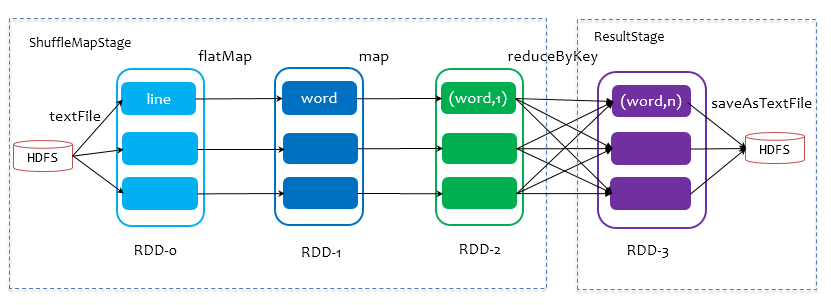

作者：十一喵先森
链接：https://juejin.im/post/5e1c414fe51d451cad4111d1
来源：掘金
著作权归作者所有。商业转载请联系作者获得授权，非商业转载请注明出处。

对上文的总结

### Spark 任务调度概述

一个Spark应用程序包括Job、Stage以及Task三个概念:

 Job是以Action方法为界，遇到一个Action方法则触发一个Job；

 Stage是Job的子集，以RDD宽依赖(即Shuffle)为界，遇到Shuffle做一次划分；

 Task是Stage的子集，以并行度(分区数)来衡量，分区数是多少，则有多少个task。

Spark的任务调度总体来说分两路进行，一路是Stage级的调度，一路是Task级的调度，

#### Spark Stage级调度

Job由saveAsTextFile触发，该Job由RDD-3和saveAsTextFile方法组成，根据RDD之间的依赖关系从RDD-3开始回溯搜索，直到没有依赖的RDD-0，在回溯搜索过程中，RDD-3依赖RDD-2，并且是宽依赖，所以在RDD-2和RDD-3之间划分Stage，RDD-3被划到最后一个Stage，即ResultStage中，RDD-2依赖RDD-1，RDD-1依赖RDD-0，这些依赖都是窄依赖，所以将RDD-0、RDD-1和RDD-2划分到同一个Stage，即ShuffleMapStage中，实际执行的时候，数据记录会一气呵成地执行RDD-0到RDD-2的转化。不难看出，其本质上是一个深度优先搜索算法。

**一个Stage是否被提交，需要判断它的父Stage是否执行，只有在父Stage执行完毕才能提交当前Stage，如果一个Stage没有父Stage，那么从该Stage开始提交。**

总结:

stage调度算法:从前往后.

#### Spark Task 级调度

**TaskScheduler支持两种调度策略，一种是FIFO，也是默认的调度策略，另一种是FAIR**

FIFO: 先来先到;

FAIR:	根据优先级来调度.

#### 失败重试与黑名单机制

对于失败的Task，会记录它失败的次数，如果失败次数还没有超过最大重试次数，那么就把它放回待调度的Task池子中，否则整个Application失败。

黑名单记录Task上一次失败所在的Executor Id和Host，以及其对应的“拉黑”时间，“拉黑”时间是指这段时间内不要再往这个节点上调度这个Task了。