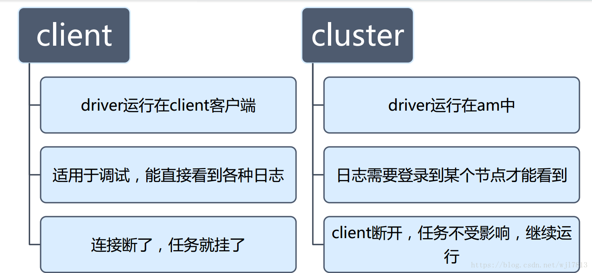

## 对比分析

### 在yarn-client 模式：

- driver运行在spark-submit提交的机器上，ApplicationMaster只是相当于一个ExecutorLauncher，仅仅负责申请启动executor；
- 具体负责调度的，还是driver ；
- driver所在机器可能跟yarn集群不在一起，所以性能可能比较差 ；
- 用于在测试环境中，进行测试，方便你看日志 。

### 在yarn-cluster模式：

- ApplicationMaster是driver；
- 具体负责调度的，也是ApplicationMaster；
- driver（AM）就在yarn集群中，进行复杂调度的时候，网络通信性能较好 ；
- 推荐作业部署上线运行时使用，性能比较好。

| 模式                       | 提交模式                          | driver（main方法,用户程序）                                  | ApplicationMaster                                       | ResourceManager    | NodeManager               | Master                                     | Worker                               | Container                         | Executor                                                     |
| -------------------------- | --------------------------------- | ------------------------------------------------------------ | ------------------------------------------------------- | ------------------ | ------------------------- | ------------------------------------------ | ------------------------------------ | --------------------------------- | ------------------------------------------------------------ |
| **standalone**             | –master spark://master1:7077      | 在Master上                                                   | 在Master上                                              | 无                 | 无                        | 用户程序通过与Master节点交互，申请所需资源 | Worker节点负责具体Executor的启动运行 | 无                                | 运行在Work上，里面运行Task上,CoarseGrainedExecutorBackend进程 |
| **spark on yarn(client)**  | –master yarn –deploy-mode client  | **driver运行在提交作业的机器上**(可以看到程序打印日志)       | 运行在某一台机器上，向RM申请资源（container）,杀死任务  | 管理资源，接受任务 | 根据RM命令，分配container | 无                                         | 无                                   | Container里面运行着Spark Executor | 运行在Container里里面运行Task                                |
| **spark on yarn(cluster)** | –master yarn –deploy-mode cluster | driver运行在集群上某个机器上（看不到日志，只可以看到running状态）,Driver在AppMaster执行 | 运行在集群某一台机器上，申请资源（container）,杀死任务. | 管理资源，接受任务 | 根据RM命令，分配container | 无                                         | 无                                   | Container里面运行着Spark Executor | 运行在Container里，里面运行Task                              |

