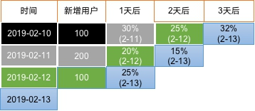

### 1 用户留存概念

**留存用户**：某段时间内的新增用户（活跃用户），经过一段时间后，又继续使用应用的被认作是留存用户；

**留存率：**留存用户占当时新增用户（活跃用户）的比例即是留存率。

例如，2月10日新增用户100，这100人在2月11日启动过应用的有30人，2月12日启动过应用的有25人，2月13日启动过应用的有32人；

则2月10日新增用户次日的留存率是30/100 = 30%，两日留存率是25/100=25%，三日留存率是32/100=32%。


<div>
  
</div>


###  2 理论基础

需求：每天计算前1、2、3、4、7、14天的留存率

分析：假设今天是11日，要统计前1天也就是10日新增设备的留存率，公式如下：
10日新增设备的留存率= 10日的新增设备 且 11日活跃的 / 10日的新增设备


1）分母获取
     10日活跃表left join 每日新增表，新增表id为null的为10日新增设备

2）分子获取
      10的新增join 11日的活跃，且新增日期是10日，活跃日期是11日

3）留存率计算
     10日的新增设备 且 11日活跃的用户表   与10日新增设备join，算出留存率

### 3  DWS层（每日留存用户明细表）

##### 3.1 建表(dws_user_retention_day)

```sql
hive (gmall)>
drop table if exists dws_user_retention_day;
create external table dws_user_retention_day 
(
    `mid_id` string COMMENT '设备唯一标识',
    `user_id` string COMMENT '用户标识', 
    `version_code` string COMMENT '程序版本号', 
    `version_name` string COMMENT '程序版本名', 
    `lang` string COMMENT '系统语言', 
    `source` string COMMENT '渠道号', 
    `os` string COMMENT '安卓系统版本', 
    `area` string COMMENT '区域', 
    `model` string COMMENT '手机型号', 
    `brand` string COMMENT '手机品牌', 
    `sdk_version` string COMMENT 'sdkVersion', 
    `gmail` string COMMENT 'gmail', 
    `height_width` string COMMENT '屏幕宽高',
    `app_time` string COMMENT '客户端日志产生时的时间',
    `network` string COMMENT '网络模式',
    `lng` string COMMENT '经度',
    `lat` string COMMENT '纬度',
   `create_date`    string  comment '设备新增时间',
   `retention_day`  int comment '截止当前日期留存天数'
)  COMMENT '每日用户留存情况'
PARTITIONED BY (`dt` string)
stored as parquet
location '/warehouse/gmall/dws/dws_user_retention_day/'
;
```

#####  3.2 导入数据

每天计算前1天的新用户访问留存明细

```sql
hive (gmall)>
insert overwrite table dws_user_retention_day
partition(dt="2019-02-11")
select  
    nm.mid_id,
    nm.user_id , 
    nm.version_code , 
    nm.version_name , 
    nm.lang , 
    nm.source, 
    nm.os, 
    nm.area, 
    nm.model, 
    nm.brand, 
    nm.sdk_version, 
    nm.gmail, 
    nm.height_width,
    nm.app_time,
    nm.network,
    nm.lng,
    nm.lat,
		nm.create_date,
		1 retention_day 
from dws_uv_detail_day ud join dws_new_mid_day nm   on ud.mid_id =nm.mid_id 
where ud.dt='2019-02-11' and nm.create_date=date_add('2019-02-11',-1);
```

###  4  DWS层（1,2,3,n天留存用户明细表）

每天计算前1,2,3天的新用户访问留存明细

```sql
hive (gmall)>
insert overwrite table dws_user_retention_day
partition(dt="2019-02-11")
select
    nm.mid_id,
    nm.user_id,
    nm.version_code,
    nm.version_name,
    nm.lang,
    nm.source,
    nm.os,
    nm.area,
    nm.model,
    nm.brand,
    nm.sdk_version,
    nm.gmail,
    nm.height_width,
    nm.app_time,
    nm.network,
    nm.lng,
    nm.lat,
    nm.create_date,
    1 retention_day 
from dws_uv_detail_day ud join dws_new_mid_day nm  on ud.mid_id =nm.mid_id 
where ud.dt='2019-02-11' and nm.create_date=date_add('2019-02-11',-1)

union all
select  
    nm.mid_id,
    nm.user_id , 
    nm.version_code , 
    nm.version_name , 
    nm.lang , 
    nm.source, 
    nm.os, 
    nm.area, 
    nm.model, 
    nm.brand, 
    nm.sdk_version, 
    nm.gmail, 
    nm.height_width,
    nm.app_time,
    nm.network,
    nm.lng,
    nm.lat,
    nm.create_date,
    2 retention_day 
from  dws_uv_detail_day ud join dws_new_mid_day nm   on ud.mid_id =nm.mid_id 
where ud.dt='2019-02-11' and nm.create_date=date_add('2019-02-11',-2)

union all
select  
    nm.mid_id,
    nm.user_id , 
    nm.version_code , 
    nm.version_name , 
    nm.lang , 
    nm.source, 
    nm.os, 
    nm.area, 
    nm.model, 
    nm.brand, 
    nm.sdk_version, 
    nm.gmail, 
    nm.height_width,
    nm.app_time,
    nm.network,
    nm.lng,
    nm.lat,
    nm.create_date,
    3 retention_day 
from  dws_uv_detail_day ud join dws_new_mid_day nm   on ud.mid_id =nm.mid_id 
where ud.dt='2019-02-11' and nm.create_date=date_add('2019-02-11',-3);

```

##### 4.1  Union与Union all区别

- 1 ）准备两张表

```
tableA			         tableB

id　　name　　score       id　　name　　score

1　　　a　　　　80        1　　  d　　　　48

2　　  b　　　　79        2　　　e　　　　23

3　　  c　　  68        3　　　c　　　　86


```


- 2）采用union查询

```
select name from tableA　　　　　　　　　　　　　

union　　　　　　　　　　　　　　　　　　　　　　　　

select name from tableB　　

查询结果

name

a
d
b
e
c

```


- 3）采用union all查询

```sql
select name from tableA
union all
select name from tableB

查询结果

name

a
b
c  ##
d
e
c  ##
```


- 4）总结

（1）union会将联合的结果集去重，效率较union all差

（2）union all不会对结果集去重，所以效率高

###  5 ADS层留存用户数

##### 5.1 建表(ads_user_retention_day_count)

```sql
hive (gmall)>
drop table if exists ads_user_retention_day_count;
create external table ads_user_retention_day_count 
(
   `create_date`       string  comment '设备新增日期',
   `retention_day`     int comment '截止当前日期留存天数',
   `retention_count`    bigint comment  '留存数量'
)  COMMENT '每日用户留存情况'
row format delimited fields terminated by '\t'
location '/warehouse/gmall/ads/ads_user_retention_day_count/';
```

##### 5.2 导入数据

```sql
hive (gmall)>
insert into table ads_user_retention_day_count 
select
    create_date,
    retention_day,
    count(*) retention_count
from dws_user_retention_day
where dt='2019-02-11' 
group by create_date,retention_day;
```

### 6 留存用户比率

##### 6.1建表(ads_user_retention_day_rate)

```sql
hive (gmall)>
drop table if exists ads_user_retention_day_rate;
create external table ads_user_retention_day_rate 
(
     `stat_date`          string comment '统计日期',
     `create_date`       string  comment '设备新增日期',
     `retention_day`     int comment '截止当前日期留存天数',
     `retention_count`    bigint comment  '留存数量',
     `new_mid_count`     bigint comment '当日设备新增数量',
     `retention_ratio`   decimal(10,2) comment '留存率'
)  COMMENT '每日用户留存情况'
row format delimited fields terminated by '\t'
location '/warehouse/gmall/ads/ads_user_retention_day_rate/';
```

##### 6.2 计算

```sql
hive (gmall)>
insert into table ads_user_retention_day_rate
select 
    '2019-02-11', 
    ur.create_date,
    ur.retention_day, 
    ur.retention_count, 
    nc.new_mid_count,
    ur.retention_count/nc.new_mid_count*100
from ads_user_retention_day_count ur join ads_new_mid_count nc
on nc.create_date=ur.create_date;
```

