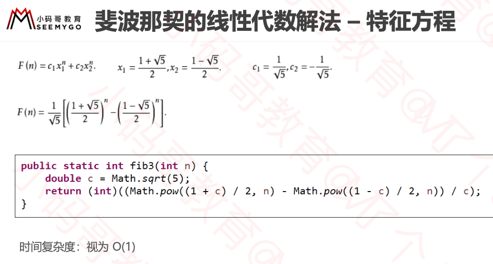

### 如何评价一个算法的好坏?

正确性,可读性,健壮性

时间复杂度: 估算执行次数.

空间复杂度:估算占用空间


### 大O表示法

**忽略常数,系数,低阶等.**

```
9 >> O(1)  
2n+3 >> O(n)
n2+2n+6 >>O(n2)
4n3 + 3n2 + 22n+100 >> O(n3)
写法上，n3 等价于 n^3 								
注意:大O表示法仅仅是一种粗略的分析模型，是一种估算，能帮助我们短时间内了解一个算法的执行效率 							 					 				
```


### 对数阶的细节

对数阶一般省略底数
log2n = log29 ∗ log9n
所以 log2n 、log9n 统称为 logn


### 常见复杂度

| 执行次数            | 复杂度   | 非正式术语 |
| ------------------- | -------- | ---------- |
| 12                  | O(1)     | 常数阶     |
| 2n+3                | O(n)     | 线性阶     |
| 4n2 +2n+6           | O(n2)    | 平方阶     |
| 4log2n + 25         | O(logn)  | 对数阶     |
| 3n + 2nlog3n + 15   | O(nlogn) | nlogn阶    |
| 4n^3 +3n^2 +22n+100 | O(n^3)   | 立方阶     |
| 2^n                 | O(2^n )  | 指数阶     |
|                     |          |            |
|                     |          |            |

◼O(1) < O(logn) < O(n) < O(nlogn) < O(n2) < O(n3) < O(2n) < O(n!) < O(nn)


### fib函数时间复杂度分析

#### 1.O(2^n)

```java
public int fib1(int n){
  if(n<1) return n;
  return fib1(n-2) + fib1(n-1);
}
```

#### 2 O(n)

```java
public int fib2(int n){
   if (n < 1) return n;
  
  int first = 0;
  int second = 1;
  while(n-- > 1){
    second += first;
    first = second - first;
  }
  return second;
}
```


如果有一台1GHz的普通计算机，运算速度 10^9 次每秒( n 为 64 ) 

O(n) 大约耗时 6.4 ∗ 10^−8 秒  

O(2n) 大约耗时 584.94 年 

有时候算法之间的差距，往往比硬件方面的差距还要大 							 						 		

#### 3 O(1)



 							 		


### 算法的优化方向

用尽量少的时间

用尽量少的空间

空间换时间

时间换空间


