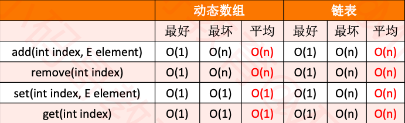

### 分析




### 数组复杂度

```java
/**
	 * 在index位置插入一个元素
	 * @param index
	 * @param element
	 */
	public void add(int index, E element) { 
		/*
		 * 最好：O(1)
		 * 最坏：O(n)
		 * 平均：O(n)
		 */
		rangeCheckForAdd(index);
		
		ensureCapacity(size + 1);
		
		for (int i = size; i > index; i--) {
			elements[i] = elements[i - 1];
		}
		elements[index] = element;
		size++;
	} // size是数据规模

	/**
	 * 删除index位置的元素
	 * @param index
	 * @return
	 */
	public E remove(int index) {
		/*
		 * 最好：O(1)
		 * 最坏：O(n)
		 * 平均：O(n)
		 */
		rangeCheck(index);
		
		E old = elements[index];
		for (int i = index + 1; i < size; i++) {
			elements[i - 1] = elements[i];
		}
		elements[--size] = null;
		return old;
	}

	/**
	 * 查看元素的索引
	 * @param element
	 * @return
	 */
	public int indexOf(E element) {
    /**
    	* O(1)
    	*
    	*/
		if (element == null) {
			for (int i = 0; i < size; i++) {
				if (elements[i] == null) return i;
			}
		} else {
			for (int i = 0; i < size; i++) {
				if (element.equals(elements[i])) return i;
			}
		}
		return ELEMENT_NOT_FOUND;
	}
```

### 链表复杂度

```java
@Override
	public E get(int index) {
		/*
		 * 最好：O(1)
		 * 最坏：O(n)
		 * 平均：O(n)
		 */
		return node(index).element;
	}

	@Override
	public E set(int index, E element) {
		/*
		 * 最好：O(1)
		 * 最坏：O(n)
		 * 平均：O(n)
		 */
		Node<E> node = node(index);
		E old = node.element;
		node.element = element;
		return old;
	}

	@Override
	public void add(int index, E element) {
		/*
		 * 最好：O(1)
		 * 最坏：O(n)
		 * 平均：O(n)
		 */
		rangeCheckForAdd(index);
		
		if (index == 0) {
			first = new Node<>(element, first);
		} else {
			Node<E> prev = node(index - 1);
			prev.next = new Node<>(element, prev.next);
		}
		size++;
	}

	@Override
	public E remove(int index) {
		/*
		 * 最好：O(1)
		 * 最坏：O(n)
		 * 平均：O(n)
		 */
		rangeCheck(index);
		
		Node<E> node = first;
		if (index == 0) {
			first = first.next;
		} else {
			Node<E> prev = node(index - 1);
			node = prev.next;
			prev.next = node.next;
		}
		size--;
		return node.element;
	}

```

