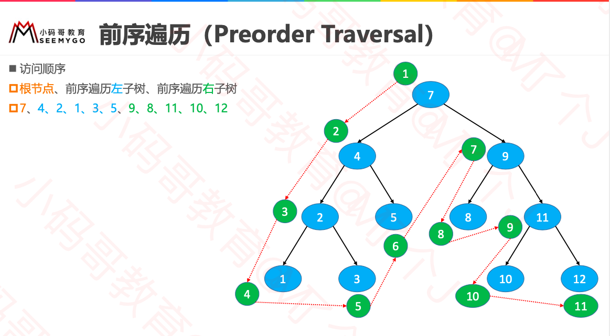

### 代码实现

#### BinaryTree

```java
package com.mj.tree;

import java.util.LinkedList;
import java.util.Queue;

import com.mj.printer.BinaryTreeInfo;

@SuppressWarnings("unchecked")
public class BinaryTree<E> implements BinaryTreeInfo {
	protected int size;
	protected Node<E> root;
	
	public int size() {
		return size;
	}

	public boolean isEmpty() {
		return size == 0;
	}

	public void clear() {
		root = null;
		size = 0;
	}
	
	public void preorder(Visitor<E> visitor) {
		if (visitor == null) return;
		preorder(root, visitor);
	}
	
	private void preorder(Node<E> node, Visitor<E> visitor) {
		if (node == null || visitor.stop) return;
		
		visitor.stop = visitor.visit(node.element);
		preorder(node.left, visitor);
		preorder(node.right, visitor);
	}
	
	public void inorder(Visitor<E> visitor) {
		if (visitor == null) return;
		inorder(root, visitor);
	}
	
	private void inorder(Node<E> node, Visitor<E> visitor) {
		if (node == null || visitor.stop) return;
		
		inorder(node.left, visitor);
		if (visitor.stop) return;
		visitor.stop = visitor.visit(node.element);
		inorder(node.right, visitor);
	}
	
	public void postorder(Visitor<E> visitor) {
		if (visitor == null) return;
		postorder(root, visitor);
	}
	
	private void postorder(Node<E> node, Visitor<E> visitor) {
		if (node == null || visitor.stop) return;
		
		postorder(node.left, visitor);
		postorder(node.right, visitor);
		if (visitor.stop) return;
		visitor.stop = visitor.visit(node.element);
	}
	
	public void levelOrder(Visitor<E> visitor) {
		if (root == null || visitor == null) return;
		
		Queue<Node<E>> queue = new LinkedList<>();
		queue.offer(root);
		
		while (!queue.isEmpty()) {
			Node<E> node = queue.poll();
			if (visitor.visit(node.element)) return;
			
			if (node.left != null) {
				queue.offer(node.left);
			}
			
			if (node.right != null) {
				queue.offer(node.right);
			}
		}
	}
	
	public boolean isComplete() {
		if (root == null) return false;
		Queue<Node<E>> queue = new LinkedList<>();
		queue.offer(root);
		
		boolean leaf = false;
		while (!queue.isEmpty()) {
			Node<E> node = queue.poll();
			if (leaf && !node.isLeaf()) return false;

			if (node.left != null) {
				queue.offer(node.left);
			} else if (node.right != null) {
				return false;
			}
			
			if (node.right != null) {
				queue.offer(node.right);
			} else { // 后面遍历的节点都必须是叶子节点
				leaf = true;
			}
		}
		
		return true;
	}
	
	public int height() {
		if (root == null) return 0;
		
		// 树的高度
		int height = 0;
		// 存储着每一层的元素数量
		int levelSize = 1;
		Queue<Node<E>> queue = new LinkedList<>();
		queue.offer(root);
		
		while (!queue.isEmpty()) {
			Node<E> node = queue.poll();
			levelSize--;
			
			if (node.left != null) {
				queue.offer(node.left);
			}
			
			if (node.right != null) {
				queue.offer(node.right);
			}

			if (levelSize == 0) { // 意味着即将要访问下一层
				levelSize = queue.size();
				height++;
			}
		}
		
		return height;
	}
	
	public int height2() {
		return height(root);
	}
	
	private int height(Node<E> node) {
		if (node == null) return 0;
		return 1 + Math.max(height(node.left), height(node.right));
	}

	protected Node<E> predecessor(Node<E> node) {
		if (node == null) return null;
		
		// 前驱节点在左子树当中（left.right.right.right....）
		Node<E> p = node.left;
		if (p != null) {
			while (p.right != null) {
				p = p.right;
			}
			return p;
		}
		
		// 从父节点、祖父节点中寻找前驱节点
		while (node.parent != null && node == node.parent.left) {
			node = node.parent;
		}

		// node.parent == null
		// node == node.parent.right
		return node.parent;
	}
	
	protected Node<E> successor(Node<E> node) {
		if (node == null) return null;
		
		// 前驱节点在左子树当中（right.left.left.left....）
		Node<E> p = node.right;
		if (p != null) {
			while (p.left != null) {
				p = p.left;
			}
			return p;
		}
		
		// 从父节点、祖父节点中寻找前驱节点
		while (node.parent != null && node == node.parent.right) {
			node = node.parent;
		}

		return node.parent;
	}

	public static abstract class Visitor<E> {
		boolean stop;
		/**
		 * @return 如果返回true，就代表停止遍历
		 */
		abstract boolean visit(E element);
	}
	
	protected static class Node<E> {
		E element;
		Node<E> left;
		Node<E> right;
		Node<E> parent;
		public Node(E element, Node<E> parent) {
			this.element = element;
			this.parent = parent;
		}
		
		public boolean isLeaf() {
			return left == null && right == null;
		}
		
		public boolean hasTwoChildren() {
			return left != null && right != null;
		}
	}

	@Override
	public Object root() {
		return root;
	}

	@Override
	public Object left(Object node) {
		return ((Node<E>)node).left;
	}

	@Override
	public Object right(Object node) {
		return ((Node<E>)node).right;
	}

	@Override
	public Object string(Object node) {
		Node<E> myNode = (Node<E>)node;
		String parentString = "null";
		if (myNode.parent != null) {
			parentString = myNode.parent.element.toString();
		}
		return myNode.element + "_p(" + parentString + ")";
	}
}

```

#### BST

```java
package com.mj.tree;

import java.util.Comparator;

@SuppressWarnings("unchecked")
public class BST<E> extends BinaryTree<E> {
	private Comparator<E> comparator;
	
	public BST() {
		this(null);
	}
	
	public BST(Comparator<E> comparator) {
		this.comparator = comparator;
	}

	public void add(E element) {
		elementNotNullCheck(element);
		
		// 添加第一个节点
		if (root == null) {
			root = new Node<>(element, null);
			size++;
			return;
		}
		
		// 添加的不是第一个节点
		// 找到父节点
		Node<E> parent = root;
		Node<E> node = root;
		int cmp = 0;
		do {
			cmp = compare(element, node.element);
			parent = node;
			if (cmp > 0) {
				node = node.right;
			} else if (cmp < 0) {
				node = node.left;
			} else { // 相等
				node.element = element;
				return;
			}
		} while (node != null);

		// 看看插入到父节点的哪个位置
		Node<E> newNode = new Node<>(element, parent);
		if (cmp > 0) {
			parent.right = newNode;
		} else {
			parent.left = newNode;
		}
		size++;
	}

	public void remove(E element) {
		remove(node(element));
	}

	public boolean contains(E element) {
		return node(element) != null;
	}
	
	private void remove(Node<E> node) {
		if (node == null) return;
		
		size--;
		
		if (node.hasTwoChildren()) { // 度为2的节点
			// 找到后继节点
			Node<E> s = successor(node);
			// 用后继节点的值覆盖度为2的节点的值
			node.element = s.element;
			// 删除后继节点
			node = s;
		}
		
		// 删除node节点（node的度必然是1或者0）
		Node<E> replacement = node.left != null ? node.left : node.right;
		
		if (replacement != null) { // node是度为1的节点
			// 更改parent
			replacement.parent = node.parent;
			// 更改parent的left、right的指向
			if (node.parent == null) { // node是度为1的节点并且是根节点
				root = replacement;
			} else if (node == node.parent.left) {
				node.parent.left = replacement;
			} else { // node == node.parent.right
				node.parent.right = replacement;
			}
		} else if (node.parent == null) { // node是叶子节点并且是根节点
			root = null;
		} else { // node是叶子节点，但不是根节点
			if (node == node.parent.left) {
				node.parent.left = null;
			} else { // node == node.parent.right
				node.parent.right = null;
			}
		}
	}
	
	private Node<E> node(E element) {
		Node<E> node = root;
		while (node != null) {
			int cmp = compare(element, node.element);
			if (cmp == 0) return node;
			if (cmp > 0) {
				node = node.right;
			} else { // cmp < 0
				node = node.left;
			}
		}
		return null;
	}
	
	/**
	 * @return 返回值等于0，代表e1和e2相等；返回值大于0，代表e1大于e2；返回值小于于0，代表e1小于e2
	 */
	private int compare(E e1, E e2) {
		if (comparator != null) {
			return comparator.compare(e1, e2);
		}
		return ((Comparable<E>)e1).compareTo(e2);
	}
	
	private void elementNotNullCheck(E element) {
		if (element == null) {
			throw new IllegalArgumentException("element must not be null");
		}
	}
}

```


### 前序遍历



### 中序遍历


### 后序遍历


