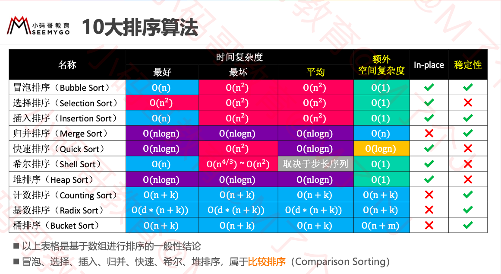

10大排序算法



### 排序算法的稳定性

如果相等的2个元素，在排序前后的相对位置保持不变，那么这是稳定的排序算法 

排序前:5, 1, 3𝑎, 4, 7, 3𝑏

稳定的排序: 1, 3𝑎, 3𝑏, 4, 5, 7  

不稳定的排序:1, 3𝑏, 3𝑎, 4, 5, 7 

### 原地算法

不依赖额外的资源或者依赖少数的额外资源，仅依靠输出来覆盖输入

 空间复杂度为 𝑂(1) 的都可以认为是原地算法 


### 冒泡排序

#### 概念

(选出最大的一个放在最后,再在剩下的中选择最大的.像气泡一样从下往上冒)

1 从头开始比较每一对相邻元素，如果第1个比第2个大，就交换它们的位置 ✓ 执行完一轮后，最末尾那个元素就是最大的元素

2 忽略 1 中曾经找到的最大元素，重复执行步骤 1，直到全部元素有序 	

基本原理:						 					 					 

```java
for (int end = array.length - 1; end > 0; end--) {
  //每循环一次,最后一个就是最大的,就不用再排序
			for (int begin = 1; begin <= end; begin++) {
				// if (array[begin] < array[begin - 1]) {
				if (cmp(begin, begin - 1) < 0) {
					swap(begin, begin - 1);
				}
			}
		}
```

#### 优化1

如果序列已经完全有序，可以提前终止冒泡排序 

```java
for (int end = array.length - 1; end > 0; end--) {
			boolean sorted = true;
  //后end个已经有序
			for (int begin = 1; begin <= end; begin++) {
				// if (array[begin] < array[begin - 1]) {
				if (cmp(begin, begin - 1) < 0) {
					swap(begin, begin - 1);
					sorted = false;
          //从第1个到第end个,都是有序的话,那么就是全部有序了.跳出循环
				}
			}
			if (sorted) break;
		}
```

#### 优化2

如果序列尾部已经局部有序，可以记录最后1次交换的位置，减少比较次数 							 					 					 

```java
for (int end = array.length - 1; end > 0; end--) {
			int sortedIndex = 1;
			for (int begin = 1; begin <= end; begin++) {
				// if (array[begin] < array[begin - 1]) {
				if (cmp(begin, begin - 1) < 0) {
					swap(begin, begin - 1);
          //最后一次交换,就代表后面的是有序的.
					sortedIndex = begin;
				}
			}
			end = sortedIndex;
		}
```

### 选择排序

1 从序列中找出最大的那个元素，然后与最末尾的元素交换位置 ✓ 执行完一轮后，最末尾的那个元素就是最大的元素 		

2 忽略 1 中曾经找到的最大元素，重复执行步骤 1						

选择排序的交换次数要远远少于冒泡排序，平均性能优于冒泡排序  

 最好、最坏、平均时间复杂度:O(n2)，空间复杂度:O(1)，属于不稳定排序

```java
for (int end = array.length - 1; end > 0; end--) {
			int max = 0;
			for (int begin = 1; begin <= end; begin++) {
				if (cmp(max, begin) < 0) {
					max = begin;
				}
			}
			swap(max, end);
		}
```

### 堆排序

执行流程
 1 对序列进行原地建堆(heapify)
 2 重复执行以下操作，直到堆的元素数量为 1 

✓ 交换堆顶元素与尾元素
 ✓堆的元素数量减 1
 ✓对 0 位置进行 1 次 siftDown 操作


最好,最坏.平均时间复杂度O(nlogn) ,空间复杂度O(1) ,属于不稳定排序.

```java
@Override
	protected void sort() {
		// 原地建堆
		heapSize = array.length;
		for (int i = (heapSize >> 1) - 1; i >= 0; i--) {
			siftDown(i);
		}
		
		while (heapSize > 1) {
			// 交换堆顶元素和尾部元素
			swap(0, --heapSize);

			// 对0位置进行siftDown（恢复堆的性质）
			siftDown(0);
		}
	}
	
	private void siftDown(int index) {
		T element = array[index];
		
		int half = heapSize >> 1;
		while (index < half) { // index必须是非叶子节点
			// 默认是左边跟父节点比
			int childIndex = (index << 1) + 1;
			T child = array[childIndex];
			
			int rightIndex = childIndex + 1;
			// 右子节点比左子节点大
			if (rightIndex < heapSize && 
					cmp(array[rightIndex], child) > 0) { 
				child = array[childIndex = rightIndex];
			}
			
			// 大于等于子节点
			if (cmp(element, child) >= 0) break;
			
			array[index] = child;
			index = childIndex;
		}
		array[index] = element;
	}
```

### 插入排序

插入排序非常类似于扑克牌的排序

执行流程 
1 在执行过程中，插入排序会将序列分为2部分  
头部是已经排好序的，尾部是待排序的已经排好序 待排序
2 从头开始扫描每一个元素  ✓ 每当扫描到一个元素，就将它插入到头部合适的位置，使得头部数据依然保持有序 

```java
protected void sort() {
		for (int begin = 1; begin < array.length; begin++) {
			int cur = begin;
      //前cur-1个都是排序好的,从小到大,如果cur比前一个大,就下一轮循环
      //如果cur 比前一个小,就交换,再比较前一个和前两个.
			while (cur > 0 && cmp(cur, cur - 1) < 0) {
				swap(cur, cur - 1);
				cur--;
			}
		}
	}
```

#### 逆序对

什么是逆序对?  
数组 <2,3,8,6,1> 的逆序对为:<2,1> <3,1> <8,1> <8,6> <6,1>，共5个逆序对 								插入排序的时间复杂度与逆序对的数量成正比关系 
逆序对的数量越多，插入排序的时间复杂度越高
最坏、平均时间复杂度:O(n2)

最好时间复杂度:O(n)  

 空间复杂度:O(1) 

属于稳定排序
当逆序对的数量极少时，插入排序的效率特别高 甚至速度比 O nlogn 级别的快速排序还要快,÷效率也是非常好的 							 					 				

#### 优化

将交换变为挪动

```java
for (int begin = 1; begin < array.length; begin++) {
			int cur = begin;
			T v = array[cur];
			while (cur > 0 && cmp(v, array[cur - 1]) < 0) {
				array[cur] = array[cur - 1];
				cur--;
			}
			array[cur] = v;
		}
```

#### 优化-二分查找

```java
/**
	 * 利用二分搜索找到 index 位置元素的待插入位置
	 * 已经排好序数组的区间范围是 [0, index)
	 * @param index
	 * @return
	 */
	private int search(int index) {
		int begin = 0;
		int end = index;
		while (begin < end) {
			int mid = (begin + end) >> 1;
			if (cmp(array[index], array[mid]) < 0) {
				end = mid;
			} else {
				begin = mid + 1;
			}
		}
		return begin;
	}
```


### 归并排序


执行流程  

1 不断地将当前序列平均分割成2个子序列 

​	 直到不能再分割(序列中只剩1个元素) 

2 不断地将2个子序列合并成一个有序序列 

​	 直到最终只剩下1个有序序列 	

```java
private T[] leftArray;

	@Override
	protected void sort() {
		leftArray = (T[]) new Comparable[array.length >> 1];
		sort(0, array.length);
	}
	
	// T(n) = T(n/2) + T(n/2) + O(n)
	
	/**
	 * 对 [begin, end) 范围的数据进行归并排序
	 */
	private void sort(int begin, int end) {
		if (end - begin < 2) return;
		
		int mid = (begin + end) >> 1;
		sort(begin, mid);
		sort(mid, end);
		merge(begin, mid, end);
	}
	
	/**
	 * 将 [begin, mid) 和 [mid, end) 范围的序列合并成一个有序序列
	 */
	private void merge(int begin, int mid, int end) {
		int li = 0, le = mid - begin;
		int ri = mid, re = end;
		int ai = begin;
		
		// 备份左边数组
		for (int i = li; i < le; i++) {
			leftArray[i] = array[begin + i];
		}
		
		// 如果左边还没有结束
		while (li < le) { 
			if (ri < re && cmp(array[ri], leftArray[li]) < 0) {
				array[ai++] = array[ri++];
			} else {
				array[ai++] = leftArray[li++];
			}
		}
	}
```


**归并排序 – 复杂度分析**
  归并排序花费的时间 
  Tn =2∗Tn/2 +O(n) 
  T1 =O(1)  T n /n=T n/2 /(n/2)+O(1) 

  令Sn =Tn/n  
  S1 =O(1)  
  S n =S n/2 +O(1)=S n/4 +O(2)=S n/8 +O(3)=S n/2k +O k =S 1 +O(logn)=O(logn) 
  Tn =n∗Sn=O(nlogn) 	
  由于归并排序总是平均分割子序列，所以最好、最坏、平均时间复杂度都是 O(nlogn) ，属于稳定排序 								
  从代码中不难看出:归并排序的空间复杂度是On/2+logn =O(n) 

n/2 用于临时存放左侧数组，logn 是因为递归调用 


