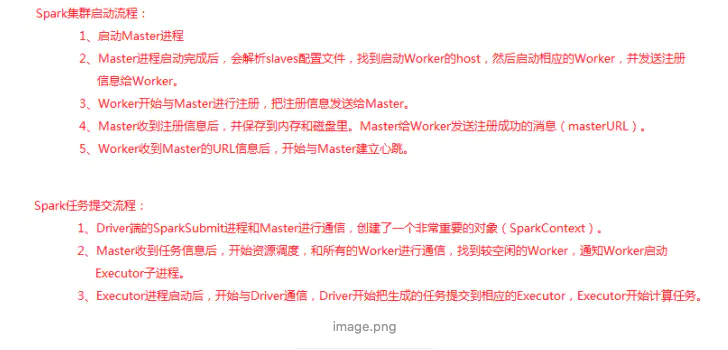

#### spark的启动流程任务提交流程.

### 怎么实时分析mysql里面的业务数据?

参考原文:https://www.cnblogs.com/itboys/p/10624670.html

回答: 用canal监控mysql的数据变化,把变化数据发送到kafka,然后到sparkStreaming.进行实时分析.

### spark数据倾斜

过滤导致倾斜的key

将reduce join转换为map join

### sparkstreaming  与kafka连接.

 SparkStreaming连接到kafka，防止重复消费,自己手动管理offset.

自己编写代码维护offset，并将offset保存到MongoDB或者redis

### spark 挂掉 

高可用的,不会挂掉.真挂掉,没遇到呢.

### spark优化

##### 常规性能优化:

重复使用的RDD要持久化.

并行度调节:task数量应该设置为Spark作业总CPU core数量的2~3倍

广播大变量

##### 算子调优:

mapPartition和map的合理化使用. foreachPartition

##### shuffle调节

调节map端缓冲区大小

调节reduce端拉取数据缓冲区大小

调节reduce端拉取数据重试次数(最大60次)

调节reduce端拉取数据等待间隔(60s)

##### jvm调优

降低cache操作的内存占比 

增加Executor堆外内存,增加 (2G)

增加连接等待时长,增加 300

