# 大数据开发复习课程

* 课程安排
  * day01
    * 就业岗位介绍
    * 面试流程
      * 最重要的是简历
    * 基础复习
      * Java
      * mysql
      * Linux
  * day02
    * HDFS
    * MapReduce
    * hive (sql boy)
    * HBASE
  * day03
    * kafka
    * redis
    * es
  * day04
    * scala
    * spark
    * flink
  * day05
    * etl
    * 数据仓库
  * day06
    * bi开发
      * 帆软软件


### 课程目标

* 复习基础知识
* 掌握重点内容
* 熟悉常见面试题
* 熟悉常见笔试题
* 工作中会遇到的一些问题


## 1、大数据就业岗位


### 职位 > 

* 数据工程师
* 大数据工程师
* 大数据开发
* Hadoop开发工程师
* spark开发工程师
* flink开发工程师
* ETL开发工程师
* BI开发工程师
* 数仓开发


#### 技能标签

Java，scala，shell，HDFS，MapReduce，hive，HBASE，kafka，Redis，spark，flink


#### 任职要求


* 蚂蚁金服


* 小米

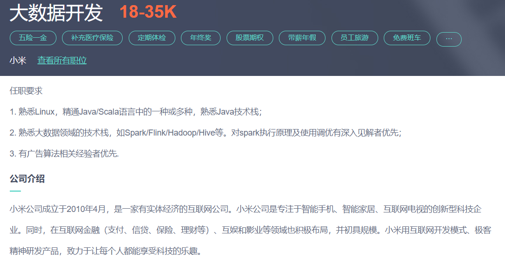


* 万达


#### 岗位所需技能点

* 语言
  * Java
  * scala
  * shell
  * Python
  * sql
* 大数据生态圈
  * HDFS
  * MapReduce
  * yarn
  * hive
  * HBASE
  * kafka
  * spark
  * flink
* 数据库
  * MySQL，Redis


## 2、面试流程


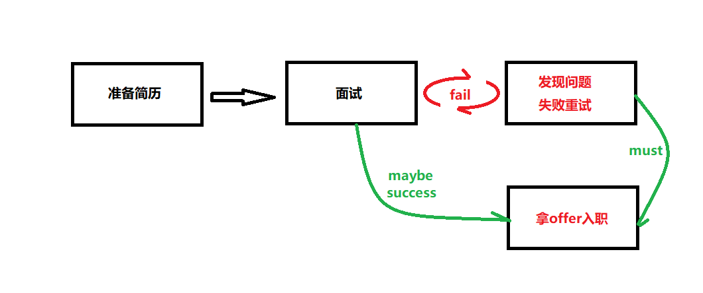

### 2.1、面试准备

**个人相关：**

```properties
学校、专业
公司履历
住址（问到再说）
```


**公司相关**：（站长之家）

```properties
公司名称，
公司地址，
公司人数，
公司主营业务
所在项目组名称（大数据组，智能风控组），
项目组人员架构（几个人，都是做什么的？）
公司集群有多少台服务器？
每台节点都部署的什么服务？
采用的什么大数据集群？
针对某个项目每天的数据量多大？
证明人（项目经理、同事）
```

**技术点相关**：(是什么，都有什么角色，有什么用，在项目里怎么落地的)

```properties
zookeeper
hadoop
mapreduce
hive
flume
sqoop
kafka
hbase
spark
scala
java
mysql

1、以上技术的中在项目中的具体用法（比如kafka的topic名称，是否有规范）
2、功能、现场需求实现
3、高级用法，相关优化（课程里挑选一些）
```

**项目相关**：

```properties
思路清晰，逻辑缜密不结巴的介绍出来（特别是最近的第一个项目）
项目架构
有几个模块
开发时长
个人负责模块开发
项目有什么技术亮点
遇到过什么问题，怎么解决的
```

**综合素质（情商）**

```properties
不卑不亢（你 -》 您）
性格温顺
低姿态
表现的勤学好问，对技术痴迷
情商高、不死板（脸上得有表情，有眼神交流）
无异常表现（发抖、无眼神对视）
从容稳定
```

**总结：将以上内容准备好，以纸质文本做准备。 ping -> pong;**


### 2.2、准备简历

* 简历准备是第一步也是最重要的最重要的一步，以下几点需要注意
  * 简历要写的高端大气上档次（撑死胆大，饿死胆小，面试机会多）
  * 技能点认知程度合理（了解spark）
  * 项目准备详细，可参照优秀简历，用自己的话背一下
  * 项目要三个及以上
  * 项目优先级
    * 同学朋友真实的项目
    * 课程中最新的项目（改头换面）
    * 网上找项目（github）
    * 从简历中筛选项目
  * 自己的项目要考虑周全
    - 几个人开发，分工是什么
    - 数据量多大，多少台机器，每台机器都部署了什么服务
    - 遇到什么问题
    - 用到几个表，哪些字段
    - 用到的框架是什么版本的
    - 有什么优点，有什么需要优化的地方
  * 把自己的简历吃透，复习大纲就是自己的简历
  * 自己的简历就是自我介绍（年度最火问题）**想一个逻辑，让自我介绍不卡壳**
  * 我是xx,基本信息，我的上家公司的基本信息，我在上家公司做的什么职位做了什么项目，最近在研究什么技术，客气话。
* 总结
  * **只要把简历吃透，心态方正，走出去面试，技术还行，就一定能入职。**
  * **如果是二线三线城市，技术要求更低，只要对工资要求不高，都能入职。**


### 2.3、投递简历

* 投递简历的平台有哪些？
  * 智联招聘
  * Boss直聘
  * 猎聘
  * 前程无忧
  * 实习僧
* 总结：
  * 为了面试机会更多，把所有平台都注册填写信息。
* 投递的时间怎么安排？
  * **工作日** 上午9:00  下午2:00各投一波（根据反馈10-30家） 


### 2.4、面试

* 面试流程一般包括 **笔试、一线开发面试**、**技术leader面试**、**人事面试**


* 一线开发会问什么？

  * 自我介绍
  * 介绍项目（深挖）
  * 介绍技术、高级用法、项目中怎么落地的
  * 现场出场景题，sql题

  

* 技术leader会问什么？

  * 自我介绍
  * 项目介绍（最近的项目）
  * 一个个的技能点问
  * 拿他最拿手的技能问，一是测试你的水平，二是用他的长处挫败你
  * 亮点，遇到的问题，公司人员架构，服务器分配，数据量
  * 看过什么书籍，看过什么源码
  * 你在你们项目组实力怎么样？

  

* 人事面试

  * 为什么离职
  * 自我介绍
  * 职业规划
  * 期望薪资
  * 接受996吗
  * 薪资可谈吗 / 尽快入职，明天能入职吗？下周呢
  * 确定发放offer时间


### 2.5、入职

* 入职都需要准备哪些资料？
  * 一般在offer邮件上都有注明所需要的材料
  * 身份证，学历证书，体检证明，银行卡，offer等
* 入职就开始撸代码吗？
  * 交资料
  * 录指纹
  * 安装环境 JDK，idea ，git 
  * 熟悉环境（登录各个平台账号）


## 3、基础复习

### 3.1、idea


#### 3.11、idea常用快捷键

* Ctrl-N      	再键入类的名字可以快速地在编辑器里打开任何一个类
* Ctrl-Shift-N    打开工程中的普通文件
* Ctrl-D              复制当前行
* Ctrl-Y               删除当前行
* Ctrl-F               查找
* Ctrl-R               替换
* Ctrl＋P            显示方法的参数信息
* Ctrl＋Alt＋V   自动创建变量
* Ctrl+Alt+L       格式化代码
* ALT+INSERT   生成get/set


#### 3.12、idea常见问题

* idea项目所需要的依赖下载过程中，有下载动作，但是下载失败

  * 有下载动作

  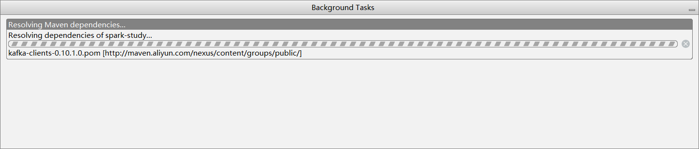

  * 下载失败

  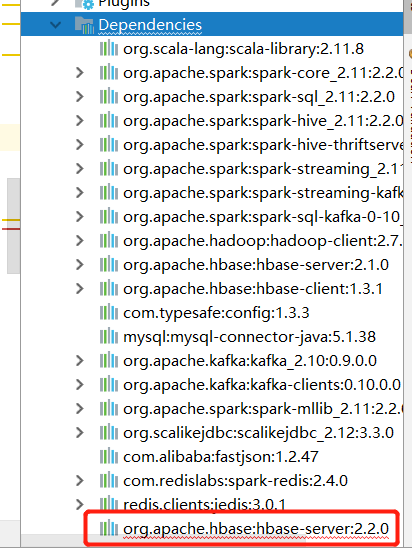

  * 原因
    * 在依赖坐标没有错误的情况下，一般是网速导致的。
  * 解决办法
    * 反复重试，或到本地仓库将临时文件删除再试。一般在公司开发网速正常很少碰到。

* idea项目所需要的依赖下载过程中，无下载动作，直接下载失败

  * 解决办法
    * 一般是当前idea版本和所使用的maven版本不兼容导致的，可尝试更换maven版本。


### 3.2、Java

#### 3.2.1、Java中的基本数据类型

​	自从Java发布以来，基本数据类型就是Java语言的一部分，分别是**byte, short, int, long, char, float, double, boolean**.

​	

​	整型：byte, short, int, long

​	字符型：char

​	浮点型：float, double

​	布尔型：boolean


##### 3.2.1.1、整形

​	Java中最小的计算单元为**字节**，1字节=8位（bit），Java中整型数据属于有符号数，即第一个bit位为0表示正整数，第一个bit位为1表示负整数。

* **byte**
  * byte属于Java中的整型，长度为1字节8bit，取值10000000（-128）到 01111111（127），变量初始化默认值为0，包装类Byte.
* **short**
  * short属于Java中的整型，长度为2字节16bit，取值10000000 00000000（-32768）到 01111111 11111111（32767），变量初始化默认值为0，包装类Short.
* **int**
  * int属于Java中的整型，长度为4字节32bit，取值-2^31 （-2,147,483,648）到 2^31-1（2,147,483,647），变量初始化默认值为0，包装类Integer
* **long**
  * long属于Java中的整型，长度为8字节64bit，取值-2^63 （-9,223,372,036,854,775,808‬）到 2^63-1（9,223,372,036,854,775,8087），变量初始化默认值为0或0L，包装类Long


##### 3.2.1.2、浮点型

* float
  * float属于Java中的浮点型，也叫单精度浮点型，长度为4字节32bit，变量初始化默认值0.0f，包装类Float
* double
  * double属于Java中的浮点型，也叫双精度浮点型，长度为8字节64bit，变量初始化默认值0.0d，包装类Double

##### 3.2.1.3、字符型

* char
  * char属于java中的字符型，占2字节16bit，可以赋值单字符以及整型数值, 变量初始化无默认值，包装类Character。


##### 3.2.1.4、布尔型

* boolean
  * 在JVM中并没有提供boolean专用的字节码指令，而boolean类型数据在经过编译后在JVM中会通过int类型来表示，此时boolean数据4字节32位，而boolean数组将会被编码成Java虚拟机的byte数组，此时每个boolean数据1字节占8bit.


#### 3.2.2、String、Stringbulider、StringBuffer

​	String这个类是Java中使用得最频繁的类之一，并且又是各大公司面试喜欢问到的地方，今天就来和大家一起学习一下String、StringBuilder和StringBuffer这几个类，分析它们的异同点以及了解各个类适用的场景。


* **String str="hello world"和String str=new String("hello world")** 的区别？

　　想必大家对上面2个语句都不陌生，在平时写代码的过程中也经常遇到，那么它们到底有什么区别和联系呢？

~~~Java
public class Main {
         
    public static void main(String[] args) {
        String str1 = "hello world";
        String str2 = new String("hello world");
        String str3 = "hello world";
        String str4 = new String("hello world");
         
        System.out.println(str1==str2);
        System.out.println(str1==str3);
        System.out.println(str2==str4);
    }
}
~~~

​	

这段代码的输出结果为：

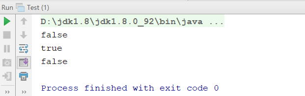


​	这个结果和你的答案是一致的吗？**为什么是这样的结果呢？**

​	String str1 = "hello world";和String str3 = "hello world"; 都在编译期间生成了 字面常量和符号引用，运行期间字面常量"hello world"被存储在运行时**常量池**（当然只保存了一份）。通过这种方式来将String对象跟引用绑定的话，JVM执行引擎会先在运行时常量池查找是否存在相同的字面常量，如果存在，则直接将引用指向已经存在的字面常量；否则在运行时常量池开辟一个空间来存储该字面常量，并将引用指向该字面常量。

​	通过**new关键字**来生成对象是在堆区进行的，而在堆区进行对象生成的过程是不会去检测该对象是否已经存在的。因此通过new来创建对象，创建出的一定是不同的对象。


* **String、StringBuffer以及StringBuilder的区别？**

  既然在Java中已经存在了String类，那为什么还需要StringBuilder和StringBuffer类呢？一起来看下面的代码

  ~~~Java
  public class Main {
           
      public static void main(String[] args) {
          String string = "";
          for(int i=0;i<10000;i++){
              string += "hello";
          }
      }
  }

  	以上代码在底层，每次循环会new出一个StringBuilder对象，然后进行append操作，最后通过toString方法返回String对象。也就是说这个循环执行完毕new出了10000个对象，试想一下，如果这些对象没有被回收，会造成多大的内存资源浪费。
  ~~~


*  再看下面这段代码：

  ~~~java
  public class Main {
           
      public static void main(String[] args) {
          StringBuilder stringBuilder = new StringBuilder();
          for(int i=0;i<10000;i++){
              stringBuilder.append("hello");
          }
      }
  }

  	以上代码new操作只进行了一次，也就是说只生成了一个对象，append操作是在原有对象的基础上进行的。因此在循环了10000次之后，这段代码所占的资源要比上面小得多。
  ~~~


​	那么有人会问既然有了StringBuilder类，为什么还需要StringBuffer类？查看源代码便一目了然，事实上，StringBuilder和StringBuffer类拥有的成员属性以及成员方法基本相同，区别是StringBuffer类的成员方法前面多了一个关键字：synchronized，不用多说，这个关键字是在多线程访问时起到安全保护作用的,也就是说StringBuffer是线程安全的。

* StringBuilder

  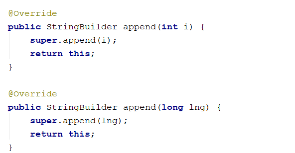


* StringBuffer

  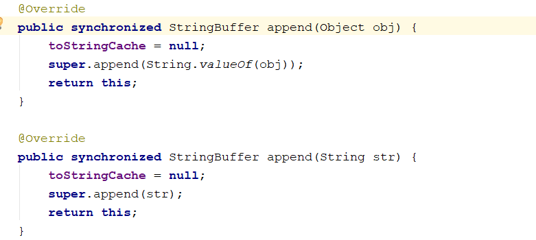

  

* **String、StringBuilder、StringBuffer三者的执行效率**


​	StringBuilder  >  StringBuffer  >  String


* **String、StringBuilder、StringBuffer三者的使用场景**
  1. 当字符串相加操作或者改动较少的情况下，建议使用 String str="hello"这种形式定义变量；
  2. 当字符串相加操作较多的情况下，建议使用StringBuilder
  3. 如果采用了多线程，则使用StringBuffer。


#### 3.2.3、ArrayList、LinkedList、Vector


**ArrayList**

​	ArrayList是最常用的List实现类，内部是通过数组实现的，它允许对元素进行快速随机访问。

​	**优点**：查询快，修改快。

​	**缺点**：增删慢。

1）数组的缺点是每个元素之间不能有间隔，当数组大小不满足时需要增加存储能力，会在原始大小上扩容1.5倍，将已经有数组的数据复制到新的存储空间中。（在内存中是连续的）

2）当从ArrayList的中间位置插入或者删除元素时，需要对数组进行复制、移动，代价比较高。适合随机查找和遍历，不适合插入和删除。


**Vector**

​	Vector与ArrayList一样，也是通过数组实现的，不同的是它**支持线程的同步**，即某一时刻只有一个线程能够写Vector，避免多线程同时写而引起的不一致性，但实现同步需要很高的花费，因此，访问它比访问ArrayList慢。


**LinkedList**

​	LinkedList是用链表结构存储数据的，优缺点和数组正好相反。

​	优点：增删快

​		每次增加或删除的时候，不会影响到其它大量元素，只会影响链表中相关联的前后关系。

​	缺点：查询慢，修改慢

​		每次查询元素，都需要根据链接关系逐个进行匹配。

很适合数据的动态插入和删除，随机访问和遍历速度比较慢。


#### 3.2.4、数组和链表

**数组**

​	数组必须事先定义固定的长度，不能适应数据动态地增减的情况。从栈中分配空间, 对于程序方便快速,但是自由度小。

​	优点：利用下标定位，随机访问性强，查找速度快。

​	缺点：插入和删除的效率低，内存利用率低，内存空间要求高，必须有足够的连续的内存空间。


**链表**

链表动态地进行存储分配，可以适应数据动态地增减的情况。从堆中分配空间, 自由度大但是申请管理比较麻烦。

​	优点：插入和删除的效率高。内存利用率高，不会浪费内存。

​	缺点：定位查询速度慢，修改慢。

总结：如果需要快速访问数据，很少或不插入和删除元素，就应该用数组;；相反， 如果需要经常插入和删除元素就需要用链表数据结构了。


#### 3.2.5、时间复杂度与空间复杂度

​	复杂度也叫渐进复杂度，包括**时间复杂度**和**空间复杂度**，用来分析算法执行效率与数据规模之间的增长关系，可以粗略地表示，越高阶复杂度地算法，执行效率越低。常见的复杂度并不多，从低阶到高阶有：O(1)、O(logn)、O(n)、O(nlogn)、O(n2)。

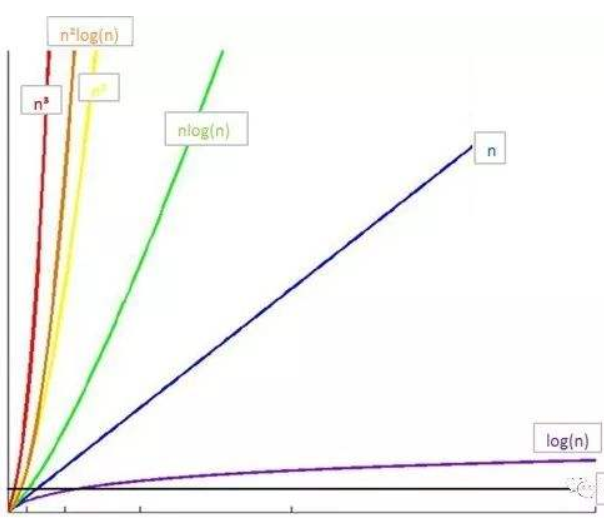


##### **时间复杂度**

​	执行效率是衡量算法优劣的一个重要指标，一般来说我们把代码运行一遍就能得到算法执行的时间和占用的内存大小，但这其实很不准确，结果既依赖于运行环境硬件设备又被测试规模影响。

​	所以我们需要一种分析方法去计算算法的运行效率，这就是**大O复杂度表示法**，比如我们经常看见O(n)之类的。

~~~Java
public int count(int n){
　　int sum = 0;
　　for(int i = 1; i <= n; i++) 
    sum += i;
   return sum;
}
~~~

​	从CPU角度来说，每段代码都意味着读数据-计算数据-写数据，假设每行代码的运行时间为unit_time，那么for循环了n遍，所以运行时间为2n\*unit_time，再加上第一句赋值的时间，总运行时间为(2n+1)*unit_time。

​	所以可以观察到**代码的执行时间 T(n) 与每行代码的执行次数成正比**，如果将代码的执行次数记为f(n)，代码执行时间和执行次数的关系记为O，那么将其总结为公式：

**T(n) = O(f(n))**

​	大O时间复杂度实际上并不具体表示代码真正的执行时间，而是表示代码执行时间随数据规模增长的变化趋势，所以也叫作渐进时间复杂度（asymptotic time complexity），简称时间复杂度。

​	比如第一个例子T(n) = O(2n+1)，如果n非常大的时候，公式中的**低阶、常量、系数**三部分并不左右增长趋势，所以**都可以忽略**。我们只需要记录一个最大量级就可以了，如果用大 O 表示法表示第一个例子的时间复杂度，就可以记为：T(n) = O(n)。

​	所以时间复杂度分析的重点就是只关注循环执行次数最多的一段代码，忽略执行次数公式中的**低阶、常量、系数**。


​	另外再分析下**O(logn)**、**O(nlogn)**这种类型的时间复杂度。

~~~Java
int i = 0;
  while(i <= n){
    i *= 2;
}

~~~

​	上述代码运行的次数和2的指数有关，就是运行了x次，2x = n的时候循环结束，那么运行次数x为log2n，很简单就可以得出时间复杂度为O(log2n)。

​	实际上，不管是以2为底、以3为底，还是以10为底，我们可以把所有对数阶的时间复杂度都记为 O(logn)。

​	假如将上述代码改成i *= 3，那么算法执行了log3n次，根据对数转换的公式，log3n 就等于 log32 * log2n 时间复杂度就相当于log32*O(log2n )，忽略掉系数log32就是O(log2n )，因此，在对数阶时间复杂度的表示方法里，我们忽略对数的底，统一表示为O(logn)。

​	如果一段代码的时间复杂度是O(logn)，又循环执行n遍，时间复杂度就是O(nlogn) 了。而且O(nlogn) 也是一种非常常见的算法时间复杂度。比如归并排序和快速排序。


* 思考，什么情况下，时间复杂度为 n的平方？


##### 空间复杂度

​	类比之前的时间复杂度，空间复杂度全称就是渐进空间复杂度(asymptotic space complexity)，表示算法的存储空间与数据规模之间的增长关系。

比如代码申请了一个int[n]的数组，忽略其他低阶等那么空间复杂度也就是O(n)。


再举个例子比如存储一个二进制数n，那么其空间复杂度就是是O(logn)。

举例：8用二进制数表示就是3个bit，16用二进制表示4个bit，以此类推n用二进制表示就是 logn 个bit。

1000

常见的空间复杂度就是O(1)，O(n)，O(n的平方)。


#### 3.2.6、排序算法（笔试题）


**稳定：**如果a原本在b前面且a=b，排序之后a仍然在b的前面。 

**不稳定：**如果a原本在b的前面且a=b，排序之后 a 可能会出现在 b 的后面。

**时间复杂度：**对排序数据的总的操作次数。反映当n变化时，操作次数呈现什么规律。

**空间复杂度：**是指算法在计算机内执行时所需存储空间的度量，它也是数据规模n的函数。

**内部排序：**所有排序操作都在内存中完成。本文主要介绍的是内部排序。

**外部排序：**待排序记录的数量很大，以致于内存不能一次容纳全部记录，所以在排序过程中需要对外存进行访问的排序过程。


参考资料：<https://www.jianshu.com/p/47170b1ced23>


#### 3.2.7、 Java 中的重载和重写

* 重载
  * 方法名要一样，但是参数类型和个数不一样，返回值类型可以相同也可以不相同。
* 重写
  * 1、在子类中可以根据需要对从基类中继承来的方法进行重写。
  * 2、重写的方法和被重写的方法必须具有相同方法名称、参数列表和返回类型。
  * 3、重写方法不能使用比被重写的方法更严格的访问权限。


#### 3.2.8、单例模式

​	所谓单例，就是整个程序有且仅有一个实例。该类负责创建自己的对象，同时确保只有一个对象被创建。在Java，一般常用在工具类的实现【加载配置，写日志，web访问计数器】。（笔试题）


**特点**

- 类构造器私有
- 持有自己类型的属性
- 对外提供获取实例的静态方法


**懒汉模式**
线程不安全，延迟初始化

~~~Java
public class Singleton {  
    private static Singleton instance;  
    private Singleton (){}  
  
    public static Singleton getInstance() {  
    if (instance == null) {  
        instance = new Singleton();  
    }  
    return instance;  
    }  
}
~~~


**饿汉模式**
线程安全，比较常用，但容易产生垃圾，因为一开始就初始化

~~~Java
public class Singleton {  
    private static Singleton instance = new Singleton();  
    private Singleton (){}  
    public static Singleton getInstance() {  
    return instance;  
    }  
}
~~~


**双重锁模式**
线程安全，延迟初始化。这种方式采用双锁机制，安全且在多线程情况下能保持高性能。

~~~Java
public class Singleton {  
    private volatile static Singleton singleton;  
    private Singleton (){}  
    public static Singleton getSingleton() {  
    if (singleton == null) {  
        synchronized (Singleton.class) {  
        if (singleton == null) {  
            singleton = new Singleton();  
        }  
        }  
    }  
    return singleton;  
    }  
}
~~~


#### 3.2.9、工厂模式

* 工厂模式（Factory Pattern）是 Java 中最常用的设计模式之一。这种类型的设计模式属于创建型模式，它提供了一种创建对象的最佳方式。

  工厂模式分为简单工厂模式，工厂方法模式和抽象工厂模式，它们都属于设计模式中的创建型模式。其主要功能都是帮助我们把对象的实例化部分抽取了出来，目的是降低系统中代码耦合度，并且增强了系统的扩展性。本文对简单工厂模式进行讲解。


* 案例

  * 我们将创建一个 *Shape* 接口和实现 *Shape* 接口的实体类。下一步是定义工厂类 *ShapeFactory*。

  ##### 步骤 1

  创建一个接口: Shape.java

  ~~~Java

  public interface Shape {   
    void draw();
  }
  ~~~

  

  ##### 步骤 2

  创建实现接口的实体类。

   Rectangle.java

  ~~~Java
  public class Rectangle implements Shape {   
    @Override   public void draw() {     
      System.out.println("Inside Rectangle::draw() method.");   }
  }
  ~~~

  

  Square.java

  ~~~Java
  public class Square implements Shape {    
    @Override   public void draw() {      
      System.out.println("Inside Square::draw() method.");   }
  }
  ~~~

  

  Circle.java

  ~~~Java
  public class Circle implements Shape {    
    @Override   public void draw() {      
      System.out.println("Inside Circle::draw() method.");   }
  }
  ~~~

  

  ##### 步骤 3

  创建一个工厂，生成基于给定信息的实体类的对象。

  ShapeFactory.java

  ~~~Java
  public class ShapeFactory {
      
     //使用 getShape 方法获取形状类型的对象
     public Shape getShape(String shapeType){
        if(shapeType == null){
           return null;
        }        
        if(shapeType.equalsIgnoreCase("CIRCLE")){
           return new Circle();
        } else if(shapeType.equalsIgnoreCase("RECTANGLE")){
           return new Rectangle();
        } else if(shapeType.equalsIgnoreCase("SQUARE")){
           return new Square();
        }
        return null;
     }
  }
  ~~~

  

  ##### 步骤 4

  使用该工厂，通过传递类型信息来获取实体类的对象。

  FactoryPatternDemo.java

  ~~~Java
  public class FactoryPatternDemo {
   
     public static void main(String[] args) {
        ShapeFactory shapeFactory = new ShapeFactory();
   
        //获取 Circle 的对象，并调用它的 draw 方法
        Shape shape1 = shapeFactory.getShape("CIRCLE");
   
        //调用 Circle 的 draw 方法
        shape1.draw();
   
        //获取 Rectangle 的对象，并调用它的 draw 方法
        Shape shape2 = shapeFactory.getShape("RECTANGLE");
   
        //调用 Rectangle 的 draw 方法
        shape2.draw();
   
        //获取 Square 的对象，并调用它的 draw 方法
        Shape shape3 = shapeFactory.getShape("SQUARE");
   
        //调用 Square 的 draw 方法
        shape3.draw();
     }
  }
  ~~~

  

  ##### 步骤 5

  执行程序，输出结果：

  ```
  Inside Circle::draw() method.
  Inside Rectangle::draw() method.
  Inside Square::draw() method.
  ```

  

  **优点：** 1、一个调用者想创建一个对象，只要知道其名称就可以了。 2、扩展性高，如果想增加一个产品，只要扩展一个工厂类就可以。 3、屏蔽产品的具体实现，调用者只关心产品的接口。

  **缺点：**每次增加一个产品时，都需要增加一个具体类和对象实现工厂，使得系统中类的个数成倍增加，在一定程度上增加了系统的复杂度，同时也增加了系统具体类的依赖。这并不是什么好事


#### 3.2.10、jvm类加载机制

* JVM是一个进程, 用来模拟计算单元, 将.class字节码文件转成计算机能够识别的指令.

* Java程序编译执行流程

  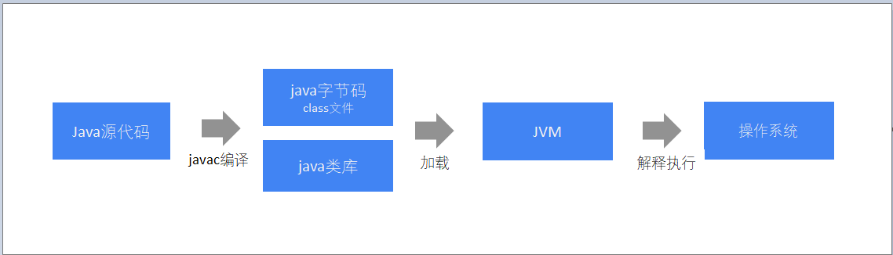


* 类加载机制

  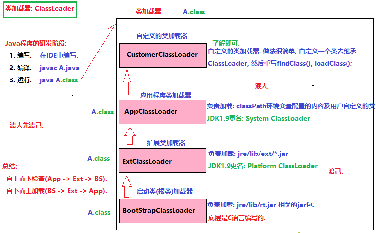


	JVM底层加载类依靠三大组件:
	BootStrapClassLoader	//启动类加载器
	//负责加载: jre\lib\rt.jar		//rt: runtime, 运行的意思
	
	ExtClassLoader:			//扩展类加载器
	//负责加载: jre\lib\ext\* 文件夹下所有的jar包
	//这两个加载器执行完毕后, JVM虚拟机基本上就初始化完毕了.
	
	APPClassLoader:			//应用程序类加载器
	//负责加载: 用户自定义的类的.
	//就是加载: 用户配置的classpath环境变量值的.
* 加载顺序是: 	BootStrap --> ExtClassLoader --> AppClassLoader --> UserClassLoader


#### 3.2.11、jvm内存模型

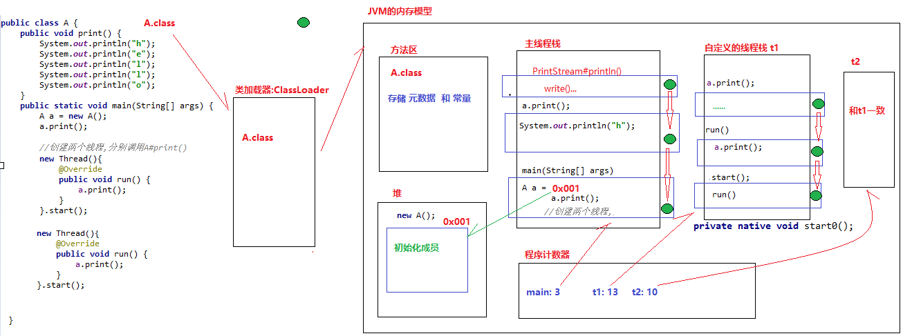


#### 3.2.12、jvm堆内存划分及垃圾回收

* JDK1.7

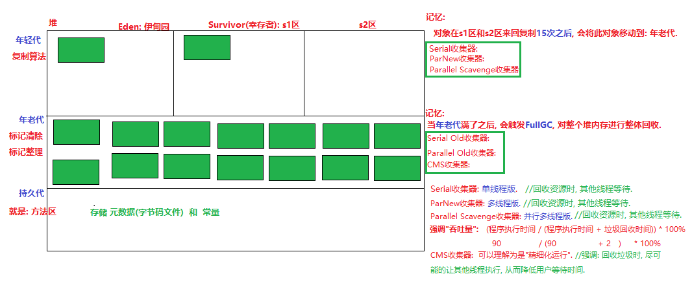

* JDK1.8

  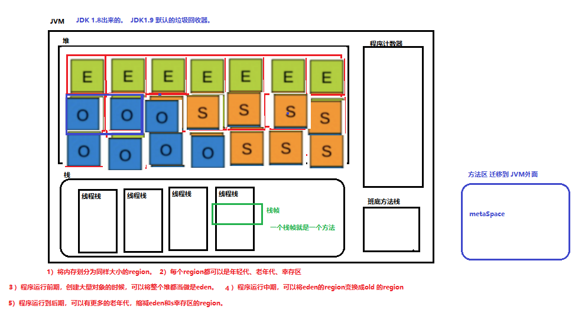


#### 3.2.13、spring项目中常用的注解

* @Controller 		
* @RestController
* @Service
* @Autowired
* @Resource
* @Configuration
* @Bean
* @Value
* @Scheduled
* @ExceptionHandler


### 3.3、MySQL

#### 3.3.1、什么是数据库

​	数据库：保存数据的仓库。它体现我们电脑中，就是一个文件系统。然后把数据都保存这些特殊的文件中，并且需要使用固定的语言（**SQL语言**）去操作文件中的数据。

技术定义：

​	数据库(Database)是按照[数据结构](https://baike.baidu.com/item/%E6%95%B0%E6%8D%AE%E7%BB%93%E6%9E%84)来组织、[[存储](https://baike.baidu.com/item/%E5%AD%98%E5%82%A8)和管理数据的建立在计算机存储设备上的仓库。


#### 3.3.2、数据库的分类

关系型、非关系型的数据库

常见的数据库软件：

Oracle：它是Oracle公司的大型关系型数据库，它是收费的。

DB2：IBM公司的数据库，它是收费的。

SqlServer：微软数据库。收费

Sybase：Sybase公司的。 工具PowerDesign 数据库建模工具。

MySql：早期瑞典一个公司发明，后期被Oracle收购。

Java开发应用程序主要使用的数据库：

MySQL（5.5）、Oracle、DB2。


#### 3.3.3、基本操作


##### 3.3.3.1、登录MySQL

~~~sql
mysql -uroot -p123456
123456
~~~

##### 3.3.3.2、退出MySQL

~~~sql
mysql>quit
~~~

##### 3.3.3.3、输入查询

- 查看当前mysql的版本号及当前时间

  ```mysql
  SELECT VERSION(), CURRENT_DATE;
  ```

  ```mysql
  mysql> SELECT VERSION(), CURRENT_DATE;
  +-----------+--------------+
  | VERSION() | CURRENT_DATE |
  +-----------+--------------+
  | 5.6.25    | 2018-08-08   |
  +-----------+--------------+
  1 row in set (0.32 sec)
  ```

- mysql中sql语句不区分大小写

  ```mysql
  mysql> SELECT VERSION(), CURRENT_DATE;
  mysql> select version(), current_date;
  mysql> SeLeCt vErSiOn(), current_DATE;
  ```

  ```mysql
  mysql> SELECT VERSION(), CURRENT_DATE;
  +-----------+--------------+
  | VERSION() | CURRENT_DATE |
  +-----------+--------------+
  | 5.6.25    | 2018-08-08   |
  +-----------+--------------+
  1 row in set (0.00 sec)

  mysql> select version(), current_date;
  +-----------+--------------+
  | version() | current_date |
  +-----------+--------------+
  | 5.6.25    | 2018-08-08   |
  +-----------+--------------+
  1 row in set (0.00 sec)

  mysql> SeLeCt vErSiOn(), current_DATE;
  +-----------+--------------+
  | vErSiOn() | current_DATE |
  +-----------+--------------+
  | 5.6.25    | 2018-08-08   |
  +-----------+--------------+
  1 row in set (0.00 sec)

  mysql> 
  ```


- 可以进行简单的计算（如下所示）

  ```mysql
  mysql>SELECT SIN(PI()/4), (4+1)*5;

  mysql> SELECT SIN(PI()/4), (4+1)*5;
  +--------------------+---------+
  | SIN(PI()/4)        | (4+1)*5 |
  +--------------------+---------+
  | 0.7071067811865475 |      25 |
  +--------------------+---------+
  1 row in set (0.34 sec)
  ```


- 多条语句比较短，可以写在一行

  ```mysql
  mysql>SELECT VERSION(); SELECT NOW();

  mysql> SELECT VERSION(); SELECT NOW();
  +-----------+
  | VERSION() |
  +-----------+
  | 5.6.25    |
  +-----------+
  1 row in set (0.00 sec)

  +---------------------+
  | NOW()               |
  +---------------------+
  | 2018-08-08 23:11:11 |
  +---------------------+
  1 row in set (0.00 sec)
  ```

- 多个字段之间可以用逗号分隔，多行组成一条语句结束以分号结束

  ```mysql
  mysql> SELECT
  -> USER()
  -> ,
  -> CURRENT_DATE;
  +---------------+--------------+
  | USER() | CURRENT_DATE |
  +---------------+--------------+
  | jon@localhost | 2010-08-06 |
  +---------------+--------------+
  ```

- sql语句写了一半，又不想执行可以在语句末尾加上'\c'

  ```mysql
  mysql> select 
      -> user()
      -> \c
  mysql> 
  ```


##### 3.3.3.4、创建和使用数据库

- 查看当前有哪些数据库

  ```mysql
  mysql>show databases;

  mysql> show databases;
  +--------------------+
  | Database           |
  +--------------------+
  | information_schema |
  | mysql              |
  | performance_schema |
  | test               |
  +--------------------+
  4 rows in set (0.07 sec)
  ```


- 创建数据库

  ```
  mysql> CREATE DATABASE menagerie;
  ```

- 使用及切换数据库

  ```mysql
  mysql> USE menagerie；
  Database changed
  ```


##### 3.3.3.5、创建表及使用

- 查看当前数据库有哪些表

  ```sql
  mysql>show tables;

  ```


- 创建一个表

  ```sql
  mysql> CREATE TABLE pet (name VARCHAR(20), owner VARCHAR(20),species VARCHAR(20), sex CHAR(1), birth DATE, death DATE);

  ```


- 校验创建表语句是否和执行的一致

  ```mysql
  mysql>show create table pet;

  +-------+--------------------------------
  | Table | Create Table                   
  +-------+--------------------------------
  | pet   | CREATE TABLE `pet` (
    `name` varchar(20) DEFAULT NULL,
    `owner` varchar(20) DEFAULT NULL,
    `species` varchar(20) DEFAULT NULL,
    `sex` char(1) DEFAULT NULL,
    `birth` date DEFAULT NULL,
    `death` date DEFAULT NULL
  ) ENGINE=InnoDB DEFAULT CHARSET=latin1 |
  +-------+--------------------------------
  ```


- 查看表详情

  ```mysql
  mysql> desc pet;
  +---------+-------------+------+-----+---------+-------+
  | Field   | Type        | Null | Key | Default | Extra |
  +---------+-------------+------+-----+---------+-------+
  | name    | varchar(20) | YES  |     | NULL    |       |
  | owner   | varchar(20) | YES  |     | NULL    |       |
  | species | varchar(20) | YES  |     | NULL    |       |
  | sex     | char(1)     | YES  |     | NULL    |       |
  | birth   | date        | YES  |     | NULL    |       |
  | death   | date        | YES  |     | NULL    |       |
  +---------+-------------+------+-----+---------+-------+
  ```


- 准备数据

```
Fluffy Harold cat f 1993-02-04
Claws Gwen cat m 1994-03-17
Buffy Harold dog f 1989-05-13
Fang Benny dog m 1990-08-27
Bowser Diane dog m 1979-08-31 1995-07-29
Chirpy Gwen bird f 1998-09-11
Whistler Gwen bird 1997-12-09
Slim Benny snake m 1996-04-29

```


##### 3.3.3.6、表中导入数据

在表中导入数据的方式有两种

- 第一种：将以上数据整理成SQL语句，insert into pet....

- 第二种：通过加载文件的方式将数据导入到表中

  1、创建一个pet.txt的文件（注：每个字段中用tab键隔开，字段没有值得记录用\N代替）

  ```
  Fluffy  Harold  cat     f       1993-02-04
  Claws   Gwen    cat     m       1994-03-17
  Buffy   Harold  dog     f       1989-05-13
  Fang    Benny   dog     m       1990-08-27
  Bowser  Diane   dog     m       1979-08-31      1995-07-29
  Chirpy  Gwen    bird    f       1998-09-11
  Whistler        Gwen    bird    \N      1997-12-09      \N
  Slim    Benny   snake   m       1996-04-29

  ```

  2、加载数据

  ```mysql
  mysql> load data local infile '/root/data/pet.txt' into table pet;
  Query OK, 8 rows affected, 6 warnings (0.06 sec)
  Records: 8  Deleted: 0  Skipped: 0  Warnings: 6
  ```

  3、校验是否加载进去

  ```mysql
  mysql> select *from pet;
  +----------+--------+---------+------+------------+------------+
  | name     | owner  | species | sex  | birth      | death      |
  +----------+--------+---------+------+------------+------------+
  | Fluffy   | Harold | cat     | f    | 1993-02-04 | NULL       |
  | Claws    | Gwen   | cat     | m    | 1994-03-17 | NULL       |
  | Buffy    | Harold | dog     | f    | 1989-05-13 | NULL       |
  | Fang     | Benny  | dog     | m    | 1990-08-27 | NULL       |
  | Bowser   | Diane  | dog     | m    | 1979-08-31 | 1995-07-29 |
  | Chirpy   | Gwen   | bird    | f    | 1998-09-11 | NULL       |
  | Whistler | Gwen   | bird    | NULL | 1997-12-09 | NULL       |
  | Slim     | Benny  | snake   | m    | 1996-04-29 | NULL       |
  +----------+--------+---------+------+------------+------------+
  8 rows in set (0.01 sec)
  ```


##### 3.3.7、数据检索部分

###### 3.3.7.1、检索全部数据

```mysql
mysql> select *from pet;
+----------+--------+---------+------+------------+------------+
| name     | owner  | species | sex  | birth      | death      |
+----------+--------+---------+------+------------+------------+
| Fluffy   | Harold | cat     | f    | 1993-02-04 | NULL       |
| Claws    | Gwen   | cat     | m    | 1994-03-17 | NULL       |
| Buffy    | Harold | dog     | f    | 1989-05-13 | NULL       |
| Fang     | Benny  | dog     | m    | 1990-08-27 | NULL       |
| Bowser   | Diane  | dog     | m    | 1979-08-31 | 1995-07-29 |
| Chirpy   | Gwen   | bird    | f    | 1998-09-11 | NULL       |
| Whistler | Gwen   | bird    | NULL | 1997-12-09 | NULL       |
| Slim     | Benny  | snake   | m    | 1996-04-29 | NULL       |
+----------+--------+---------+------+------------+------------+
8 rows in set (0.01 sec)
```

###### 3.3.7.2、删除表中全部数据

```mysql
mysql> DELETE FROM pet;
mysql> LOAD DATA LOCAL INFILE '/path/pet.txt' INTO TABLE pet;
```

###### 3.3.7.3、更新表中特定记录的数据

- 更新表中名字为Bowser的生日

```mysql
mysql> UPDATE pet SET birth = '1989-08-31' WHERE name = 'Bowser';
```

###### 3.3.7.4、查询特定的行

- 查询名字为Bowser的记录

```mysql
mysql> SELECT * FROM pet WHERE name = 'Bowser';
+--------+-------+---------+------+------------+------------+
| name | owner | species | sex | birth | death |
+--------+-------+---------+------+------------+------------+
| Bowser | Diane | dog | m | 1989-08-31 | 1995-07-29 |
+--------+-------+---------+------+------------+------------+
```

说明：字符串比较不区分大小写！如下所示：

```mysql
mysql> SELECT * FROM pet WHERE name = 'Bowser';
+--------+-------+---------+------+------------+------------+
| name   | owner | species | sex  | birth      | death      |
+--------+-------+---------+------+------------+------------+
| Bowser | Diane | dog     | m    | 1979-08-31 | 1995-07-29 |
+--------+-------+---------+------+------------+------------+
1 row in set (0.00 sec)

mysql> SELECT * FROM pet WHERE name = 'BowsEr';
+--------+-------+---------+------+------------+------------+
| name   | owner | species | sex  | birth      | death      |
+--------+-------+---------+------+------------+------------+
| Bowser | Diane | dog     | m    | 1979-08-31 | 1995-07-29 |
+--------+-------+---------+------+------------+------------+
1 row in set (0.00 sec)

mysql> SELECT * FROM pet WHERE name = 'BOWSER';
+--------+-------+---------+------+------------+------------+
| name   | owner | species | sex  | birth      | death      |
+--------+-------+---------+------+------------+------------+
| Bowser | Diane | dog     | m    | 1979-08-31 | 1995-07-29 |
+--------+-------+---------+------+------------+------------+
1 row in set (0.00 sec)
```

###### 3.3.7.4.1、查找生日在1998年以后的特定查询

```mysql
mysql> SELECT * FROM pet WHERE birth >= '1998-1-1';
+----------+-------+---------+------+------------+-------+
| name | owner | species | sex | birth | death |
+----------+-------+---------+------+------------+-------+
| Chirpy | Gwen | bird | f | 1998-09-11 | NULL |
| Puffball | Diane | hamster | f | 1999-03-30 | NULL |
+----------+-------+---------+------+------------+-------+
```

###### 3.3.7.4.2、多条件查询（and | or）

```mysql
mysql> SELECT * FROM pet WHERE species = 'dog' AND sex = 'f';
+-------+--------+---------+------+------------+-------+
| name | owner | species | sex | birth | death |
+-------+--------+---------+------+------------+-------+
| Buffy | Harold | dog | f | 1989-05-13 | NULL |
+-------+--------+---------+------+------------+-------+
```

```mysql
mysql> SELECT * FROM pet WHERE species = 'snake' OR species = 'bird';
+----------+-------+---------+------+------------+-------+
| name | owner | species | sex | birth | death |
+----------+-------+---------+------+------------+-------+
| Chirpy | Gwen | bird | f | 1998-09-11 | NULL |
| Whistler | Gwen | bird | NULL | 1997-12-09 | NULL |
| Slim | Benny | snake | m | 1996-04-29 | NULL |
+----------+-------+---------+------+------------+-------+
```

- ###### 优先执行括号中的逻辑

  ```mysql
  mysql> SELECT * FROM pet WHERE (species = 'cat' AND sex = 'm')
  -> OR (species = 'dog' AND sex = 'f');
  +-------+--------+---------+------+------------+-------+
  | name | owner | species | sex | birth | death |
  +-------+--------+---------+------+------------+-------+
  | Claws | Gwen | cat | m | 1994-03-17 | NULL |
  | Buffy | Harold | dog | f | 1989-05-13 | NULL |
  +-------+--------+---------+------+------------+-------+
  ```

###### 3.3.7.5、检索特定的列

```mysql
mysql> SELECT name, birth FROM pet;
+----------+------------+
| name | birth |
+----------+------------+
| Fluffy | 1993-02-04 |
| Claws | 1994-03-17 |
| Buffy | 1989-05-13 |
| Fang | 1990-08-27 |
| Bowser | 1989-08-31 |
| Chirpy | 1998-09-11 |
| Whistler | 1997-12-09 |
| Slim | 1996-04-29 |
| Puffball | 1999-03-30 |
+----------+------------+
```

- 查询不重复的字段要使用关键词DISTINCT

  ```sql
  mysql> SELECT DISTINCT owner FROM pet;
  +--------+
  | owner |
  +--------+
  | Benny |
  | Diane |
  | Gwen |
  | Harold |
  +--------+

  ```


- 可以使用组合条件查询特定的列

  ```mysql
  mysql> SELECT name, species, birth FROM pet
  -> WHERE species = 'dog' OR species = 'cat';
  +--------+---------+------------+
  | name | species | birth |
  +--------+---------+------------+
  | Fluffy | cat | 1993-02-04 |
  | Claws | cat | 1994-03-17 |
  | Buffy | dog | 1989-05-13 |
  | Fang | dog | 1990-08-27 |
  | Bowser | dog | 1989-08-31 |
  +--------+---------+------------+
  ```

###### 3.3.7.6、排序

- 根据某个字段进行排序（关键词：ORDER BY ）

```mysql
mysql> SELECT name, birth FROM pet ORDER BY birth;
+----------+------------+
| name | birth |
+----------+------------+
| Buffy | 1989-05-13 |
| Bowser | 1989-08-31 |
| Fang | 1990-08-27 |
| Fluffy | 1993-02-04 |
| Claws | 1994-03-17 |
| Slim | 1996-04-29 |
| Whistler | 1997-12-09 |
| Chirpy | 1998-09-11 |
| Puffball | 1999-03-30 |
+----------+------------+
```

- 升降序排列（desc：降序；asc：升序）

  ```sql
  mysql> SELECT name, birth FROM pet ORDER BY birth desc;//降序排列
  mysql> SELECT name, birth FROM pet ORDER BY birth asc ;//升序排列

  ```


- 多列排序

  根据species字段升序排列，根据birth字段降序排列

  **注： ORDER BY species 中无asc，desc，默认为升序排列**

  ```mysql
  mysql> SELECT name, species, birth FROM pet
  -> ORDER BY species, birth DESC;
  +----------+---------+------------+
  | name | species | birth |
  +----------+---------+------------+
  | Chirpy | bird | 1998-09-11 |
  | Whistler | bird | 1997-12-09 |
  | Claws | cat | 1994-03-17 |
  | Fluffy | cat | 1993-02-04 |
  | Fang | dog | 1990-08-27 |
  | Bowser | dog | 1989-08-31 |
  | Buffy | dog | 1989-05-13 |
  | Puffball | hamster | 1999-03-30 |
  | Slim | snake | 1996-04-29 |
  +----------+---------+------------+
  ```

###### 3.3.7.7、日期计算

查看宠物多少岁，就可以使用计算日期的函数TIMESTAMPDIFF()

```mysql
#查询当前的日期
mysql> select curdate() from pet;
+------------+
| curdate()  |
+------------+
| 2018-08-09 |
+------------+

#获取当年的年
mysql> select YEAR('2018-02-05') AS YEARS from pet;
+-------+
| YEARS |
+-------+
|  2018 |
+-------+

#获取当年的月
mysql> select month('2018-02-05') AS YEARS from pet;      
+-------+
| YEARS |
+-------+
|     2 |
+-------+

#获取当年的日
mysql> select day('2018-02-05') AS YEARS from pet;      
+-------+
| YEARS |
+-------+
|     5 |
+-------+
```

```mysql
mysql> SELECT name, birth, CURDATE(),
-> TIMESTAMPDIFF(YEAR,birth,CURDATE()) AS age
-> FROM pet;
```

###### 3.3.7.8、null和not null值

对一些字段类型要进行检查，判断某些字段是否为NULL，或者 non-NULL

```mysql
mysql> SELECT name, birth, death,
-> TIMESTAMPDIFF(YEAR,birth,death) AS age
-> FROM pet WHERE death IS NOT NULL ORDER BY age;
+--------+------------+------------+------+
| name | birth | death | age |
+--------+------------+------------+------+
| Bowser | 1989-08-31 | 1995-07-29 | 5 |
+--------+------------+------------+------+
```


#### 3.3.4、实例

以下是如何解决MySQL的一些常见问题的示例。


##### 3.3.4.1、首先创建一个表，并且导入数据

```sql
CREATE TABLE shop (
article INT(4) UNSIGNED ZEROFILL DEFAULT '0000' NOT NULL,
dealer CHAR(20) DEFAULT '' NOT NULL,
price DOUBLE(16,2) DEFAULT '0.00' NOT NULL,
PRIMARY KEY(article, dealer));


INSERT INTO shop VALUES
(1,'A',3.45),(1,'B',3.99),(2,'A',10.99),(3,'B',1.45),
(3,'C',1.69),(3,'D',1.25),(4,'D',19.95);
```

##### 3.3.4.2、检索表中的全部数据

```sql
select * from shop;

+---------+--------+-------+
| article | dealer | price |
+---------+--------+-------+
|    0001 | A      |  3.45 |
|    0001 | B      |  3.99 |
|    0002 | A      | 10.99 |
|    0003 | B      |  1.45 |
|    0003 | C      |  1.69 |
|    0003 | D      |  1.25 |
|    0004 | D      | 19.95 |
+---------+--------+-------+
```

##### 3.3.4.3、求某一列的最大值或者 最小值

```sql
SELECT MAX(article) AS article FROM shop;

+---------+
| article |
+---------+
|       4 |
+---------+

//求某一列的最小值
 select min(price) as article from shop; 
 
 +---------+
| article |
+---------+
|    1.25 |
+---------+
```

##### 3.3.4.4、过滤出某个字段值最大的整条记录数据-涉及到子查询

```sql
SELECT article, dealer, price
FROM shop
WHERE price=(SELECT MAX(price) FROM shop);

+---------+--------+-------+
| article | dealer | price |
+---------+--------+-------+
|    0004 | D      | 19.95 |
+---------+--------+-------+
```

##### 3.3.4.4、也可以通过关联查询来进行检索

```sql 
SELECT s1.article, s1.dealer, s1.price
FROM shop s1
LEFT JOIN shop s2 ON s1.price < s2.price
WHERE s2.article IS NULL;

SELECT article, dealer, price
FROM shop
ORDER BY price DESC
LIMIT 1;
```


##### 3.3.4.5、求出每一列的最大值，并且根据某一个字段进行分组--分组top1求法

```sql
SELECT article, MAX(price) AS price
FROM shop
GROUP BY article;

+---------+-------+
| article | price |
+---------+-------+
|    0001 |  3.99 |
|    0002 | 10.99 |
|    0003 |  1.69 |
|    0004 | 19.95 |
+---------+-------+
```


#### 3.3.5、SQL中的聚合函数

​	SQL语言中定义了部分的函数，可以帮助我们完成对查询结果的计算操作：

1.count 统计个数（行数）

2.sum函数：求和

3.avg函数：求平均值

4.max、min 求最大值和最小值


##### 3.3.5.1、count函数

**语法：select count(\*)|count(**列名) from**表名**

注意： count在根据指定的列统计的时候，如果这一列中有null 不会被统计在其中。

```
mysql> select * from pet;
+----------+--------+---------+------+------------+------------+
| name     | owner  | species | sex  | birth      | death      |
+----------+--------+---------+------+------------+------------+
| Fluffy   | Harold | cat     | f    | 1993-02-04 | NULL       |
| Claws    | Gwen   | cat     | m    | 1994-03-17 | NULL       |
| Buffy    | Harold | dog     | f    | 1989-05-13 | NULL       |
| Fang     | Benny  | dog     | m    | 1990-08-27 | NULL       |
| Bowser   | Diane  | dog     | m    | 1989-08-31 | 1995-07-29 |
| Chirpy   | Gwen   | bird    | f    | 1998-09-11 | NULL       |
| Whistler | Gwen   | bird    | NULL | 1997-12-09 | NULL       |
| Slim     | Benny  | snake   | m    | 1996-04-29 | NULL       |
+----------+--------+---------+------+------------+------------+
8 rows in set (0.00 sec)

mysql> select count(sex) from pet; 
+------------+
| count(sex) |
+------------+
|          7 |
+------------+
1 row in set (0.00 sec)

mysql> select count(owner) from pet;   
+--------------+
| count(owner) |
+--------------+
|            8 |
+--------------+
1 row in set (0.00 sec)

mysql> select count(death) from pet;     
+--------------+
| count(death) |
+--------------+
|            1 |
+--------------+


```

##### 3.3.5.2、sum函数

**语法：select sum(**列名) from 表名; 

注意事项：

1、如果使用sum 多列进行求和的时候，如果某一列中的有null，这一列所在的行中的其他数据不会被加到总和。

2、可以使用mysql 数据库提供的函数 ifnull(列名,值)

3、在数据库中定义double类型数据，是一个近似值，需要确定准确的位数，这时可以把这一列设计成numeric类型。numeric(数据的总列数,小数位数)

numericdouble float

```
mysql> select sum(price) from shop;  
+------------+
| sum(price) |
+------------+
|      42.77 |
+------------+

```

##### 3.3.5.3、avg函数

语法：select avg(列名) from 表名;

```
mysql> select avg(price) from shop;   
+------------+
| avg(price) |
+------------+
|   6.110000 |
+------------+

```

##### 3.3.5.4、max函数

语法：select max(列名) from 表名;

```
mysql> select max(price) from shop;   
+------------+
| max(price) |
+------------+
|      19.95 |
+------------+

```

##### 3.3.5.5、min函数

语法：select min(列名) from 表名;

```
mysql> select min(price) from shop;   
+------------+
| min(price) |
+------------+
|       1.25 |
+------------+

```


#### 3.3.6、SQL分类

##### 3.3.6.1、DDL （数据定义语言）

数据定义语言 - Data Definition Language

用来定义数据库的对象，如数据表、视图、索引等

```
创建数据库：create database test;
创建视图：create  view  test;
创建索引：create index test;
创建表：create table test1;

```


##### 3.3.6.2、DML  （数据操纵语言）

数据处理语言 - Data Manipulation Language

在数据库表中更新，增加和删除记录

如 update， insert， delete

```
update tableName set age='18' where name='lisi'

insert into tableName value('1','2','3');

drop table tableName //删除表操作

```

##### 3.3.6.3、DCL （数据控制语言）

数据控制语言 – Data Control Language

指用于设置用户权限和控制事务语句

如grant，revoke，if…else，while，begintransaction


##### 3.3.6.4、DQL （数据查询语言）

数据查询语言 – Data Query Language

select


##### 3.3.6.5、小结

```
1、创建数据库：create database  itcast;
2、使用数据库：use itcast;
3、查看当前数据库中的所有表：show tables ;
4、查看所有的数据库：show databases;

5、删除数据库：drop database itcast;
6、删除数据库中的表：drop table t1;


```


#### 3.3.7、数据库的备份与恢复

##### 3.3.7.1、备份命令

在mysql的安装目录的bin目录下有mysqldump命令，可以完成对数据库的备份。

语法：mysqldump -u 用户名 -p 数据库名> 磁盘SQL文件路径

由于mysqldump命令不是sql命令，需要在dos窗口下使用。

​	注意：在备份数据的时候，数据库不会被删除。可以手动删除数据库。同时在恢复数据的时候，不会

自动的给我们创建数据库，仅仅只会恢复数据库中的表和表中的数据。

```
mysqldump -uroot -p123456 menagerie >/root/data/menagerie.sql

//备份的文件
-rw-r--r--. 1 root root 3118 Oct 20 04:04 menagerie.sql

```

##### 3.3.7.2、恢复命令

恢复数据库，需要手动的先创建数据库：

create database heima;

语法：mysql -u 用户名-p 导入库名< 硬盘SQL文件绝对路径

需求：

​	1、创建heima8数据库。

​	2、重新开启一个新的dos窗口。

```sql
//恢复命令
mysql -uroot -p123456 heima </root/data/menagerie.sql

```

​	


#### 3.3.8、多表查询

##### 3.3.8.1、笛卡尔积介绍

​	笛卡尔乘积是指在数学中，两个集合X和Y的笛卡尓积（Cartesian product），又称直积，表示为X × Y，第一个对象是X的成员而第二个对象是Y的所有可能有序对的其中一个成员

准备数据：

```
create table A(
  A_ID int primary key auto_increment,
  A_NAME varchar(20) not null
);
insert into A values(1,'apple');
insert into A values(2,'orange');
insert into A values(3,'banana');

create table B( 
   A_ID int primary key auto_increment,
   B_PRICE double
);
insert into B values(1,2.30);
insert into B values(2,3.50);
insert into B values(4,null);


```

展示效果：

```
mysql> select * from A,B;
+------+--------+------+---------+
| A_ID | A_NAME | A_ID | B_PRICE |
+------+--------+------+---------+
|    1 | apple  |    1 |     2.3 |
|    2 | orange |    1 |     2.3 |
|    3 | banana |    1 |     2.3 |
|    1 | apple  |    2 |     3.5 |
|    2 | orange |    2 |     3.5 |
|    3 | banana |    2 |     3.5 |
|    1 | apple  |    4 |    NULL |
|    2 | orange |    4 |    NULL |
|    3 | banana |    4 |    NULL |
+------+--------+------+---------+

```


作用：笛卡尔积的数据，对程序是没有意义的，我们需要对笛卡尔积中的数据再次进行过滤。

对于多表查询操作，需要过滤出满足条件的数据，需要把多个表进行连接，连接之后需要加上过滤的条件。

```
mysql> select * from A,B where B.A_ID=1;
+------+--------+------+---------+
| A_ID | A_NAME | A_ID | B_PRICE |
+------+--------+------+---------+
|    1 | apple  |    1 |     2.3 |
|    2 | orange |    1 |     2.3 |
|    3 | banana |    1 |     2.3 |
+------+--------+------+---------+
3 rows in set (0.00 sec)

mysql> select * from A,B where B.A_ID=1 and A.A_ID=1;
+------+--------+------+---------+
| A_ID | A_NAME | A_ID | B_PRICE |
+------+--------+------+---------+
|    1 | apple  |    1 |     2.3 |
+------+--------+------+---------+

```

##### 3.3.8.2、内连接

内连接：
语法一：
select 列名 , 列名 .... from 表名1,表名2 where 表名1.列名 = 表名2.列名;

语法二：

select * from 表名1  inner join 表名2 on 条件

```
mysql> select * from A inner join B on A.A_ID=B.A_ID;
+------+--------+------+---------+
| A_ID | A_NAME | A_ID | B_PRICE |
+------+--------+------+---------+
|    1 | apple  |    1 |     2.3 |
|    2 | orange |    2 |     3.5 |
+------+--------+------+---------+

```


##### 3.3.8.3、左外连接

外链接：左外连接、右外连接、全连接、自连接。

左外连接：用左边表去右边表中查询对应记录，不管是否找到，都将显示左边表中全部记录。

即：虽然右表没有香蕉对应的价格，也要把他查询出来。

语法：select * from 表1 left outer join 表2 on 条件;


```
mysql> select * from A left join B on A.A_ID=B.A_ID;
+------+--------+------+---------+
| A_ID | A_NAME | A_ID | B_PRICE |
+------+--------+------+---------+
|    1 | apple  |    1 |     2.3 |
|    2 | orange |    2 |     3.5 |
|    3 | banana | NULL |    NULL |
+------+--------+------+---------+

```


##### 3.3.8.4、右外连接

用右边表去左边表查询对应记录，不管是否找到，右边表全部记录都将显示。

即：不管左方能够找到右方价格对应的水果，都要把左方的价格显示出来。

语法：select * from 表1 right outer join 表2 on 条件;


```
mysql> select * from A right join B on A.A_ID=B.A_ID;     
+------+--------+------+---------+
| A_ID | A_NAME | A_ID | B_PRICE |
+------+--------+------+---------+
|    1 | apple  |    1 |     2.3 |
|    2 | orange |    2 |     3.5 |
| NULL | NULL   |    4 |    NULL |
+------+--------+------+---------+

```

##### 3.3.8.5、全外连接

全外连接：左外连接和右外连接的结果合并，单会去掉重复的记录。
select * from 表1 full outer join 表2 on 条件
select * from a full outer join b on a.A_ID = b.A_ID; 但是mysql数据库不支持此语法。


##### 3.3.8.6、关联子查询

子查询：把一个sql的查询结果作为另外一个查询的参数存在。

##### 3.3.8.6.1、in和exist关键词的用法

关联子查询其他的关键字使用：

回忆：age=23 or age=24  等价于 age in (23,24)

in 表示条件应该是在多个列值中。

in：使用在where后面，经常表示是一个列表中的数据，只要被查询的数据在这个列表中存在即可。


```
mysql> select * from A where A_ID in(1,2,3);
+------+--------+
| A_ID | A_NAME |
+------+--------+
|    1 | apple  |
|    2 | orange |
|    3 | banana |
+------+--------+
3 rows in set (0.00 sec)

mysql> select * from A where A_ID =1 or A_ID =2 or A_ID =3;
+------+--------+
| A_ID | A_NAME |
+------+--------+
|    1 | apple  |
|    2 | orange |
|    3 | banana |
+------+--------+
//not in
mysql> select * from A where A_ID not in (1,2,3,4);
Empty set (0.00 sec)

mysql> select * from A where A_ID not in (3,4);    
+------+--------+
| A_ID | A_NAME |
+------+--------+
|    1 | apple  |
|    2 | orange |
+------+--------+
2 rows in set (0.00 sec)

```

exists：

exists：表示存在，当子查询的结果存在，就会显示主查询中的所有数据。

使用exists完成：


```
mysql> select * from A where exists(select A_ID from B);
+------+--------+
| A_ID | A_NAME |
+------+--------+
|    1 | apple  |
|    2 | orange |
|    3 | banana |
+------+--------+

mysql> select * from A where not exists(select A_ID from B);
Empty set (0.00 sec)

```


##### 3.3.8.6.2、union 和union  all使用法


**UNION 语句**：用于将不同表中相同列中查询的数据展示出来；（不包括重复数据）

**UNION ALL 语句**：用于将不同表中相同列中查询的数据展示出来；（包括重复数据）

```
mysql> select * from A  union   select * from B;   
+------+--------+
| A_ID | A_NAME |
+------+--------+
|    1 | apple  |
|    2 | orange |
|    3 | banana |
|    1 | 2.3    |
|    2 | 3.5    |
|    4 | NULL   |
+------+--------+
6 rows in set (0.00 sec)

mysql> select * from A  union all  select * from B;
+------+--------+
| A_ID | A_NAME |
+------+--------+
|    1 | apple  |
|    2 | orange |
|    3 | banana |
|    1 | 2.3    |
|    2 | 3.5    |
|    4 | NULL   |
+------+--------+

```


##### 3.3.8.6.3、case when 语句

case when 语句语法结构：

```sql
CASE sex  
WHEN '1' THEN '男'  
WHEN '2' THEN '女'  
ELSE '其他' END 

```

准备数据

```sql
//创建表
create table employee(
empid                   int  ,                                       
deptid                  int   ,                                      
sex                     varchar(20)  ,                                    
salary                  double 
);

//加载数据
1	10	female	5500.0
2	10	male	4500.0
3	20	female	1900.0
4	20	male	4800.0
5	40	female	6500.0
6	40	female	14500.0
7	40	male	44500.0
8	50	male	6500.0
9	50	male	7500.0

load data local infile '/root/data/emp.txt' into table employee ;


```

```sql
select *,
case 
when salary < 5000 then "低等收入" 
when salary>= 5000 and salary < 10000 then "中等收入"
when salary > 10000 then "高等收入"  
end  as level,
case sex
when "female" then 1 
when "male" then 0
end as flag 
from employee;

```


#### 3.3.9、GROUP BY 语句

GROUP BY 语句根据一个或多个列对结果集进行分组。

在分组的列上我们可以使用 COUNT, SUM, AVG,等函数。

语法结构：

```sql
SELECT column_name, function(column_name)
FROM table_name
WHERE column_name operator value
GROUP BY column_name;

```

准备数据：

```sql
CREATE TABLE `employee_tbl` (
  `id` int(11) NOT NULL,
  `name` char(10) NOT NULL DEFAULT '',
  `date` datetime NOT NULL,
  `singin` tinyint(4) NOT NULL DEFAULT '0' COMMENT '登录次数',
  PRIMARY KEY (`id`)
) ENGINE=InnoDB DEFAULT CHARSET=utf8;

-- ----------------------------

INSERT INTO `employee_tbl` VALUES ('1', '小明', '2016-04-22 15:25:33', '1'), ('2', '小王', '2016-04-20 15:25:47', '3'), ('3', '小丽', '2016-04-19 15:26:02', '2'), ('4', '小王', '2016-04-07 15:26:14', '4'), ('5', '小明', '2016-04-11 15:26:40', '4'), ('6', '小明', '2016-04-04 15:26:54', '2');

```


```sql
mysql> SELECT name, COUNT(*) FROM   employee_tbl GROUP BY name;
+--------+----------+
| name   | COUNT(*) |
+--------+----------+
| 小丽 |        1 |
| 小明 |        3 |
| 小王 |        2 |
+--------+----------+

mysql> select * from employee_tbl;
+----+------+---------------------+--------+
| id | name | date                | singin |
+----+------+---------------------+--------+
|  1 | ??   | 2016-04-22 15:25:33 |      1 |
|  2 | ??   | 2016-04-20 15:25:47 |      3 |
|  3 | ??   | 2016-04-19 15:26:02 |      2 |
|  4 | ??   | 2016-04-07 15:26:14 |      4 |
|  5 | ??   | 2016-04-11 15:26:40 |      4 |
|  6 | ??   | 2016-04-04 15:26:54 |      2 |
+----+------+---------------------+--------+

mysql> select * from employee_tbl group by singin;
+----+------+---------------------+--------+
| id | name | date                | singin |
+----+------+---------------------+--------+
|  1 | ??   | 2016-04-22 15:25:33 |      1 |
|  3 | ??   | 2016-04-19 15:26:02 |      2 |
|  2 | ??   | 2016-04-20 15:25:47 |      3 |
|  4 | ??   | 2016-04-07 15:26:14 |      4 |
+----+------+---------------------+--------+

```

注意：

1、group by 可以实现一个最简单的去重查询，假设想看下有哪些员工，除了用 distinct,还可以用：

```sql
SELECT name FROM employee_tbl GROUP BY name;

```

返回的结果集就是所有员工的名字。

2、分组后的条件使用 HAVING 来限定，WHERE 是对原始数据进行条件限制。几个关键字的使用顺序为 where 、group by 、having、order by ，例如：

```sql
SELECT name ,sum(*)  FROM employee_tbl WHERE id<>1 GROUP BY name  HAVING sum(*)>5 ORDER BY sum(*) DESC;

```


#### 3.3.10、MySQL 元数据

你可能想知道MySQL以下三种信息：

- **查询结果信息：** SELECT, UPDATE 或 DELETE语句影响的记录数。
- **数据库和数据表的信息：** 包含了数据库及数据表的结构信息。
- **MySQL服务器信息：** 包含了数据库服务器的当前状态，版本号等。

在MySQL的命令提示符中，我们可以很容易的获取以上服务器信息。

##### 获取服务器元数据

以下命令语句可以在 MySQL 的命令提示符使用，也可以在脚本中 使用，如PHP脚本。

| 命令                 | 描述             |
| ------------------ | -------------- |
| SELECT VERSION( )  | 服务器版本信息        |
| SELECT DATABASE( ) | 当前数据库名 (或者返回空) |
| SELECT USER( )     | 当前用户名          |
| SHOW STATUS        | 服务器状态          |
| SHOW VARIABLES     | 服务器配置变量        |


#### 3.3.11、mysql函数

MySQL 有很多内置的函数，以下列出了这些函数的说明。

##### 3.3.11.1、MySQL 字符串函数

| 函数                                    | 描述                                       | 实例                                       |
| ------------------------------------- | ---------------------------------------- | ---------------------------------------- |
| ASCII(s)                              | 返回字符串 s 的第一个字符的 ASCII 码。                 | 返回 CustomerName 字段第一个字母的 ASCII 码：`SELECT ASCII(CustomerName) AS NumCodeOfFirstCharFROM Customers;` |
| **CHAR_LENGTH(s)**                    | 返回字符串 s 的字符数                             | 返回字符串 itcast 的字符数`SELECT CHAR_LENGTH("itcast") AS LengthOfString;` |
| CHARACTER_LENGTH(s)                   | 返回字符串 s 的字符数                             | 返回字符串 itcast 的字符数`SELECT CHARACTER_LENGTH("itcast") AS LengthOfString;` |
| **CONCAT(s1,s2...sn)**                | 字符串 s1,s2 等多个字符串合并为一个字符串                 | 合并多个字符串`SELECT CONCAT("SQL ", "itcast ", "Gooogle ", "Facebook") AS ConcatenatedString;` |
| **CONCAT_WS(x, s1,s2...sn)**          | 同 CONCAT(s1,s2,...) 函数，但是每个字符串直接要加上 x，x 可以是分隔符 | 合并多个字符串，并添加分隔符：`SELECT CONCAT_WS("-", "SQL", "Tutorial", "is", "fun!")AS ConcatenatedString;` |
| FIELD(s,s1,s2...)                     | 返回第一个字符串 s 在字符串列表(s1,s2...)中的位置          | 返回字符串 c 在列表值中的位置：`SELECT FIELD("c", "a", "b", "c", "d", "e");` |
| FIND_IN_SET(s1,s2)                    | 返回在字符串s2中与s1匹配的字符串的位置                    | 返回字符串 c 在指定字符串中的位置：`SELECT FIND_IN_SET("c", "a,b,c,d,e");` |
| FORMAT(x,n)                           | 函数可以将数字 x 进行格式化 "#,###.##", 将 x 保留到小数点后 n 位，最后一位四舍五入。 | 格式化数字 "#,###.##" 形式：`SELECT FORMAT(250500.5634, 2);     -- 输出 250,500.56` |
| INSERT(s1,x,len,s2)                   | 字符串 s2 替换 s1 的 x 位置开始长度为 len 的字符串        | 从字符串第一个位置开始的 6 个字符替换为 itcast：`SELECT INSERT("google.com", 1, 6, "runnob");  -- 输出：runnob.com` |
| LOCATE(s1,s)                          | 从字符串 s 中获取 s1 的开始位置                      | 获取 b 在字符串 abc 中的位置：`SELECT INSTR('abc','b') -- 2` |
| LCASE(s)                              | 将字符串 s 的所有字母变成小写字母                       | 字符串 itcast 转换为小写：`SELECT LOWER('itcast') -- itcast` |
| LEFT(s,n)                             | 返回字符串 s 的前 n 个字符                         | 返回字符串 itcast 中的前两个字符：`SELECT LEFT('itcast',2) -- it` |
| LEFT(s,n)                             | 返回字符串 s 的前 n 个字符                         | 返回字符串 abcde 的前两个字符：`SELECT LEFT('abcde',2) -- ab` |
| LOCATE(s1,s)                          | 从字符串 s 中获取 s1 的开始位置                      | 返回字符串 abc 中 b 的位置：`SELECT LOCATE('b', 'abc') -- 2` |
| LOWER(s)                              | 将字符串 s 的所有字母变成小写字母                       | 字符串 itcast 转换为小写：`SELECT LOWER('itcast') -- itcast` |
| LPAD(s1,len,s2)                       | 在字符串 s1 的开始处填充字符串 s2，使字符串长度达到 len        | 将字符串 xx 填充到 abc 字符串的开始处：`SELECT LPAD('abc',5,'xx') -- xxabc` |
| LTRIM(s)                              | 去掉字符串 s 开始处的空格                           | 去掉字符串 itcast开始处的空格：`SELECT LTRIM("    itcast") AS LeftTrimmedString;-- itcast` |
| MID(s,n,len)                          | 从字符串 s 的 start 位置截取长度为 length 的子字符串，同 SUBSTRING(s,n,len) | 从字符串 itcast 中的第 2 个位置截取 3个 字符：`SELECT MID("itcast", 2, 3) AS ExtractString; -- tca` |
| POSITION(s1 IN s)                     | 从字符串 s 中获取 s1 的开始位置                      | 返回字符串 abc 中 b 的位置：`SELECT POSITION('b' in 'abc') -- 2` |
| REPEAT(s,n)                           | 将字符串 s 重复 n 次                            | 将字符串 itcast 重复三次：`SELECT REPEAT('itcast',3) -- itcastitcastitcast` |
| REPLACE(s,s1,s2)                      | 将字符串 s2 替代字符串 s 中的字符串 s1                 | 将字符串 abc 中的字符 a 替换为字符 x：`SELECT REPLACE('abc','a','x') --xbc` |
| REVERSE(s)                            | 将字符串s的顺序反过来                              | 将字符串 abc 的顺序反过来：`SELECT REVERSE('abc') -- cba` |
| RIGHT(s,n)                            | 返回字符串 s 的后 n 个字符                         | 返回字符串 itcast 的后两个字符：`SELECT RIGHT('itcast',2) -- st` |
| RPAD(s1,len,s2)                       | 在字符串 s1 的结尾处添加字符串 s1，使字符串的长度达到 len       | 将字符串 xx 填充到 abc 字符串的结尾处：`SELECT RPAD('abc',5,'xx') -- abcxx` |
| RTRIM(s)                              | 去掉字符串 s 结尾处的空格                           | 去掉字符串 itcast 的末尾空格：`SELECT RTRIM("itcast     ") AS RightTrimmedString;   -- itcast` |
| SPACE(n)                              | 返回 n 个空格                                 | 返回 10 个空格：`SELECT SPACE(10);`            |
| STRCMP(s1,s2)                         | 比较字符串 s1 和 s2，如果 s1 与 s2 相等返回 0 ，如果 s1>s2 返回 1，如果 s1<s2 返回 -1 | 比较字符串：`SELECT STRCMP("itcast", "itcast");  -- 0` |
| SUBSTR(s, start, length)              | 从字符串 s 的 start 位置截取长度为 length 的子字符串      | 从字符串 itcast 中的第 2 个位置截取 3个 字符：`SELECT SUBSTR("itcast", 2, 3) AS ExtractString; -- tca` |
| SUBSTRING(s, start, length)           | 从字符串 s 的 start 位置截取长度为 length 的子字符串      | 从字符串 itcast 中的第 2 个位置截取 3个 字符：`SELECT SUBSTRING("itcast", 2, 3) AS ExtractString; -- tca` |
| SUBSTRING_INDEX(s, delimiter, number) | 返回从字符串 s 的第 number 个出现的分隔符 delimiter 之后的子串。如果 number 是正数，返回第 number 个字符左边的字符串。如果 number 是负数，返回第(number 的绝对值(从右边数))个字符右边的字符串。 | `SELECT SUBSTRING_INDEX('a*b','*',1) -- aSELECT SUBSTRING_INDEX('a*b','*',-1)    -- bSELECT SUBSTRING_INDEX(SUBSTRING_INDEX('a*b*c*d*e','*',3),'*',-1)    -- c` |
| TRIM(s)                               | 去掉字符串 s 开始和结尾处的空格                        | 去掉字符串 itcast 的首尾空格：`SELECT TRIM('    itcast    ') AS TrimmedString;` |
| UCASE(s)                              | 将字符串转换为大写                                | 将字符串 itcast 转换为大写：`SELECT UCASE("itcast"); -- itcast` |
| UPPER(s)                              | 将字符串转换为大写                                | 将字符串 itcast 转换为大写：`SELECT UPPER("itcast"); -- itcast` |

------

##### 3.3.1.11.2、MySQL 数字函数

| 函数名                                      | 描述                                       | 实例                                       |
| ---------------------------------------- | ---------------------------------------- | ---------------------------------------- |
| ABS(x)                                   | 返回 x 的绝对值                                | 返回 -1 的绝对值：`SELECT ABS(-1) -- 返回1`       |
| ACOS(x)                                  | 求 x 的反余弦值(参数是弧度)                         | `SELECT ACOS(0.25);`                     |
| ASIN(x)                                  | 求反正弦值(参数是弧度)                             | `SELECT ASIN(0.25);`                     |
| ATAN(x)                                  | 求反正切值(参数是弧度)                             | `SELECT ATAN(2.5);`                      |
| ATAN2(n, m)                              | 求反正切值(参数是弧度)                             | `SELECT ATAN2(-0.8, 2);`                 |
| AVG(expression)                          | 返回一个表达式的平均值，expression 是一个字段             | 返回 Products 表中Price 字段的平均值：`SELECT AVG(Price) AS AveragePrice FROM Products;` |
| CEIL(x)                                  | 返回大于或等于 x 的最小整数                          | `SELECT CEIL(1.5) -- 返回2`                |
| CEILING(x)                               | 返回大于或等于 x 的最小整数                          | `SELECT CEIL(1.5) -- 返回2`                |
| COS(x)                                   | 求余弦值(参数是弧度)                              | `SELECT COS(2);`                         |
| COT(x)                                   | 求余切值(参数是弧度)                              | `SELECT COT(6);`                         |
| COUNT(expression)                        | 返回查询的记录总数，expression 参数是一个字段或者 * 号       | 返回 Products 表中 products 字段总共有多少条记录：`SELECT COUNT(ProductID) AS NumberOfProducts FROM Products;` |
| DEGREES(x)                               | 将弧度转换为角度                                 | `SELECT DEGREES(3.1415926535898) -- 180` |
| n DIV m                                  | 整除，n 为被除数，m 为除数                          | 计算 10 除于 5：`SELECT 10 DIV 5;  -- 2`      |
| EXP(x)                                   | 返回 e 的 x 次方                              | 计算 e 的三次方：`SELECT EXP(3) -- 20.085536923188` |
| FLOOR(x)                                 | 返回小于或等于 x 的最大整数                          | 小于或等于 1.5 的整数：`SELECT FLOOR(1.5) -- 返回1` |
| GREATEST(expr1, expr2, expr3, ...)       | 返回列表中的最大值                                | 返回以下数字列表中的最大值：`SELECT GREATEST(3, 12, 34, 8, 25); -- 34`返回以下字符串列表中的最大值：`SELECT GREATEST("Google", "itcast", "Apple");   -- itcast` |
| LEAST(expr1, expr2, expr3, ...)          | 返回列表中的最小值                                | 返回以下数字列表中的最小值：`SELECT LEAST(3, 12, 34, 8, 25); -- 3`返回以下字符串列表中的最小值：`SELECT LEAST("Google", "itcast", "Apple");   -- Apple` |
| [LN](http://www.itcast.com/mysql/func_mysql_ln.asp) | 返回数字的自然对数                                | 返回 2 的自然对数：`SELECT LN(2);  -- 0.6931471805599453` |
| LOG(x)                                   | 返回自然对数(以 e 为底的对数)                        | `SELECT LOG(20.085536923188) -- 3`       |
| LOG10(x)                                 | 返回以 10 为底的对数                             | `SELECT LOG10(100) -- 2`                 |
| LOG2(x)                                  | 返回以 2 为底的对数                              | 返回以 2 为底 6 的对数：`SELECT LOG2(6);  -- 2.584962500721156` |
| MAX(expression)                          | 返回字段 expression 中的最大值                    | 返回数据表 Products 中字段 Price 的最大值：`SELECT MAX(Price) AS LargestPrice FROM Products;` |
| MIN(expression)                          | 返回字段 expression 中的最小值                    | 返回数据表 Products 中字段 Price 的最小值：`SELECT MIN(Price) AS LargestPrice FROM Products;` |
| MOD(x,y)                                 | 返回 x 除以 y 以后的余数                          | 5 除于 2 的余数：`SELECT MOD(5,2) -- 1`        |
| PI()                                     | 返回圆周率(3.141593）                          | `SELECT PI() --3.141593`                 |
| POW(x,y)                                 | 返回 x 的 y 次方                              | 2 的 3 次方：`SELECT POW(2,3) -- 8`          |
| POWER(x,y)                               | 返回 x 的 y 次方                              | 2 的 3 次方：`SELECT POWER(2,3) -- 8`        |
| RADIANS(x)                               | 将角度转换为弧度                                 | 180 度转换为弧度：`SELECT RADIANS(180) -- 3.1415926535898` |
| **RAND()**                               | 返回 0 到 1 的随机数                            | `SELECT RAND() --0.93099315644334`       |
| ROUND(x)                                 | 返回离 x 最近的整数                              | `SELECT ROUND(1.23456) --1`              |
| SIGN(x)                                  | 返回 x 的符号，x 是负数、0、正数分别返回 -1、0 和 1         | `SELECT SIGN(-10) -- (-1)`               |
| SIN(x)                                   | 求正弦值(参数是弧度)                              | `SELECT SIN(RADIANS(30)) -- 0.5`         |
| SQRT(x)                                  | 返回x的平方根                                  | 25 的平方根：`SELECT SQRT(25) -- 5`           |
| SUM(expression)                          | 返回指定字段的总和                                | 计算 OrderDetails 表中字段 Quantity 的总和：`SELECT SUM(Quantity) AS TotalItemsOrdered FROM OrderDetails;` |
| TAN(x)                                   | 求正切值(参数是弧度)                              | `SELECT TAN(1.75);  -- -5.52037992250933` |
| TRUNCATE(x,y)                            | 返回数值 x 保留到小数点后 y 位的值（与 ROUND 最大的区别是不会进行四舍五入） | `SELECT TRUNCATE(1.23456,3) -- 1.234`    |

------

##### 3.3.11.3、MySQL 日期函数

| 函数名                               | 描述                                       | 实例                                       |
| --------------------------------- | ---------------------------------------- | ---------------------------------------- |
| ADDDATE(d,n)                      | 计算其实日期 d 加上 n 天的日期                       | `SELECT ADDDATE("2017-06-15", INTERVAL 10 DAY);->2017-06-25` |
| ADDTIME(t,n)                      | 时间 t 加上 n 秒的时间                           | `SELECT ADDTIME('2011-11-11 11:11:11', 5)->2011-11-11 11:11:16 (秒)` |
| CURDATE()                         | 返回当前日期                                   | `SELECT CURDATE();-> 2018-09-19`         |
| CURRENT_DATE()                    | 返回当前日期                                   | `SELECT CURRENT_DATE();-> 2018-09-19`    |
| CURRENT_TIME                      | 返回当前时间                                   | `SELECT CURRENT_TIME();-> 19:59:02`      |
| CURRENT_TIMESTAMP()               | 返回当前日期和时间                                | `SELECT CURRENT_TIMESTAMP()-> 2018-09-19 20:57:43` |
| CURTIME()                         | 返回当前时间                                   | `SELECT CURTIME();-> 19:59:02`           |
| DATE()                            | 从日期或日期时间表达式中提取日期值                        | `SELECT DATE("2017-06-15");    -> 2017-06-15` |
| DATEDIFF(d1,d2)                   | 计算日期 d1->d2 之间相隔的天数                      | `SELECT DATEDIFF('2001-01-01','2001-02-02')-> -32` |
| DATE_ADD(d，INTERVAL expr type)    | 计算起始日期 d 加上一个时间段后的日期                     | `SELECT ADDDATE('2011-11-11 11:11:11',1)-> 2011-11-12 11:11:11    (默认是天)SELECT ADDDATE('2011-11-11 11:11:11', INTERVAL 5 MINUTE)-> 2011-11-11 11:16:11 (TYPE的取值与上面那个列出来的函数类似)` |
| DATE_FORMAT(d,f)                  | 按表达式 f的要求显示日期 d                          | `SELECT DATE_FORMAT('2011-11-11 11:11:11','%Y-%m-%d %r')-> 2011-11-11 11:11:11 AM` |
| DATE_SUB(date,INTERVAL expr type) | 函数从日期减去指定的时间间隔。                          | Orders 表中 OrderDate 字段减去 2 天：`SELECT OrderId,DATE_SUB(OrderDate,INTERVAL 2 DAY) AS OrderPayDateFROM Orders` |
| DAY(d)                            | 返回日期值 d 的日期部分                            | `SELECT DAY("2017-06-15");  -> 15`       |
| DAYNAME(d)                        | 返回日期 d 是星期几，如 Monday,Tuesday             | `SELECT DAYNAME('2011-11-11 11:11:11')->Friday` |
| DAYOFMONTH(d)                     | 计算日期 d 是本月的第几天                           | `SELECT DAYOFMONTH('2011-11-11 11:11:11')->11` |
| DAYOFWEEK(d)                      | 日期 d 今天是星期几，1 星期日，2 星期一，以此类推             | `SELECT DAYOFWEEK('2011-11-11 11:11:11')->6` |
| DAYOFYEAR(d)                      | 计算日期 d 是本年的第几天                           | `SELECT DAYOFYEAR('2011-11-11 11:11:11')->315` |
| EXTRACT(type FROM d)              | 从日期 d 中获取指定的值，type 指定返回的值。 type可取值为： MICROSECONDSECONDMINUTEHOURDAYWEEKMONTHQUARTERYEARSECOND_MICROSECONDMINUTE_MICROSECONDMINUTE_SECONDHOUR_MICROSECONDHOUR_SECONDHOUR_MINUTEDAY_MICROSECONDDAY_SECONDDAY_MINUTEDAY_HOURYEAR_MONTH | `SELECT EXTRACT(MINUTE FROM '2011-11-11 11:11:11') -> 11` |
| ROM_DAYS(n)                       | 计算从 0000 年 1 月 1 日开始 n 天后的日期             | `SELECT FROM_DAYS(1111)-> 0003-01-16`    |
| HOUR(t)                           | 返回 t 中的小时值                               | `SELECT HOUR('1:2:3')-> 1`               |
| LAST_DAY(d)                       | 返回给给定日期的那一月份的最后一天                        | `SELECT LAST_DAY("2017-06-20");-> 2017-06-30` |
| LOCALTIME()                       | 返回当前日期和时间                                | `SELECT LOCALTIME()-> 2018-09-19 20:57:43` |
| LOCALTIMESTAMP()                  | 返回当前日期和时间                                | `SELECT LOCALTIMESTAMP()-> 2018-09-19 20:57:43` |
| MAKEDATE(year, day-of-year)       | 基于给定参数年份 year 和所在年中的天数序号 day-of-year 返回一个日期 | `SELECT MAKEDATE(2017, 3);-> 2017-01-03` |
| MAKETIME(hour, minute, second)    | 组合时间，参数分别为小时、分钟、秒                        | `SELECT MAKETIME(11, 35, 4);-> 11:35:04` |
| MICROSECOND(date)                 | 返回日期参数所对应的毫秒数                            | `SELECT MICROSECOND("2017-06-20 09:34:00.000023");-> 23` |
| MINUTE(t)                         | 返回 t 中的分钟值                               | `SELECT MINUTE('1:2:3')-> 2`             |
| MONTHNAME(d)                      | 返回日期当中的月份名称，如 Janyary                    | `SELECT MONTHNAME('2011-11-11 11:11:11')-> November` |
| MONTH(d)                          | 返回日期d中的月份值，1 到 12                        | `SELECT MONTH('2011-11-11 11:11:11')->11` |
| NOW()                             | 返回当前日期和时间                                | `SELECT NOW()-> 2018-09-19 20:57:43`     |
| PERIOD_ADD(period, number)        | 为 年-月 组合日期添加一个时段                         | `SELECT PERIOD_ADD(201703, 5);   -> 201708` |
| PERIOD_DIFF(period1, period2)     | 返回两个时段之间的月份差值                            | `SELECT PERIOD_DIFF(201710, 201703);-> 7` |
| QUARTER(d)                        | 返回日期d是第几季节，返回 1 到 4                      | `SELECT QUARTER('2011-11-11 11:11:11')-> 4` |
| SECOND(t)                         | 返回 t 中的秒钟值                               | `SELECT SECOND('1:2:3')-> 3`             |
| SEC_TO_TIME(s)                    | 将以秒为单位的时间 s 转换为时分秒的格式                    | `SELECT SEC_TO_TIME(4320)-> 01:12:00`    |
| STR_TO_DATE(string, format_mask)  | 将字符串转变为日期                                | `SELECT STR_TO_DATE("August 10 2017", "%M %d %Y");-> 2017-08-10` |
| SUBDATE(d,n)                      | 日期 d 减去 n 天后的日期                          | `SELECT SUBDATE('2011-11-11 11:11:11', 1)->2011-11-10 11:11:11 (默认是天)` |
| SUBTIME(t,n)                      | 时间 t 减去 n 秒的时间                           | `SELECT SUBTIME('2011-11-11 11:11:11', 5)->2011-11-11 11:11:06 (秒)` |
| SYSDATE()                         | 返回当前日期和时间                                | `SELECT SYSDATE()-> 2018-09-19 20:57:43` |
| TIME(expression)                  | 提取传入表达式的时间部分                             | `SELECT TIME("19:30:10");-> 19:30:10`    |
| TIME_FORMAT(t,f)                  | 按表达式 f 的要求显示时间 t                         | `SELECT TIME_FORMAT('11:11:11','%r')11:11:11 AM` |
| TIME_TO_SEC(t)                    | 将时间 t 转换为秒                               | `SELECT TIME_TO_SEC('1:12:00')-> 4320`   |
| TIMEDIFF(time1, time2)            | 计算时间差值                                   | `SELECT TIMEDIFF("13:10:11", "13:10:10");-> 00:00:01` |
| TIMESTAMP(expression, interval)   | 单个参数时，函数返回日期或日期时间表达式；有2个参数时，将参数加和        | `SELECT TIMESTAMP("2017-07-23",  "13:10:11");-> 2017-07-23 13:10:11` |
| TO_DAYS(d)                        | 计算日期 d 距离 0000 年 1 月 1 日的天数              | `SELECT TO_DAYS('0001-01-01 01:01:01')-> 366` |
| WEEK(d)                           | 计算日期 d 是本年的第几个星期，范围是 0 到 53              | `SELECT WEEK('2011-11-11 11:11:11')-> 45` |
| WEEKDAY(d)                        | 日期 d 是星期几，0 表示星期一，1 表示星期二                | `SELECT WEEKDAY("2017-06-15");-> 3`      |
| WEEKOFYEAR(d)                     | 计算日期 d 是本年的第几个星期，范围是 0 到 53              | `SELECT WEEKOFYEAR('2011-11-11 11:11:11')-> 45` |
| YEAR(d)                           | 返回年份                                     | `SELECT YEAR("2017-06-15");-> 2017`      |
| YEARWEEK(date, mode)              | 返回年份及第几周（0到53），mode 中 0 表示周天，1表示周一，以此类推  | `SELECT YEARWEEK("2017-06-15");-> 201724` |

------

##### 3.3.11.4、MySQL 高级函数

| 函数名                                      | 描述                                       | 实例                                       |
| ---------------------------------------- | ---------------------------------------- | ---------------------------------------- |
| BIN(x)                                   | 返回 x 的二进制编码                              | 15 的 2 进制编码:`SELECT BIN(15); -- 1111`    |
| BINARY(s)                                | 将字符串 s 转换为二进制字符串                         | `SELECT BINARY "itcast";-> itcast`       |
| `CASE expression    WHEN condition1 THEN result1    WHEN condition2 THEN result2   ...    WHEN conditionN THEN resultN    ELSE resultEND` | CASE 表示函数开始，END 表示函数结束。如果 condition1 成立，则返回 result1, 如果 condition2 成立，则返回 result2，当全部不成立则返回 result，而当有一个成立之后，后面的就不执行了。 | `SELECT CASE 　　WHEN 1 > 0　　THEN '1 > 0'　　WHEN 2 > 0　　THEN '2 > 0'　　ELSE '3 > 0'　　END->1 > 0` |
| CAST(x AS type)                          | 转换数据类型                                   | 字符串日期转换为日期：`SELECT CAST("2017-08-29" AS DATE);-> 2017-08-29` |
| COALESCE(expr1, expr2, ...., expr_n)     | 返回参数中的第一个非空表达式（从左向右）                     | `SELECT COALESCE(NULL, NULL, NULL, 'itcast.com', NULL, 'google.com');-> itcast.com` |
| CONNECTION_ID()                          | 返回服务器的连接数                                | `SELECT CONNECTION_ID();-> 4292835`      |
| CONV(x,f1,f2)                            | 返回 f1 进制数变成 f2 进制数                       | `SELECT CONV(15, 10, 2);-> 1111`         |
| CONVERT(s USING cs)                      | 函数将字符串 s 的字符集变成 cs                       | `SELECT CHARSET('ABC')->utf-8    SELECT CHARSET(CONVERT('ABC' USING gbk))->gbk` |
| CURRENT_USER()                           | 返回当前用户                                   | `SELECT CURRENT_USER();-> guest@%`       |
| DATABASE()                               | 返回当前数据库名                                 | `SELECT DATABASE();   -> itcast`         |
| IF(expr,v1,v2)                           | 如果表达式 expr 成立，返回结果 v1；否则，返回结果 v2。        | `SELECT IF(1 > 0,'正确','错误')    ->正确`     |
| [IFNULL(v1,v2)](http://www.itcast.com/mysql/mysql-func-ifnull.html) | 如果 v1 的值不为 NULL，则返回 v1，否则返回 v2。          | `SELECT IFNULL(null,'Hello Word')->Hello Word` |
| ISNULL(expression)                       | 判断表达式是否为空                                | `SELECT ISNULL(NULL);->1`                |
| LAST_INSERT_ID()                         | 返回最近生成的 AUTO_INCREMENT 值                 | `SELECT LAST_INSERT_ID();->6`            |
| NULLIF(expr1, expr2)                     | 比较两个字符串，如果字符串 expr1 与 expr2 相等 返回 NULL，否则返回 expr1 | `SELECT NULLIF(25, 25);->`               |
| SESSION_USER()                           | 返回当前用户                                   | `SELECT SESSION_USER();-> guest@%`       |
| SYSTEM_USER()                            | 返回当前用户                                   | `SELECT SYSTEM_USER();-> guest@%`        |
| USER()                                   | 返回当前用户                                   | `SELECT USER();-> guest@%`               |
| VERSION()                                | 返回数据库的版本号                                | `SELECT VERSION()-> 5.6.34`              |


#### 3.3.12、MySQL 索引

MySQL索引的建立对于MySQL的高效运行是很重要的，索引可以大大提高MySQL的检索速度。

索引分单列索引和组合索引。单列索引，即一个索引只包含单个列，一个表可以有多个单列索引，但这不是组合索引。组合索引，即一个索引包含多个列。

创建索引时，你需要确保该索引是应用在	SQL 查询语句的条件(一般作为 WHERE 子句的条件)。

实际上，索引也是一张表，该表保存了主键与索引字段，并指向实体表的记录。

上面都在说使用索引的好处，但过多的使用索引将会造成滥用。因此索引也会有它的缺点：虽然索引大大提高了查询速度，同时却会降低更新表的速度，如对表进行INSERT、UPDATE和DELETE。因为更新表时，MySQL不仅要保存数据，还要保存一下索引文件。

建立索引会占用磁盘空间的索引文件。

##### 3.3.12.1、普通索引

###### 3.3.12.1.1、创建索引

这是最基本的索引，它没有任何限制。它有以下几种创建方式：

```
CREATE INDEX indexName ON mytable(username(length)); 


//创建索引
 create index id on B(A_ID);

```

如果是CHAR，VARCHAR类型，length可以小于字段实际长度；如果是BLOB和TEXT类型，必须指定 length。

###### 3.3.12.1.2、修改表结构(添加索引)

```
ALTER table tableName ADD INDEX indexName(columnName)


```

###### 3.3.12.1.3、创建表的时候直接指定

```
CREATE TABLE mytable(  
 
ID INT NOT NULL,   
 
username VARCHAR(16) NOT NULL,  
 
INDEX [indexName] (username(length))  
 
);  

```

###### 3.3.12.1.4、删除索引的语法

```
DROP INDEX [indexName] ON mytable; 

```


##### 3.3.12.2、唯一索引

它与前面的普通索引类似，不同的就是：索引列的值必须唯一，但允许有空值。如果是组合索引，则列值的组合必须唯一。它有以下几种创建方式：

###### 3.3.12.2.1、创建索引

```
CREATE UNIQUE INDEX indexName ON mytable(username(length)) 

```

###### 3.3.12.2.2、修改表结构

```
ALTER table mytable ADD UNIQUE [indexName] (username(length))

```

###### 3.3.12.2.3、创建表的时候直接指定

```
CREATE TABLE mytable(  
 
ID INT NOT NULL,   
 
username VARCHAR(16) NOT NULL,  
 
UNIQUE [indexName] (username(length))  
 
);  

```


##### 3.3.12.3、使用ALTER 命令添加和删除索引

有四种方式来添加数据表的索引：

- **ALTER TABLE tbl_name ADD PRIMARY KEY (column_list):** 该语句添加一个主键，这意味着索引值必须是唯一的，且不能为NULL。
- **ALTER TABLE tbl_name ADD UNIQUE index_name (column_list):** 这条语句创建索引的值必须是唯一的（除了NULL外，NULL可能会出现多次）。
- **ALTER TABLE tbl_name ADD INDEX index_name (column_list):** 添加普通索引，索引值可出现多次。
- **ALTER TABLE tbl_name ADD FULLTEXT index_name (column_list):**该语句指定了索引为 FULLTEXT ，用于全文索引。


##### 3.3.12.4、显示索引信息

你可以使用 SHOW INDEX 命令来列出表中的相关的索引信息。可以通过添加 \G 来格式化输出信息。

尝试以下实例:

```
mysql> SHOW INDEX FROM table_name; 

```

mysql> show index from B;
+-------+------------+----------+--------------+-------------+-----------+-------------+----------+--------+------+------------+---------+---------------+
| Table | Non_unique | Key_name | Seq_in_index | Column_name | Collation | Cardinality | Sub_part | Packed | Null | Index_type | Comment | Index_comment |
+-------+------------+----------+--------------+-------------+-----------+-------------+----------+--------+------+------------+---------+---------------+
| B     |          0 | PRIMARY  |            1 | A_ID        | A         |           3 |     NULL | NULL   |      | BTREE      |         |               |
+-------+------------+----------+--------------+-------------+-----------+-------------+----------+--------+------+------------+---------+---------------+


#### 3.3.13、MySQL 事务

​	MySQL 事务主要用于处理操作量大，复杂度高的数据。比如说，在人员管理系统中，你删除一个人员，你即需要删除人员的基本资料，也要删除和该人员相关的信息，如信箱，文章等等，这样，这些数据库操作语句就构成一个事务！

- 在 MySQL 中只有使用了 Innodb 数据库引擎的数据库或表才支持事务。
- 事务处理可以用来维护数据库的完整性，保证成批的 SQL 语句要么全部执行，要么全部不执行。
- 事务用来管理 insert,update,delete 语句

一般来说，事务是必须满足4个条件（ACID）：：原子性（**A**tomicity，或称不可分割性）、一致性（**C**onsistency）、隔离性（**I**solation，又称独立性）、持久性（**D**urability）。

- **原子性：**一个事务（transaction）中的所有操作，要么全部完成，要么全部不完成，在中间某个环节不会结束。事务在执行过程中发生错误，会被回滚（Rollback）到事务开始前的状态，就像这个事务从来没有执行过一样。
- **一致性：**在事务开始之前和事务结束以后，数据库的完整性没有被破坏。这表示写入的资料必须完全符合所有的预设规则，这包含资料的精确度、串联性以及后续数据库可以自发性地完成预定的工作。
- **隔离性：**数据库允许多个并发事务同时对其数据进行读写和修改的能力，隔离性可以防止多个事务并发执行时由于交叉执行而导致数据的不一致。事务隔离分为不同级别，包括读未提交（Read uncommitted）、读提交（read committed）、可重复读（repeatable read）和串行化（Serializable）。
- **持久性：**事务处理结束后，对数据的修改就是永久的，即便系统故障也不会丢失。


##### 13.2、MYSQL 事务处理主要有两种方法：

1、用 BEGIN, ROLLBACK, COMMIT来实现

- **BEGIN** 开始一个事务
- **ROLLBACK** 事务回滚
- **COMMIT** 事务确认

2、直接用 SET 来改变 MySQL 的自动提交模式:

- **SET AUTOCOMMIT=0** 禁止自动提交
- **SET AUTOCOMMIT=1** 开启自动提交


#### 3.3.14、MySQL执行引擎

对于一个Java开发者来说执行引擎和SQL优化已经是面试必问了。

首先简单了解下MySQL执行引擎，首先MySQL执行引擎分类比较多，InnoDB（重要）、MyIsam（重要）、Memory、Mrg_Myisam、Blackhole等，虽然看着多，不过在日常学习和使用过程中只需要掌握InnoDB和MyIsam即可。下面对比InnoDB和MyISAM的区别：

1.InnoDB：

* 优点：InnoDB是一个事务型的存储引擎，有行级锁定和外键约束，提供了对数据库ACID事务的支持，并且实现了SQL标准的四种隔离级别，设计目标是处理大容量数据库系统；
* 缺点：不支持全文索引，而且它没有保存表的行数，当SELECT COUNT(*) FROM TABLE时需要扫描全表；
* 适用场景：经常更新的表，适合处理多重并发的更新请求，需要事务、外键；


2.MyISAM

- 优点：支持全文类型索引，索引和记录分开存储，并存储了表的行数，所以select count(*)效率很高（不加where）；
- 缺点：不支持数据库事务，更新操作需要锁定整个表，不支持行级锁和外键；
- 适用场景：经常读取数据的场合，更新操作少；


#### 3.3.15、SQL语句优化

* 那么如何提高数据库SQL语句执行速度呢？有人会说性能调优是数据库管理员（DBA）的事，然而性能调优跟程序员们也有莫大的关系。


- 技巧1 比较运算符能用 “=”就不用“<>”

“=”增加了索引的使用几率。


- 技巧2 明知只有一条查询结果，那请使用 “LIMIT 1”

“LIMIT 1”可以避免全表扫描，找到对应结果就不会再继续扫描了。


- 技巧3 为列选择合适的数据类型

能用TINYINT就不用SMALLINT，能用SMALLINT就不用INT，道理你懂的，磁盘和内存消耗越小越好嘛。


- 技巧4 将大的DELETE，UPDATE or INSERT 查询变成多个小查询

能写一个几十行、几百行的SQL语句是不是显得逼格很高？然而，为了达到更好的性能以及更好的数据控制，你可以将他们变成多个小查询。


- 技巧5 使用UNION ALL 代替 UNION，如果结果集允许重复的话

因为 UNION ALL 不去重，效率高于 UNION。


- 技巧6 为获得相同结果集的多次执行，请保持SQL语句前后一致

这样做的目的是为了充分利用查询缓冲。

比如根据地域和产品id查询产品价格，第一次使用了：

那么第二次同样的查询，请保持以上语句的一致性，比如不要将where语句里面的id和region位置调换顺序。


- 技巧7 尽量避免使用 “SELECT *”

如果不查询表中所有的列，尽量避免使用 SELECT *，它将以磁盘扫描方式取出单条数据的末尾，而字段方式则会直接取到数据项。

（1）SELECT *，需要数据库先 Query Table Metadata For Columns，一定程度上为数据库增加了负担。
但是实际上，两者效率差别不大。

（2）考虑到今后的扩展性。
因为程序里面你需要使用到的列毕竟是确定的， SELECT * 只是减少了一句 SQL String 的长度，并不能减少其他地方的代码。


- 技巧8 WHERE 子句里面的列尽量被索引

只是“尽量”哦，并不是说所有的列。因地制宜，根据实际情况进行调整，因为有时索引太多也会降低性能。


- 技巧9 JOIN 子句里面的列尽量被索引

同样只是“尽量”哦，并不是说所有的列。


- 技巧10 ORDER BY 的列尽量被索引

ORDER BY的列如果被索引，性能也会更好。


- 技巧11 使用 LIMIT 实现分页逻辑

不仅提高了性能，同时减少了不必要的数据库和应用间的网络传输。


- 技巧12 使用 EXPLAIN 关键字去查看执行计划

EXPLAIN 可以检查索引使用情况以及扫描的行。

参考文档：<https://blog.csdn.net/why15732625998/article/details/80388236>


#### 3.3.16、作业

* 你用过mysql联合索引吗？
* 分组topn怎么实现？


### 3.4、Linux

#### 1、常用操作

- 查看当前目录下的所有文件及目录
  - ls/ll
- 进入目录
  - cd
- 查看当前目录
  - pwd
- 结束当前进程
  - ctrl+c(结束当前进程)/ctrl+z(把进程放到后台)
- 新建目录
  - mkdir dir1[ dir2 dir3 dir4] 新建四个dir
- 删除目录
  - rm -rf dir 删除目录下及目录下的所有文件
- 递归创建目录
  - mkdir -p /dir1/dir2/dir3/dir4 递归创建目录
  - scp -r 
- 清屏
  - clear 或者 ctrl+l
- 查看IP信息
  - ifconfig 
- （防火墙）打开、关闭、查看状态
  - service iptables  start、stop、status
- （网络）打开、关闭、查看状态
  - service network start、stop、status
- mysql服务打开、关闭、查看状态
  - service mysqld start、stop、status
- 配置服务开机启动
  - chkconfig mysqld on
- mysql shell客户端
  - mysql -uroot -p123456
- yum 安装
  - yum install -y telnet
  - yum remove telnet
- 测试机器之间能否通信
  - ping 192.122...
- 测试能否与某个应用（比如mysql）通信
  - telnet 192.123..  3306
- 自动补全
  - tab
- 查看进程
  - ps -ef | grep  impala
- 过滤相关信息
  - grep
  - netstat -nltp | grep 3306 查看端口
  - jps | grep NameNode
  - cat | grep -v "#"
  - ps -ef | grep redis | grep -v grep
- 查看java进程
  - jps
- 编辑文本
  - vi/vim/touch
- 删除文件
  - rm -rf filename
- 查看文件
  - cat filename
  - more filename
  - tail -f/-F/-300f filename.txt 查看文件后300行
    - -f 是一个小狗，不是很凶，只要删除了当前文件，再去重新创建，不追踪了。
    - -F是一个大狗，很凶，就算删除了，只要重新创建同名文件，继续追踪。
  - head [-number]filename查看文件头十行
- 移动文件
  - MV
  - mv file1 file2 更名
- 查找文件
  - find / -name a.xx
- 复制文件
  - cp file1 /directory/
- 节点传送文件
  - scp -r /export/servers/hadoop node02:/export/servers
  - scp -r /export/servers/hadoop node02:$PWD (发送到当前同级目录)
  - scp -r /export/servers/hadoop user@node02:/export/servers
- 查看日期
  - date
  - date +"%Y-%m-%d %H:%M:%S"
  - date -d "-1 day" +"%Y-%m-%d %H:%M:%S"
- 创建文本
  - while true; do echo 1 >> /root/a.txt ; sleep  1;done


#### 2、用户管理

- 添加用户
  - useradd username
- 更改用户密码
  - password username
- 删除用户
  - userdel username 删除用户（不删除用户数据
  - userdel -r username 删除用户和用户数据

#### 3、压缩包管理

- gz压缩包
  - tar czf file.tar.gz file 制作file的压缩包
  - tar zxvf file.tar.gz -C /directory 解压缩包
- zip压缩包
  - zip file.zip file 将file制成名为file.zip
  - unzip file.zip 解压缩

#### 4、查看属性

- 查看磁盘大小
  - df -h
- 查看内存大小
  - free -h
- 查看文件大小
  - du -h
- 任务管理器
  - top
- 清理缓存
  - echo 1 > /proc/sys/vm/drop_caches


#### 5、作业

* linux 查看当前进程有那些方式

* linux 使用shell获取当前进程id

* centos6和centos7区别有哪些

  


