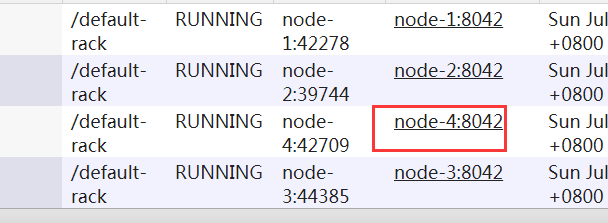
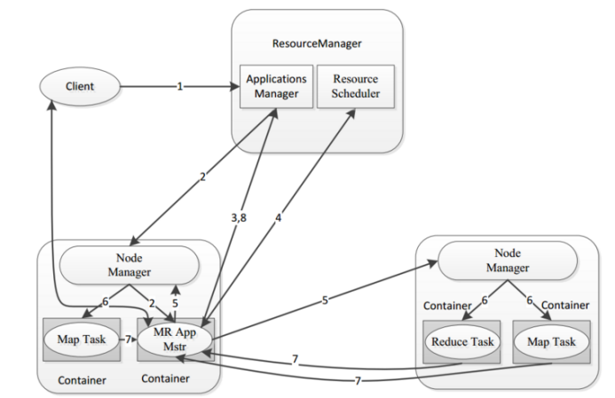
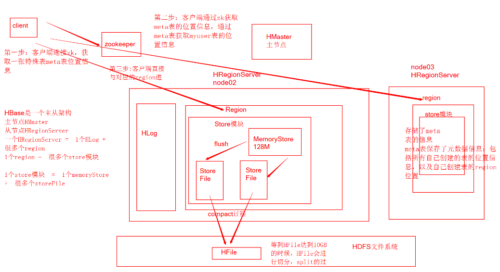
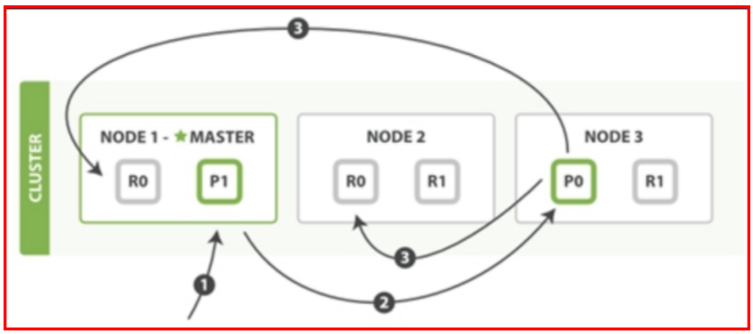

typora-copy-images-to: assert

# 大数据开发复习课程


## 1、Hadoop


### 1.1、介绍Hadoop

* 广义上来说，Hadoop通常是指一个更广泛的概念——Hadoop生态圈。
* 狭义上说，Hadoop指Apache这款开源框架，它的核心组件有：
  * HDFS（分布式文件系统）：解决海量数据存储
  * YARN（作业调度和集群资源管理的框架）：解决资源任务调度
  * MAPREDUCE（分布式运算编程框架）：解决海量数据计算


### 1.2、Hadoop特性优点

* 扩容能力（Scalable）：Hadoop是在可用的计算机集群间分配数据并完成计算任务的，这些集群可用方便的扩展到数以千计的节点中。
* 成本低（Economical）：Hadoop通过普通廉价的机器组成服务器集群来分发以及处理数据，以至于成本很低。
* 高效率（Efficient）：通过并发数据，Hadoop可以在节点之间动态并行的移动数据，使得速度非常快。
* 可靠性（Rellable）：能自动维护数据的多份复制，并且在任务失败后能自动地重新部署（redeploy）计算任务。所以Hadoop的按位存储和处理数据的能力值得人们信赖。


### 1.3、hadoop集群中hadoop都需要启动哪些进程，他们的作用分别是什么？

* namenode =>HDFS的守护进程，负责维护整个文件系统，存储着整个文件系统的元数据信息，image+edit log 
* datanode  =>是具体文件系统的工作节点，当我们需要某个数据，namenode告诉我们去哪里找，就直接和那个DataNode对应的服务器的后台进程进行通信，由DataNode进行数据的检索，然后进行具体的读/写操作
* secondarynamenode  =>一个守护进程，相当于一个namenode的元数据的备份机制，定期的更新，和namenode进行通信，将namenode上的image和edits进行合并，可以作为namenode的备份使用
* resourcemanager =>是yarn平台的守护进程，负责所有资源的分配与调度，client的请求由此负责，监控nodemanager
* nodemanager  => 是单个节点的资源管理，执行来自resourcemanager的具体任务和命令
* DFSZKFailoverController高可用时它负责监控NN的状态，并及时的把状态信息写入ZK。它通过一个独立线程周期性的调用NN上的一个特定接口来获取NN的健康状态。FC也有选择谁作为Active NN的权利，因为最多只有两个节点，目前选择策略还比较简单（先到先得，轮换）。
* 7）JournalNode 高可用情况下存放namenode的editlog文件


### 1.4、Hadoop主要的配置文件

* hadoop-env.sh

  * 文件中设置的是Hadoop运行时需要的环境变量。JAVA_HOME是必须设置的，即使我们当前的系统中设置了JAVA_HOME，它也是不认识的，因为Hadoop即使是在本机上执行，它也是把当前的执行环境当成远程服务器。

* core-site.xml

  * 设置Hadoop的文件系统地址

    ~~~xml
    <property>
    		<name>fs.defaultFS</name>
    		<value>hdfs://node-1:9000</value>
    </property>
    ~~~


* hdfs-site.xml

  * 指定HDFS副本的数量

  *  secondary namenode 所在主机的ip和端口

    ~~~xml
    <property>
    		<name>dfs.replication</name>
    		<value>2</value>
        </property>

        <property>
     		 <name>dfs.namenode.secondary.http-address</name>
      		 <value>node-2:50090</value>
        </property>
    ~~~

    ​


* mapred-site.xml

  * 指定mr运行时框架，这里指定在yarn上，默认是local

    ~~~xml
    <property>
    		<name>mapreduce.framework.name</name>
    		<value>yarn</value>
    </property>
    ~~~

    ​

* yarn-site.xml

  * 指定YARN的主角色（ResourceManager）的地址

    ~~~xml
    <property>
    		<name>yarn.resourcemanager.hostname</name>
    		<value>node-1</value>
    </property>
    ~~~

  ​


### 1.5、Hadoop集群重要命令

* 初始化

  * hadoop namenode –format

* 启动dfs

  * start-dfs.sh

* 启动yarn

  * start-yarn.sh

* 启动任务历史服务器

  * mr-jobhistory-daemon.sh start historyserver

* 一键启动

  * start-all.sh

* 启动成功后：

  * NameNode	http://nn_host:port/	默认50070.
    * ResourceManagerhttp://rm_host:port/	默认 8088

  

  

  ​

| 选项名称           | 使用格式                                     | 含义             |
| -------------- | ---------------------------------------- | -------------- |
| -ls            | -ls <路径>                                 | 查看指定路径的当前目录结构  |
| -lsr           | -lsr <路径>                                | 递归查看指定路径的目录结构  |
| -du            | -du <路径>                                 | 统计目录下个文件大小     |
| -dus           | -dus <路径>                                | 汇总统计目录下文件(夹)大小 |
| -count         | -count [-q] <路径>                         | 统计文件(夹)数量      |
| -mv            | -mv <源路径> <目的路径>                         | 移动             |
| -cp            | -cp <源路径> <目的路径>                         | 复制             |
| -rm            | -rm [-skipTrash] <路径>                    | 删除文件/空白文件夹     |
| -rmr           | -rmr [-skipTrash] <路径>                   | 递归删除           |
| -put           | -put <多个linux上的文件> <hdfs路径>              | 上传文件           |
| -copyFromLocal | -copyFromLocal <多个linux上的文件> <hdfs路径>    | 从本地复制          |
| -moveFromLocal | -moveFromLocal <多个linux上的文件> <hdfs路径>    | 从本地移动          |
| -getmerge      | -getmerge <源路径> <linux路径>                | 合并到本地          |
| -cat           | -cat <hdfs路径>                            | 查看文件内容         |
| -text          | -text <hdfs路径>                           | 查看文件内容         |
| -copyToLocal   | -copyToLocal [-ignoreCrc] [-crc] [hdfs源路径] [linux目的路径] | 从本地复制          |
| -moveToLocal   | -moveToLocal [-crc] <hdfs源路径> <linux目的路径> | 从本地移动          |
| -mkdir         | -mkdir <hdfs路径>                          | 创建空白文件夹        |
| -setrep        | -setrep [-R] [-w] <副本数> <路径>             | 修改副本数量         |
| -touchz        | -touchz <文件路径>                           | 创建空白文件         |
| -stat          | -stat [format] <路径>                      | 显示文件统计信息       |
| -tail          | -tail [-f] <文件>                          | 查看文件尾部信息       |
| -chmod         | -chmod [-R] <权限模式> [路径]                  | 修改权限           |
| -chown         | -chown [-R] [属主][:[属组]] 路径               | 修改属主           |
| -chgrp         | -chgrp [-R] 属组名称 路径                      | 修改属组           |
| -help          | -help [命令选项]                             | 帮助             |

### 1.6、HDFS的垃圾桶机制

* 修改core-site.xml

  ~~~xml
    <property>
          <name>fs.trash.interval</name>
          <value>1440</value>
     </property>
  ~~~

* 这个时间以分钟为单位，例如1440=24h=1天。HDFS的垃圾回收的默认配置属性为 0，也就是说，如果你不小心误删除了某样东西，那么这个操作是不可恢复的。 


### 1.7、HDFS写数据流程

HDFS dfs -put a.txt /


**详细步骤**：

* 1）客户端通过Distributed FileSystem模块向namenode请求上传文件，namenode检查目标文件是否已存在，父目录是否存在。
* 2）namenode返回是否可以上传。
* 3）客户端请求第一个 block上传到哪几个datanode服务器上。
* 4）namenode返回3个datanode节点，分别为dn1、dn2、dn3。
* 5）客户端通过FSDataOutputStream模块请求dn1上传数据，dn1收到请求会继续调用dn2，然后dn2调用dn3，将这个通信管道建立完成。
* 6）dn1、dn2、dn3逐级应答客户端。
* 7）客户端开始往dn1上传第一个block（先从磁盘读取数据放到一个本地内存缓存），以packet为单位（大小为64k），dn1收到一个packet就会传给dn2，dn2传给dn3；dn1每传一个packet会放入一个应答队列等待应答。
* 8）当一个block传输完成之后，客户端再次请求namenode上传第二个block的服务器。


### 1.8、Hadoop读数据流程


**详细步骤**：

* 1）客户端通过Distributed FileSystem向namenode请求下载文件，namenode通过查询元数据，找到文件块所在的datanode地址。
* 2）挑选一台datanode（就近原则，然后随机）服务器，请求读取数据。
* 3）datanode开始传输数据给客户端（从磁盘里面读取数据输入流，以packet为单位来做校验,大小为64k）。
* 4）客户端以packet为单位接收，先在本地缓存，然后写入目标文件。作者：李小李的路


### 1.9、SecondaryNameNode的作用

​	NameNode职责是管理元数据信息，DataNode的职责是负责数据具体存储，那么SecondaryNameNode的作用是什么？

答：它的职责是**合并NameNode的edit logs到fsimage文件**。


​	每达到触发条件 [达到一个小时，或者事物数达到100万]，会由secondary namenode将namenode上积累的所有edits和一个最新的fsimage下载到本地，并加载到内存进行merge（这个过程称为checkpoint），如下图所示：


### 1.10、HDFS的扩容、缩容（面试）

#### 1．动态扩容

​	随着公司业务的增长，数据量越来越大，原有的datanode节点的容量已经不能满足存储数据的需求，需要在原有集群基础上动态添加新的数据节点。也就是俗称的**动态扩容**。

​	有时候旧的服务器需要进行退役更换，暂停服务，可能就需要在当下的集群中停止某些机器上hadoop的服务，俗称**动态缩容**。


##### 1.1． 基础准备

在基础准备部分，主要是设置hadoop运行的系统环境

修改新机器系统hostname（通过/etc/sysconfig/network进行修改）


修改hosts文件，将集群所有节点hosts配置进去（集群所有节点保持hosts文件统一）


设置NameNode到DataNode的免密码登录（ssh-copy-id命令实现）

修改主节点slaves文件，添加新增节点的ip信息（集群重启时配合一键启动脚本使用）


在新的机器上上传解压一个新的hadoop安装包，从主节点机器上将hadoop的所有配置文件，scp到新的节点上。

##### 1.2． 添加datanode

* 在namenode所在的机器的

/export/servers/hadoop-2.6.0-cdh5.14.0/etc/hadoop目录下创建dfs.hosts文件

~~~
cd /export/servers/hadoop-2.6.0-cdh5.14.0/etc/hadoop

vim dfs.hosts

添加如下主机名称（包含新服役的节点）

node-1

node-2

node-3

node-4

~~~


 

* 在namenode机器的hdfs-site.xml配置文件中增加dfs.hosts属性

cd /export/servers/hadoop-2.6.0-cdh5.14.0/etc/hadoop

vim hdfs-site.xml

~~~xml 
<property>
  <name>dfs.hosts</name>
  <value>/export/servers/hadoop-2.6.0-cdh5.14.0/etc/hadoop/dfs.hosts</value>
</property>
~~~


​	dfs.hosts属性的意义：命名一个文件，其中包含允许连接到namenode的主机列表。必须指定文件的完整路径名。如果该值为空，则允许所有主机。相当于一个白名单，也可以不配置。

在新的机器上单独启动datanode：  hadoop-daemon.sh start datanode


刷新页面就可以看到新的节点加入进来了

 

##### 1.3．datanode负载均衡服务

新加入的节点，没有数据块的存储，使得集群整体来看负载还不均衡。因此最后还需要对hdfs负载设置均衡，因为默认的数据传输带宽比较低，可以设置为64M，即hdfs dfsadmin -setBalancerBandwidth 67108864即可

默认balancer的threshold为10%，即各个节点与集群总的存储使用率相差不超过10%，我们可将其设置为5%。然后启动Balancer，

sbin/start-balancer.sh -threshold 5，等待集群自均衡完成即可。

#### 1.4．添加nodemanager

在新的机器上单独启动nodemanager：  

yarn-daemon.sh start nodemanager



 

在ResourceManager，通过yarn node -list查看集群情况

 

#### 2．动态缩容

##### 2.1．添加退役节点

在namenode所在服务器的hadoop配置目录etc/hadoop下创建dfs.hosts.exclude文件，并添加需要退役的主机名称。

注意：该文件当中一定要写真正的主机名或者ip地址都行，不能写node-4

**node04.hadoop.com**

在namenode机器的hdfs-site.xml配置文件中增加dfs.hosts.exclude属性

cd /export/servers/hadoop-2.6.0-cdh5.14.0/etc/hadoop

vim hdfs-site.xml

~~~xml
<property> 
        <name>dfs.hosts.exclude</name>
        <value>/export/servers/hadoop-2.6.0-cdh5.14.0/etc/hadoop/dfs.hosts.exclude</value>
</property>
~~~


dfs.hosts.exclude属性的意义：命名一个文件，其中包含不允许连接到namenode的主机列表。必须指定文件的完整路径名。如果值为空，则不排除任何主机。

##### 2.2．刷新集群

在namenode所在的机器执行以下命令，刷新namenode，刷新resourceManager。

hdfs dfsadmin -refreshNodes

yarn rmadmin –refreshNodes


等待退役节点状态为decommissioned（所有块已经复制完成），停止该节点及节点资源管理器。注意：如果副本数是3，服役的节点小于等于3，是不能退役成功的，需要修改副本数后才能退役。

node-4执行以下命令，停止该节点进程

**cd /export/servers/hadoop-2.6.0-cdh5.14.0**

**sbin/hadoop-daemon.sh stop datanode**

**sbin/yarn-daemon.sh stop nodemanager**

 

namenode所在节点执行以下命令刷新namenode和resourceManager

**hdfs dfsadmin –refreshNodes**

**yarn rmadmin –refreshNodes**

 

namenode所在节点执行以下命令进行均衡负载

**cd /export/servers/hadoop-2.6.0-cdh5.14.0/**

**sbin/start-balancer.sh**


### 1.11、HDFS安全模式

​	安全模式是HDFS所处的一种特殊状态，在这种状态下，文件系统只接受读数据请求，而不接受删除、修改等变更请求，是一种保护机制，用于保证集群中的数据块的安全性。

​	在NameNode主节点启动时，HDFS首先进入安全模式，集群会开始检查数据块的完整性。DataNode在启动的时候会向namenode汇报可用的block信息，当整个系统达到安全标准时，HDFS自动离开安全模式。


* 手动进入安全模式

  ~~~properties
  hdfs dfsadmin -safemode enter
  ~~~

* 手动离开安全模式

  ~~~properties 
  hdfs dfsadmin -safemode leave
  ~~~


### 1.12、机架感知

​	hadoop自身是没有机架感知能力的，必须通过人为的设定来达到这个目的。一种是通过配置一个脚本来进行映射；另一种是通过实现DNSToSwitchMapping接口的resolve()方法来完成网络位置的映射。

* 1、写一个脚本，然后放到hadoop的core-site.xml配置文件中，用namenode和jobtracker进行调用。

~~~python
#!/usr/bin/python
#-*-coding:UTF-8 -*-
import sys

rack = {"hadoop-node-31":"rack1",
                                "hadoop-node-32":"rack1",
                                "hadoop-node-33":"rack1",
                                "hadoop-node-34":"rack1",
                                "hadoop-node-49":"rack2",
                                "hadoop-node-50":"rack2",
                                "hadoop-node-51":"rack2",
                                "hadoop-node-52":"rack2",
                                "hadoop-node-53":"rack2",
                                "hadoop-node-54":"rack2",
                                "192.168.1.31":"rack1",
                                "192.168.1.32":"rack1",
                                "192.168.1.33":"rack1",
                                "192.168.1.34":"rack1",
                                "192.168.1.49":"rack2",
                                "192.168.1.50":"rack2",
                                "192.168.1.51":"rack2",
                                "192.168.1.52":"rack2",
                                "192.168.1.53":"rack2",
                                "192.168.1.54":"rack2",
                                }

if __name__=="__main__":
        print "/" + rack.get(sys.argv[1],"rack0")
~~~


* 2、将脚本赋予可执行权限chmod +x RackAware.py，并放到bin/目录下。

* 3、然后打开conf/core-site.html

  ~~~xml
      <property>
          <name>topology.script.file.name</name>
          <value>/opt/modules/hadoop/hadoop-1.0.3/bin/RackAware.py</value>
  <!--机架感知脚本路径-->
      </property>
      <property>
          <name>topology.script.number.args</name>
          <value>20</value>
  <!--机架服务器数量，由于我写了20个，所以这里写20-->
      </property>
  ~~~

* 4、重启Hadoop集群

* namenode日志

  ~~~
  2012-06-08 14:42:19,174 INFO org.apache.hadoop.hdfs.StateChange: BLOCK* NameSystem.registerDatanode: node registration from 192.168.1.49:50010 storage DS-1155827498-192.168.1.49-50010-1338289368956
  2012-06-08 14:42:19,204 INFO org.apache.hadoop.net.NetworkTopology: Adding a new node: /rack2/192.168.1.49:50010
  2012-06-08 14:42:19,205 INFO org.apache.hadoop.hdfs.StateChange: BLOCK* NameSystem.registerDatanode: node registration from 192.168.1.53:50010 storage DS-1773813988-192.168.1.53-50010-1338289405131
  2012-06-08 14:42:19,226 INFO org.apache.hadoop.net.NetworkTopology: Adding a new node: /rack2/192.168.1.53:50010
  2012-06-08 14:42:19,226 INFO org.apache.hadoop.hdfs.StateChange: BLOCK* NameSystem.registerDatanode: node registration from 192.168.1.34:50010 storage DS-2024494948-127.0.0.1-50010-1338289438983
  2012-06-08 14:42:19,242 INFO org.apache.hadoop.net.NetworkTopology: Adding a new node: /rack1/192.168.1.34:50010
  2012-06-08 14:42:19,242 INFO org.apache.hadoop.hdfs.StateChange: BLOCK* NameSystem.registerDatanode: node registration from 192.168.1.54:50010 storage DS-767528606-192.168.1.54-50010-1338289412267
    2012-06-08 14:42:49,492 INFO org.apache.hadoop.hdfs.StateChange: STATE* Network topology has 2 racks and 10 datanodes
    2012-06-08 14:42:49,492 INFO org.apache.hadoop.hdfs.StateChange: STATE* UnderReplicatedBlocks has 0 blocks
    2012-06-08 14:42:49,642 INFO org.apache.hadoop.hdfs.server.namenode.FSNamesystem: ReplicateQueue QueueProcessingStatistics: First cycle completed 0 blocks in 0 msec
    2012-06-08 14:42:49,642 INFO org.apache.hadoop.hdfs.server.namenode.FSNamesystem: ReplicateQueue QueueProcessingStatistics: Queue flush completed 0 blocks in 0 msec processing time, 0 msec clock time, 1 cycles

  ~~~


## 2、MapReduce

### 2.1、介绍MapReduce

​	MapReduce的思想核心是“**分而治之**”，适用于大量复杂的任务处理场景（大规模数据处理场景）。

​	Map负责“分”，即把复杂的任务分解为若干个“简单的任务”来并行处理。可以进行拆分的前提是这些小任务可以并行计算，彼此间几乎没有依赖关系。

​	Reduce负责“合”，即对map阶段的结果进行全局汇总。


​							图：MapReduce思想模型


### 2.2、会写Wordcount

* **定义一个mapper类**

~~~Java
//首先要定义四个泛型的类型
//keyin:  LongWritable    valuein: Text
//keyout: Text            valueout:IntWritable

public class WordCountMapper extends Mapper<LongWritable, Text, Text, IntWritable>{
	//map方法的生命周期：  框架每传一行数据就被调用一次
	//key :  这一行的起始点在文件中的偏移量
	//value: 这一行的内容
	@Override
	protected void map(LongWritable key, Text value, Context context) throws IOException, InterruptedException {
		//拿到一行数据转换为string
		String line = value.toString();
		//将这一行切分出各个单词
		String[] words = line.split(" ");
		//遍历数组，输出<单词，1>
		for(String word:words){
			context.write(new Text(word), new IntWritable(1));
		}
	}
}
~~~


* **定义一个reducer类**

~~~Java
//生命周期：框架每传递进来一个kv 组，reduce方法被调用一次  
	@Override
	protected void reduce(Text key, Iterable<IntWritable> values, Context context) throws IOException, InterruptedException {
		//定义一个计数器
		int count = 0;
		//遍历这一组kv的所有v，累加到count中
		for(IntWritable value:values){
			count += value.get();
		}
		context.write(key, new IntWritable(count));
	}
}
~~~

* **定义一个主类，用来描述job并提交job**

~~~Java
public class WordCountRunner {
	//把业务逻辑相关的信息（哪个是mapper，哪个是reducer，要处理的数据在哪里，输出的结果放哪里……）描述成一个job对象
	//把这个描述好的job提交给集群去运行
	public static void main(String[] args) throws Exception {
		Configuration conf = new Configuration();
		Job wcjob = Job.getInstance(conf);
		//指定我这个job所在的jar包
//		wcjob.setJar("/home/hadoop/wordcount.jar");
		wcjob.setJarByClass(WordCountRunner.class);
		
		wcjob.setMapperClass(WordCountMapper.class);
		wcjob.setReducerClass(WordCountReducer.class);
		//设置我们的业务逻辑Mapper类的输出key和value的数据类型
		wcjob.setMapOutputKeyClass(Text.class);
		wcjob.setMapOutputValueClass(IntWritable.class);
		//设置我们的业务逻辑Reducer类的输出key和value的数据类型
		wcjob.setOutputKeyClass(Text.class);
		wcjob.setOutputValueClass(IntWritable.class);
		
		//指定要处理的数据所在的位置
		FileInputFormat.setInputPaths(wcjob, "hdfs://hdp-server01:9000/wordcount/data/big.txt");
		//指定处理完成之后的结果所保存的位置
		FileOutputFormat.setOutputPath(wcjob, new Path("hdfs://hdp-server01:9000/wordcount/output/"));
		
		//向yarn集群提交这个job
		boolean res = wcjob.waitForCompletion(true);
		System.exit(res?0:1);
	}
~~~


### 2.3、Combiner

​	  每一个map都可能会产生大量的本地输出，Combiner的作用就是对map端的输出先做一次合并，以减少在map和reduce节点之间的数据传输量，以提高网络IO性能。

​	例如：对于hadoop自带的wordcount的例子，value就是一个叠加的数字，
​	所以map一结束就可以进行reduce的value叠加，而不必要等到所有的map结束再去进行reduce的value叠加。


* 具体使用

~~~Java
自定义Combiner：

public static class MyCombiner extends  Reducer<Text, LongWritable, Text, LongWritable> {
        protected void reduce(
                Text key, Iterable<LongWritable> values,Context context)throws IOException, InterruptedException {

            long count = 0L;
            for (LongWritable value : values) {
                count += value.get();
            }
            context.write(key, new LongWritable(count));
        };
    }

~~~

* 在主类中添加

~~~Java
Combiner设置
    // 设置Map规约Combiner
    job.setCombinerClass(MyCombiner.class);

执行后看到map的输出和combine的输入统计是一致的，而combine的输出与reduce的输入统计是一样的。
~~~


### 2.4、partitioner

​	在进行MapReduce计算时，有时候需要把最终的输出数据分到不同的文件中，比如按照省份划分的话，需要把同一省份的数据放到一个文件中；按照性别划分的话，需要把同一性别的数据放到一个文件中。负责实现划分数据的类称作Partitioner。

* HashPartitioner源码如下

~~~Java
package org.apache.hadoop.mapreduce.lib.partition;

import org.apache.hadoop.mapreduce.Partitioner;

/** Partition keys by their {@link Object#hashCode()}. */
public class HashPartitioner<K, V> extends Partitioner<K, V> {

  /** Use {@link Object#hashCode()} to partition. */
  public int getPartition(K key, V value,
                          int numReduceTasks) {
    //默认使用key的hash值与上int的最大值，避免出现数据溢出 的情况
    return (key.hashCode() & Integer.MAX_VALUE) % numReduceTasks;
  }

}
~~~


* **key、value分别指的是Mapper任务的输出，numReduceTasks指的是设置的Reducer任务数量，默认值是1**。那么任何整数与1相除的余数肯定是0。也就是说getPartition(…)方法的返回值总是0。也就是Mapper任务的输出总是送给一个Reducer任务，最终只能输出到一个文件中。

**具体实现**：


~~~Java
import org.apache.hadoop.io.IntWritable;
import org.apache.hadoop.mapreduce.Partitioner;

public class FivePartitioner extends Partitioner<IntWritable, IntWritable>{

    /**
     * 我们的需求：按照能否被5除尽去分区
     * 
     * 1、如果除以5的余数是0，  放在0号分区
     * 2、如果除以5的余数不是0，  放在1分区
     */
    @Override
    public int getPartition(IntWritable key, IntWritable value, int numPartitions) {
        
        int intValue = key.get();
        
        if(intValue % 5 == 0){
            return 0;
        }else{
           return 1;
        }    
    }
}
~~~

* 在主函数里加入如下两行代码即可：

~~~Java
job.setPartitionerClass(FivePartitioner.class);
job.setNumReduceTasks(2);//设置为2
~~~


### 2.5、MapReduce的执行流程


* 详细流程

* Map阶段

  * l **第一阶段**是把输入目录下文件按照一定的标准逐个进行逻辑切片，形成切片规划。默认情况下，Split size = Block size。每一个切片由一个MapTask处理。（getSplits）

    l **第二阶段**是对切片中的数据按照一定的规则解析成<key,value>对。默认规则是把每一行文本内容解析成键值对。key是每一行的起始位置(单位是字节)，value是本行的文本内容。（TextInputFormat）

    l **第三阶段**是调用Mapper类中的map方法。上阶段中每解析出来的一个<k,v>，调用一次map方法。每次调用map方法会输出零个或多个键值对。

    l **第四阶段**是按照一定的规则对第三阶段输出的键值对进行分区。默认是只有一个区。分区的数量就是Reducer任务运行的数量。默认只有一个Reducer任务。

    l **第五阶段**是对每个分区中的键值对进行排序。首先，按照键进行排序，对于键相同的键值对，按照值进行排序。比如三个键值对<2,2>、<1,3>、<2,1>，键和值分别是整数。那么排序后的结果是<1,3>、<2,1>、<2,2>。如果有第六阶段，那么进入第六阶段；如果没有，直接输出到文件中。

    l **第六阶段**是对数据进行局部聚合处理，也就是combiner处理。键相等的键值对会调用一次reduce方法。经过这一阶段，数据量会减少。**本阶段默认是没有的。**

* reduce阶段

  * l **第一阶段**是Reducer任务会主动从Mapper任务复制其输出的键值对。Mapper任务可能会有很多，因此Reducer会复制多个Mapper的输出。

    l **第二阶段**是把复制到Reducer本地数据，全部进行合并，即把分散的数据合并成一个大的数据。再对合并后的数据排序。

    l **第三阶段**是对排序后的键值对调用reduce方法。键相等的键值对调用一次reduce方法，每次调用会产生零个或者多个键值对。最后把这些输出的键值对写入到HDFS文件中。

### 2.6、MapReduce的shuffle阶段


* shuffle被称作MapReduce的心脏，是MapReduce的核心。

* 由上图看出，每个数据切片由一个Mapper进程处理，也就是说mappper只是处理文件的一部分。

* 每一个Mapper进程都有一个环形的内存缓冲区，用来存储Map的输出数据，这个内存缓冲区的默认大小是100MB，当数据达到阙值0.8，也就是80MB的时候，一个后台的程序就会把数据溢写到磁盘中。在将数据溢写到磁盘的过程中要经过复杂的过程，首先要将数据进行分区排序（按照分区号如0，1,2），分区完以后为了避免Map输出数据的内存溢出，可以将Map的输出数据分为各个小文件再进行分区，这样map的输出数据就会被分为了具有多个小文件的分区已排序过的数据。然后将各个小文件分区数据进行合并成为一个大的文件（将各个小文件中分区号相同的进行合并）。

* 这个时候Reducer启动了三个分别为0,1,2。0号Reducer会取得0号分区 的数据；1号Reducer会取得1号分区的数据；2号Reducer会取得2号分区的数据。

  ​

### 2.7、MapReduce优化

#### 2.7.1、资源相关参数

//以下参数是在用户自己的MapReduce应用程序中配置就可以生效

(1) mapreduce.map.memory.mb: 一个Map Task可使用的内存上限（单位:MB），默认为1024。如果Map Task实际使用的资源量超过该值，则会被强制杀死。

(2) mapreduce.reduce.memory.mb: 一个Reduce Task可使用的资源上限（单位:MB），默认为1024。如果Reduce Task实际使用的资源量超过该值，则会被强制杀死。

(3) mapreduce.map.cpu.vcores: 每个Maptask可用的最多cpu core数目, 默认值: 1

(4) mapreduce.reduce.cpu.vcores: 每个Reducetask可用最多cpu core数目默认值: 1

(5) mapreduce.map.java.opts: Map Task的JVM参数，你可以在此配置默认的java heap 

size等参数, 例如：“-Xmx1024m -verbose:gc -Xloggc:/tmp/@taskid@.gc”

（@taskid@会被Hadoop框架自动换为相应的taskid）, 默认值: “”

(6) mapreduce.reduce.java.opts: Reduce Task的JVM参数，你可以在此配置默认的java 

heap size等参数, 例如：“-Xmx1024m -verbose:gc -Xloggc:/tmp/@taskid@.gc”, 默认值: “”

//应该在yarn启动之前就配置在服务器的配置文件中才能生效

(1) yarn.scheduler.minimum-allocation-mb RM中每个容器请求的最小配置，以MB为单位，默认1024。

(2) yarn.scheduler.maximum-allocation-mb RM中每个容器请求的最大分配，以MB为单位，默认8192。

(3) yarn.scheduler.minimum-allocation-vcores	1	

(4)yarn.scheduler.maximum-allocation-vcores	32

(5) yarn.nodemanager.resource.memory-mb   表示该节点上YARN可使用的物理内存总量，默认是8192（MB），注意，如果你的节点内存资源不够8GB，则需要调减小这个值，而YARN不会智能的探测节点的物理内存总量。

//shuffle性能优化的关键参数，应在yarn启动之前就配置好

(1) mapreduce.task.io.sort.mb   100    shuffle的环形缓冲区大小，默认100m

(2) mapreduce.map.sort.spill.percent   0.8    环形缓冲区溢出的阈值，默认80%


#### 2.7.2、容错相关参数

(1) mapreduce.map.maxattempts: 每个Map Task最大重试次数，一旦重试参数超过该值，则认为Map Task运行失败，默认值：4。

(2) mapreduce.reduce.maxattempts: 每个Reduce Task最大重试次数，一旦重试参数超过该值，则认为Map Task运行失败，默认值：4。

(3) mapreduce.map.failures.maxpercent: 当失败的Map Task失败比例超过该值，整个作业则失败，默认值为0. 如果你的应用程序允许丢弃部分输入数据，则该该值设为一个大于0的值，比如5，表示如果有低于5%的Map Task失败（如果一个Map Task重试次数超过mapreduce.map.maxattempts，则认为这个Map Task失败，其对应的输入数据将不会产生任何结果），整个作业扔认为成功。

(4) mapreduce.reduce.failures.maxpercent: 当失败的Reduce Task失败比例超过该值为，整个作业则失败，默认值为0.

(5) mapreduce.task.timeout:如果一个task在一定时间内没有任何进入，即不会读取新的数据，也没有输出数据，则认为该task处于block状态，可能是临时卡住，也许永远会卡住。为了防止因为用户程序永远block不退出，则强制设置了一个超时时间（单位毫秒），默认是600000，值为0将禁用超时。


#### 2.7.3、效率跟稳定性参数

(1) mapreduce.map.speculative: 是否为Map Task打开推测执行机制，默认为true, 如果为true，则可以并行执行一些Map任务的多个实例。

(2) mapreduce.reduce.speculative: 是否为Reduce Task打开推测执行机制，默认为true

(3)mapreduce.input.fileinputformat.split.minsize: FileInputFormat做切片时最小切片大小，默认1。

(5)mapreduce.input.fileinputformat.split.maxsize: FileInputFormat做切片时最大切片大小


### 2.8、mapreduce程序在yarn上的执行流程

Hadoop jar xxx.jar 




**详细流程**：

* 一：客户端向集群提交一个任务，该任务首先到ResourceManager中的ApplicationManager;
* 二：ApplicationManager收到任务之后，会在集群中找一个NodeManager，并在该NodeManager所在DataNode上启动一个AppMaster进程，该进程用于进行任务的划分和任务的监控；
* 三：AppMaster启动起来之后，会向ResourceManager中的ApplicationManager注册其信息（目的是与之通信）；
* 四：AppMaster向ResourceManager下的ResourceScheduler申请计算任务所需的资源；
* 五：AppMaster申请到资源之后，会与所有的NodeManager通信要求它们启动计算任务所需的任务（Map和Reduce）；
* 六：各个NodeManager启动对应的容器用来执行Map和Reduce任务；
* 七：各个任务会向AppMaster汇报自己的执行进度和执行状况，以便让AppMaster随时掌握各个任务的运行状态，在某个任务出了问题之后重启执行该任务；
* 八：在任务执行完之后，AppMaster向ApplicationManager汇报，以便让ApplicationManager注销并关闭自己，使得资源得以回收；


### 2.9、执行MapReduce常见的问题

1. client对集群中HDFS的操作没有权限

~~~XML
在集群配置文件hdfs-site.xml
property>
     <name>dfs.permissions</name>
    <value>false</value>
</property>
然后重启
~~~


2. mapreduce的输出路径已存在，必须先删除掉那个路径


3. 提交集群运行，运行失败

~~~java 
job.setJar("/home/hadoop/wordcount.jar");
~~~


4. 日志打不出来，报警告信息

   ~~~~verilog
   log4j:WARN No appenders could be found for logger (org.apache.hadoop.metrics2.lib.MutableMetricsFactory).  
   log4j:WARN Please initialize the log4j system properly.  
   log4j:WARN See http://logging.apache.org/log4j/1.2/faq.html#noconfig for more info.  
   ~~~~

   需要在项目的src下面新建file名为log4j.properties的文件


## 3、yarn

### 3.1、介绍yarn

​	通用资源管理系统和调度平台，可为上层应用提供统一的资源管理和调度。可以把yarn理解为相当于一个分布式的操作系统平台，而mapreduce等运算程序则相当于运行于操作系统之上的应用程序，Yarn为这些程序提供运算所需的资源（内存、cpu）。


### 3.2、yarn的基本架构


​	YARN是一个资源管理、任务调度的框架，主要包含三大模块：ResourceManager（RM）、NodeManager（NM）、ApplicationMaster（AM）。

​	**ResourceManager负责所有资源的监控、分配和管理；**

​	**ApplicationMaster负责每一个具体应用程序的调度和协调**；

​	**NodeManager负责每一个节点的维护。**

​	对于所有的applications，RM拥有绝对的控制权和对资源的分配权。而每个AM则会和RM协商资源，同时和NodeManager通信来执行和监控task。


### 3.3、yarn三大组件

#### 3.3.1．ResourceManager

* ResourceManager负责整个集群的资源管理和分配，是一个全局的资源管理系统。
* NodeManager以心跳的方式向ResourceManager汇报资源使用情况（目前主要是CPU和内存的使用情况）。RM只接受NM的资源回报信息，对于具体的资源处理则交给NM自己处理。
* YARN Scheduler根据application的请求为其分配资源，不负责application job的监控、追踪、运行状态反馈、启动等工作。

#### 3.3.2． NodeManager

* NodeManager是每个节点上的资源和任务管理器，它是管理这台机器的代理，负责该节点程序的运行，以及该节点资源的管理和监控。YARN集群每个节点都运行一个NodeManager。
* NodeManager定时向ResourceManager汇报本节点资源（CPU、内存）的使用情况和Container的运行状态。当ResourceManager宕机时NodeManager自动连接RM备用节点。
* NodeManager接收并处理来自ApplicationMaster的Container启动、停止等各种请求。

#### 3.3.3． ApplicationMaster

* 用户提交的每个应用程序均包含一个ApplicationMaster，它可以运行在ResourceManager以外的机器上。
* 负责与RM调度器协商以获取资源（用Container表示）。
* 将得到的任务进一步分配给内部的任务(资源的二次分配)。
* 与NM通信以启动/停止任务。
* 监控所有任务运行状态，并在任务运行失败时重新为任务申请资源以重启任务。
* 当前YARN自带了两个ApplicationMaster实现，一个是用于演示AM编写方法的实例程序DistributedShell，它可以申请一定数目的Container以并行运行一个Shell命令或者Shell脚本；另一个是运行MapReduce应用程序的AM—MRAppMaster。

注：RM只负责监控AM，并在AM运行失败时候启动它。RM不负责AM内部任务的容错，任务的容错由AM完成。


### 3.4、Yarn 调度器Scheduler

​	在**Yarn中，负责给应用分配资源的就是Scheduler**。在Yarn中有三种调度器可以选择：FIFO Scheduler ，Capacity Scheduler，Fair Scheduler。


#### 3.4.1.FIFO Scheduler

**FIFO** Scheduler把应用按提交的顺序排成一个队列，这是一个**先进先出**队列，在进行资源分配的时候，先给队列中最头上的应用进行分配资源，待最头上的应用需求满足后再给下一个分配，以此类推。

 

​	FIFO Scheduler是最简单也是最容易理解的调度器，也不需要任何配置，但它并不适用于共享集群。大的应用可能会占用所有集群资源，这就导致其它应用被阻塞。在共享集群中，更适合采用Capacity Scheduler或Fair Scheduler，这两个调度器都允许大任务和小任务在提交的同时获得一定的系统资源。


#### 3.4.2． Capacity Scheduler

​	Capacity 调度器允许多个组织共享整个集群，每个组织可以获得集群的一部分计算能力。通过为每个组织分配专门的队列，然后再为每个队列分配一定的集群资源，这样整个集群就可以通过设置多个队列的方式给多个组织提供服务了。除此之外，队列内部又可以垂直划分，这样一个组织内部的多个成员就可以共享这个队列资源了，在一个队列内部，资源的调度是采用的是先进先出(FIFO)策略。

 

​	容量调度器 Capacity Scheduler 最初是由 Yahoo 最初开发设计使得 Hadoop 应用能够被多用户使用，且最大化整个集群资源的吞吐量，现被 IBM BigInsights 和 Hortonworks HDP 所采用。

​	Capacity Scheduler 被设计为允许应用程序在一个可预见的和简单的方式共享集群资源，即"作业队列"。Capacity Scheduler 是根据租户的需要和要求把现有的资源分配给运行的应用程序。Capacity Scheduler 同时允许应用程序访问还没有被使用的资源，以确保队列之间共享其它队列被允许的使用资源。管理员可以控制每个队列的容量，Capacity Scheduler 负责把作业提交到队列中。


#### 3.4.3．Fair Scheduler

​	在Fair调度器中，我们不需要预先占用一定的系统资源，Fair调度器会为所有运行的job动态的调整系统资源。如下图所示，当第一个大job提交时，只有这一个job在运行，此时它获得了所有集群资源；当第二个小任务提交后，Fair调度器会分配一半资源给这个小任务，让这两个任务公平的共享集群资源。

需要注意的是，在下图Fair调度器中，从第二个任务提交到获得资源会有一定的延迟，因为它需要等待第一个任务释放占用的Container。小任务执行完成之后也会释放自己占用的资源，大任务又获得了全部的系统资源。最终效果就是Fair调度器即得到了高的资源利用率又能保证小任务及时完成。

 

​	公平调度器 Fair Scheduler 最初是由 Facebook 开发设计使得 Hadoop 应用能够被多用户公平地共享整个集群资源，现被 Cloudera CDH 所采用。

Fair Scheduler 不需要保留集群的资源，因为它会动态在所有正在运行的作业之间平衡资源。


## 4、hive

### 4.1、hive的介绍


​	Hive是基于Hadoop的一个数据仓库工具，可以将结构化的数据文件**映射**为一张数据库表，并提供类SQL查询功能。

​	本质是将**SQL转换为MapReduce**程序。

​	主要用途：用来做离线数据分析，比直接用MapReduce开发效率更高。


### 4.2、hive的架构


**用户接口**：包括 CLI、JDBC/ODBC、WebGUI。其中，CLI(command line interface)为shell命令行；JDBC/ODBC是Hive的JAVA实现，与传统数据库JDBC类似；WebGUI是通过浏览器访问Hive。

**元数据存储**：通常是存储在关系数据库如 mysql/derby中。Hive 将元数据存储在数据库中。Hive 中的元数据包括表的名字，表的列和分区及其属性，表的属性（是否为外部表等），表的数据所在目录等。

**解释器、编译器、优化器、执行器**:完成 HQL 查询语句从词法分析、语法分析、编译、优化以及查询计划的生成。生成的查询计划存储在 HDFS 中，并在随后有 MapReduce 调用执行。


### 4.3、Hive 数据模型

Hive中所有的数据都存储在HDFS中，没有专门的数据存储格式

在创建表时指定数据中的分隔符，Hive 就可以映射成功，解析数据。

**Hive中包含以下数据模型**：

**db：**在hdfs中表现为hive.metastore.warehouse.dir目录下一个文件夹

**table：**在hdfs中表现所属db目录下一个文件夹

**external table：**数据存放位置可以在HDFS任意指定路径

**partition：**在hdfs中表现为table目录下的子目录

**bucket：**在hdfs中表现为同一个表目录下根据hash散列之后的多个文件


### 4.4、常用操作

##### 4.4.1、数据库相关

Hive配置单元包含一个名为 default 默认的数据库.

* ---创建数据库

create database [if not exists] <database name>；

* --显示所有数据库

show databases;  

*  --删除数据库

drop database if exists <database name> [restrict|cascade]; 

​	默认情况下，hive不允许删除含有表的数据库，要先将数据库中的表清空才能drop，否则会报错
--加入cascade关键字，可以强制删除一个数据库

	hive> drop database if exists users cascade;
* --切换数据库

use <database name>; 


##### 4.4.2、内部表外部表

``` sql
建内部表
create table 
student(Sno int,Sname string,Sex string,Sage int,Sdept string) 
row format delimited fields terminated by ',';
建外部表
create external table 
student_ext(Sno int,Sname string,Sex string,Sage int,Sdept string) 
row format delimited fields terminated by ',' location '/stu';
```


```sql
内、外部表加载数据：
load data local inpath '/root/hivedata/students.txt' overwrite into table student;

load data inpath '/stu' into table student_ext;
```


##### 4.4.3、创建分区表

* 分区建表分为2种，一种是单分区，也就是说在表文件夹目录下只有一级文件夹目录。另外一种是多分区，表文件夹下出现多文件夹嵌套模式。
* 单分区建表语句


```sql
create table day_table (id int, content string) partitioned by (dt string);
单分区表，按天分区，在表结构中存在id，content，dt三列。
```
* 双分区建表语句

~~~sql
create table day_hour_table (id int, content string) partitioned by (dt string, hour string);
双分区表，按天和小时分区，在表结构中新增加了dt和hour两列。
~~~


```sql
 导入数据
 load data local inpath '/root/hivedata/dat_table.txt' into table day_table partition(dt='2017-07-07');
 
 load data local inpath '/root/hivedata/dat_table.txt' into table day_hour_table partition(dt='2017-07-07', hour='08');
 
 基于分区的查询：

 SELECT day_table.* FROM day_table WHERE day_table.dt = '2017-07-07';

 查看分区
 show partitions day_hour_table;  

总的说来partition就是辅助查询，缩小查询范围，加快数据的检索速度和对数据按照一定的规格和条件进行管理。
```
* 指定分隔符

  ---指定分隔符创建分区表

  ~~~ sql
  create table day_table (id int, content string) partitioned by (dt string) row format delimited fields terminated by ',';
  ~~~

  ---复杂类型的数据表指定分隔符

  数据如下

  ~~~properties
  zhangsan	beijing,shanghai,tianjin,hangzhou
  wangwu	shanghai,chengdu,wuhan,haerbin
  ~~~

  建表语句

  ~~~sql
  create table
  complex_array(name string,work_locations array<string>) 
  row format delimited fields terminated by '\t' 
  collection items terminated by ',';
  ~~~


##### 4.4.4、增删分区

* 增加分区

~~~ sql
alter table t_partition add partition (dt='2008-08-08') location 'hdfs://node-21:9000/t_parti/';

执行添加分区  /t_parti文件夹下的数据不会被移动。并且没有分区目录dt=2008-08-08 
~~~


* 删除分区

~~~sql
alter table t_partition drop partition (dt='2008-08-08');

执行删除分区时/t_parti下的数据会被删除并且连同/t_parti文件夹也会被删除

注意区别于load data时候添加分区:会移动数据 会创建分区目录
~~~


##### 4.4.5、hive中的join

~~~sql
准备数据
1,a
2,b
3,c
4,d
7,y
8,u

2,bb
3,cc
7,yy
9,pp


建表：
create table a(id int,name string)
row format delimited fields terminated by ',';

create table b(id int,name string)
row format delimited fields terminated by ',';

导入数据：
load data local inpath '/root/hivedata/a.txt' into table a;
load data local inpath '/root/hivedata/b.txt' into table b;


实验：
** inner join
select * from a inner join b on a.id=b.id;

+-------+---------+-------+---------+--+
| a.id  | a.name  | b.id  | b.name  |
+-------+---------+-------+---------+--+
| 2     | b       | 2     | bb      |
| 3     | c       | 3     | cc      |
| 7     | y       | 7     | yy      |
+-------+---------+-------+---------+--+


**left join   
select * from a left join b on a.id=b.id;
+-------+---------+-------+---------+--+
| a.id  | a.name  | b.id  | b.name  |
+-------+---------+-------+---------+--+
| 1     | a       | NULL  | NULL    |
| 2     | b       | 2     | bb      |
| 3     | c       | 3     | cc      |
| 4     | d       | NULL  | NULL    |
| 7     | y       | 7     | yy      |
| 8     | u       | NULL  | NULL    |
+-------+---------+-------+---------+--+


**right join
select * from a right join b on a.id=b.id;

select * from b right join a on b.id=a.id;
+-------+---------+-------+---------+--+
| a.id  | a.name  | b.id  | b.name  |
+-------+---------+-------+---------+--+
| 2     | b       | 2     | bb      |
| 3     | c       | 3     | cc      |
| 7     | y       | 7     | yy      |
| NULL  | NULL    | 9     | pp      |
+-------+---------+-------+---------+--+


**
select * from a full outer join b on a.id=b.id;
+-------+---------+-------+---------+--+
| a.id  | a.name  | b.id  | b.name  |
+-------+---------+-------+---------+--+
| 1     | a       | NULL  | NULL    |
| 2     | b       | 2     | bb      |
| 3     | c       | 3     | cc      |
| 4     | d       | NULL  | NULL    |
| 7     | y       | 7     | yy      |
| 8     | u       | NULL  | NULL    |
| NULL  | NULL    | 9     | pp      |
+-------+---------+-------+---------+--+


**hive中的特别join
select * from a left semi join b on a.id = b.id;

select a.* from a inner join b on a.id=b.id;
+-------+---------
| a.id  | a.name  
+-------+---------
| 2     | b       
| 3     | c       
| 7     | y       
+-------+---------
相当于
select a.id,a.name from a where a.id in (select b.id from b); 在hive中效率极低

select a.id,a.name from a join b on (a.id = b.id);

select * from a inner join b on a.id=b.id;


cross join（##慎用）
返回两个表的笛卡尔积结果，不需要指定关联键。
select a.*,b.* from a cross join b;
~~~

##### 4.4.6、json解析

~~~sql
1、先加载rating.json文件到hive的一个原始表 rat_json
样例：{"movie":"1193","rate":"5","timeStamp":"978300760","uid":"1"}

create table rat_json(line string) row format delimited;
load data local inpath '/root/hivedata/rating.json' into table rat_json;

2、需要解析json数据成四个字段，插入一张新的表 t_rating
drop table if exists t_rating;
create table t_rating(movieid string,rate int,timestring string,uid string)
row format delimited fields terminated by '\t';

3、json表数据解析到rating表中
insert overwrite table t_rating
select 
get_json_object(line,'$.movie') as moive,
get_json_object(line,'$.rate') as rate,
get_json_object(line,'$.timeStamp') as timestring, get_json_object(line,'$.uid') as uid 
from rat_json limit 10;

~~~


### 4.5、常用函数

##### 4.5.1、数值函数

* 指定精度取整函数 : **round**

  语法: round(double a, int d)

  返回值: DOUBLE

  说明: 返回指定精度d的double类型

  举例：

  ~~~sql
  hive> select round(3.1415926,4) from dual;

  3.1416
  ~~~


* 向下取整函数 : **floor**

  语法: floor(double a)

  返回值: BIGINT

  说明: 返回等于或者小于该double变量的最大的整数

  举例：

  ~~~sql
  hive> select floor(3.1415926) from dual;
  3

  hive> select floor(25) from dual;
  25
  ~~~

  ​

* 向上取整函数 : **ceil**

  语法: ceil(double a)

  返回值: BIGINT

  说明: 返回等于或者大于该double变量的最小的整数

  举例：

  ~~~sql
  hive> select ceil(3.1415926) from dual;
  4

  hive> select ceil(46) from dual;
  46
  ~~~

  ​

* 取随机数函数 : **rand**

  语法: rand(),rand(int seed)

  返回值: double

  说明: 返回一个0到1范围内的随机数。如果指定种子seed，则会等到一个稳定的随机数序列

  举例：

  ~~~sql 
  hive> select rand() from dual;

  0.5577432776034763
  ~~~

  ​

* 绝对值函数 : **abs**

  语法: abs(double a)   abs(int a)

  返回值: double        int

  说明: 返回数值a的绝对值

  举例：

  ~~~sql
  hive> select abs(-3.9) from dual;
  3.9

  hive> select abs(10.9) from dual;
  10.9
  ~~~

  ​


##### 4.5.2、日期函数

* **to_date(string timestamp)**:返回时间字符串中的日期部分,
  * 如to_date('1970-01-01 00:00:00')='1970-01-01'
* **current_date**:返回当前日期
* **year(date)**：返回日期date的年,类型为int
  * 如year('2019-01-01')=2019
* **month(date)**：返回日期date的月,类型为int,
  * 如month('2019-01-01')=1
* **day(date)**:  返回日期date的天,类型为int,
  * 如day('2019-01-01')=1
* **weekofyear(date1)**：返回日期date1位于该年第几周。
  * 如weekofyear('2019-03-06')=10
* **datediff(date1,date2)**:返回日期date1与date2相差的天数
  * 如datediff('2019-03-06','2019-03-05')=1
* **date_add(date1,int1)**:返回日期date1加上int1的日期
  * 如date_add('2019-03-06',1)='2019-03-07'
* **date_sub(date1,int1)**:返回日期date1减去int1的日期
  * 如date_sub('2019-03-06',1)='2019-03-05'
* **months_between(date1,date2)**:返回date1与date2相差月份
  * 如months_between('2019-03-06','2019-01-01')=2
* **add_months(date1,int1)**:返回date1加上int1个月的日期，int1可为负数
  * 如add_months('2019-02-11',-1)='2019-01-11'
* **last_day(date1)**:返回date1所在月份最后一天
  * 如last_day('2019-02-01')='2019-02-28'
* **next_day(date1,day1)**:返回日期date1的下个星期day1的日期。day1为星期X的英文前两字母
  * 如next_day('2019-03-06','MO') 返回'2019-03-11'
* **trunc(date1,string1):**返回日期最开始年份或月份。string1可为年(YYYY/YY/YEAR)或月(MONTH/MON/MM)。
  * 如trunc('2019-03-06','MM')='2019-03-01'，trunc('2019-03-06','YYYY')='2019-01-01'
* **unix_timestamp()**:返回当前时间的unix时间戳，可指定日期格式。
  * 如unix_timestamp('2019-03-06','yyyy-mm-dd')=1546704180
* **from_unixtime()**:返回unix时间戳的日期，可指定格式。
  * 如select from_unixtime(unix_timestamp('2019-03-06','yyyy-mm-dd'),'yyyymmdd')='20190306'
    ​


##### 4.5.3、条件函数

* **if(boolean,t1,t2)**:若布尔值成立，则返回t1,反正返回t2。
  * 如if(1>2,100,200)返回200
* **case when boolean then t1 else t2 end**:若布尔值成立，则t1,否则t2,可加多重判断
* **coalesce(v0,v1,v2)**:返回参数中的第一个非空值,若所有值均为null,则返回null。
  * 如coalesce(null,1,2)返回1
* **isnull(a)**:若a为null则返回true，否则返回false


##### 4.5.4、字符串函数

* **length(string1)**:返回字符串长度
* **concat(string1,string2)**:返回拼接string1及string2后的字符串
* **concat_ws(sep,string1,string2)**:返回按指定分隔符拼接的字符串
* **lower(string1)**:返回小写字符串，同lcase(string1)。upper()/ucase()：返回大写字符串
* **trim(string1)**:去字符串左右空格，ltrim(string1):去字符串左空格。rtrim(string1):去字符串右空
* **repeat(string1，int1)**：返回重复string1字符串int1次后的字符串
* **reverse(string1)**:返回string1反转后的字符串。
  * 如reverse('abc')返回'cba'
* **rpad(string1,len1,pad1)**:以pad1字符右填充string1字符串，至len1长度。
  * 如rpad('abc',5,'1')返回'abc11'。lpad()：左填充
* **split(string1,pat1)**:以pat1正则分隔字符串string1,返回数组。
  * 如split('a,b,c',',')返回["a","b","c"]
* **substr(string1,index1,int1)**:以index位置起截取int1个字符。
  * 如substr('abcde',1,2)返回'ab'
    ​

##### 4.5.5、类型转换

​	Hive的原子数据类型是可以进行隐式转换的，类似于Java的类型转换，例如某表达式使用INT类型，TINYINT会自动转换为INT类型，但是Hive不会进行反向转化，例如，某表达式使用TINYINT类型，INT不会自动转换为TINYINT类型，它会返回错误，除非使用CAST操作。

* cast(value AS TYPE)
  * select cast('1' as DOUBLE)； 返回1.0


### 4.6、hive常用的优化


#### 4.6.1、 Fetch抓取（Hive可以避免进行MapReduce）

​	Hive中对某些情况的查询可以不必使用MapReduce计算。例如：SELECT * FROM employees;在这种情况下，Hive可以简单地读取employee对应的存储目录下的文件，然后输出查询结果到控制台。

​	在hive-default.xml.template文件中hive.fetch.task.conversion默认是more，老版本hive默认是minimal，该属性修改为more以后，在全局查找、字段查找、limit查找等都不走mapreduce。

**案例实操**：

​	1）把hive.fetch.task.conversion设置成none，然后执行查询语句，都会执行mapreduce程序。

~~~sql
hive (default)> set hive.fetch.task.conversion=none;

hive (default)> select * from score;

hive (default)> select s_score from score;

hive (default)> select s_score from score limit 3;

~~~


2）把hive.fetch.task.conversion设置成more，然后执行查询语句，如下查询方式都不会执行mapreduce程序。

~~~sql
hive (default)> set hive.fetch.task.conversion=more;

hive (default)> select * from score;

hive (default)> select s_score from score;

hive (default)> select s_score from score limit 3;
~~~


#### 4.6.2、本地模式

​	大多数的Hadoop Job是需要Hadoop提供的完整的可扩展性来处理大数据集的。不过，有时Hive的输入数据量是非常小的。在这种情况下，为查询触发执行任务时消耗可能会比实际job的执行时间要多的多。对于大多数这种情况，Hive可以通过本地模式在单台机器上处理所有的任务。对于小数据集，执行时间可以明显被缩短。

​	用户可以通过设置hive.exec.mode.local.auto的值为true，来让Hive在适当的时候自动启动这个优化。

~~~sql
set hive.exec.mode.local.auto=true;  //开启本地mr
//设置local mr的最大输入数据量，当输入数据量小于这个值时采用local  mr的方式，默认为134217728，即128M
set hive.exec.mode.local.auto.inputbytes.max=51234560;
//设置local mr的最大输入文件个数，当输入文件个数小于这个值时采用local mr的方式，默认为4
set hive.exec.mode.local.auto.input.files.max=10;
~~~

案例实操：

~~~sql
1）开启本地模式，并执行查询语句
hive (default)> set hive.exec.mode.local.auto=true; 
hive (default)> select * from score cluster by s_id;
18 rows selected (1.568 seconds)
2）关闭本地模式，并执行查询语句
hive (default)> set hive.exec.mode.local.auto=false; 
hive (default)> select * from score cluster by s_id;
18 rows selected (11.865 seconds)
~~~


#### 4.6.3、分区表分桶表

* 分区表对sql过滤查询是一种优化
* 分桶表对join操作时提升性能很大,桶为表加上了额外的结构，Hive 在处理有些查询时能利用这个结构。具体而言，连接两个在（包含连接列的）相同列上划分了桶的表，可以使用 Map 端连接 （Map-side join）高效的实现。比如JOIN操作。对于JOIN操作两个表有一个相同的列，如果对这两个表都进行了桶操作。那么将保存相同列值的桶进行JOIN操作就可以，可以大大较少JOIN的数据量。
  ​


#### 4.6.4、join优化

##### 4.6.4.1、小表Join大表

* （新的版本当中已经没有区别了，旧的版本当中需要使用小表）

1）将key相对分散，并且数据量小的表放在join的左边，这样可以有效减少内存溢出错误发生的几率；再进一步，可以使用Group让小的维度表（1000条以下的记录条数）先进内存。在map端完成reduce。

2）多个表关联时，最好分拆成小段，避免大sql（无法控制中间Job）

3）大表Join大表

（1）空KEY过滤

有时join超时是因为某些key对应的数据太多，而相同key对应的数据都会发送到相同的reducer上，从而导致内存不够。此时我们应该仔细分析这些异常的key，很多情况下，这些key对应的数据是异常数据，我们需要在SQL语句中进行过滤。例如key对应的字段为空。

对比如下：

**不过滤**

~~~sql 
INSERT OVERWRITE TABLE jointable
SELECT a.* FROM nullidtable a JOIN ori b ON a.id = b.id;
结果：
No rows affected (152.135 seconds)
~~~

**过滤**

~~~sql 
INSERT OVERWRITE TABLE jointable
SELECT a.* FROM (SELECT * FROM nullidtable WHERE id IS NOT NULL ) a JOIN ori b ON a.id = b.id;
结果：
No rows affected (141.585 seconds)
~~~


##### 4.6.4.2、mapjoin

​	如果不指定MapJoin或者不符合MapJoin的条件，那么Hive解析器会将Join操作转换成Common Join，即：在Reduce阶段完成join。容易发生数据倾斜。可以用MapJoin把小表全部加载到内存在map端进行join，避免reducer处理。

1）开启MapJoin参数设置：

（1）设置自动选择Mapjoin

set hive.auto.convert.join = true; 默认为true

（2）大表小表的阈值设置（默认25M以下认为是小表）：

set hive.mapjoin.**smalltable**.filesize=25123456;

#### 4.6.5、group by

默认情况下，Map阶段同一Key数据分发给一个reduce，当一个key数据过大时就倾斜了。

​    并不是所有的聚合操作都需要在Reduce端完成，很多聚合操作都可以先在Map端进行部分聚合，最后在Reduce端得出最终结果。

1）开启Map端聚合参数设置

​	（1）是否在Map端进行聚合，默认为True

​    **set hive.map.aggr = true;**

（2）在Map端进行聚合操作的条目数目

​    **set hive.groupby.mapaggr.checkinterval = 100000;**

（3）有数据倾斜的时候进行负载均衡（默认是false）

​    **set hive.groupby.skewindata = true;**

 	当选项设定为 true，生成的查询计划会有两个MR Job。第一个MR Job中，Map的输出结果会随机分布到Reduce中，每个Reduce做部分聚合操作，并输出结果，这样处理的结果是相同的Group By Key有可能被分发到不同的Reduce中，从而达到负载均衡的目的；第二个MR Job再根据预处理的数据结果按照Group By Key分布到Reduce中（这个过程可以保证相同的Group By Key被分布到同一个Reduce中），最后完成最终的聚合操作。


#### 4.6.6、Map数

1. 通常情况下，作业会通过input的目录产生一个或者多个map任务。

   主要的决定因素有：input的文件总个数，input的文件大小，集群设置的文件块大小(目前为128M，可在hive中通过set dfs.block.size;命令查看到，该参数不能自定义修改)；

2. 举例：

   a)  假设input目录下有1个文件a，大小为780M，那么hadoop会将该文件a分隔成7个块（6个128m的块和1个12m的块），从而产生7个map数。

   b) 假设input目录下有3个文件a，b，c大小分别为10m，20m，150m，那么hadoop会分隔成4个块（10m，20m，128m，22m），从而产生4个map数。即，如果文件大于块大小(128m)，那么会拆分，如果小于块大小，则把该文件当成一个块。

3. 是不是map数越多越好？

   答案是否定的。如果一个任务有很多小文件（远远小于块大小128m），则每个小文件也会被当做一个块，用一个map任务来完成，而一个map任务启动和初始化的时间远远大于逻辑处理的时间，就会造成很大的资源浪费。而且，同时可执行的map数是受限的。

4. 是不是保证每个map处理接近128m的文件块，就高枕无忧了？

   答案也是不一定。比如有一个127m的文件，正常会用一个map去完成，但这个文件只有一个或者两个小字段，却有几千万的记录，如果map处理的逻辑比较复杂，用一个map任务去做，肯定也比较耗时。

   针对上面的问题3和4，我们需要采取两种方式来解决：即减少map数和增加map数；

5. 如何增加map数

   如果表a只有一个文件，大小为120M，但包含几千万的记录，如果用1个map去完成这个任务，肯定是比较耗时的，这种情况下，我们要考虑将这一个文件合理的拆分成多个，这样就可以用多个map任务去完成。

   ~~~ sql
   set mapreduce.job.reduces =10;
   create table a_1 as
   select * from a
   distribute by rand(123);
   ~~~

   这样会将a表的记录，随机的分散到包含10个文件的a_1表中，再用a_1代替上面sql中的a表，则会用10个map任务去完成。


#### 4.6.7、reduce数

1. 调整reduce个数方法一

 （1）每个Reduce处理的数据量默认是256MB

​	hive.exec.reducers.bytes.per.reducer=256123456

（2）每个任务最大的reduce数，默认为1009

​	hive.exec.reducers.max=1009


2. 调整reduce个数方法二

   在hadoop的mapred-default.xml文件中修改

   设置每个job的Reduce个数

   set mapreduce.job.reduces = 15;

   ​

3. reduce个数并不是越多越好

   1）过多的启动和初始化reduce也会消耗时间和资源；

   2）另外，有多少个reduce，就会有多少个输出文件，如果生成了很多个小文件，那么如果这些小文件作为下一个任务的输入，则也会出现小文件过多的问题；

   在设置reduce个数的时候也需要考虑这两个原则：处理大数据量利用合适的reduce数；使单个reduce任务处理数据量大小要合适；


#### 4.6.8、jvm重用

​	JVM重用是Hadoop调优参数的内容，其对Hive的性能具有非常大的影响，特别是对于很难避免小文件的场景或task特别多的场景，这类场景大多数执行时间都很短。

​	JVM重用可以使得JVM实例在同一个job中重新使用N次。N的值可以在Hadoop的mapred-site.xml文件中进行配置。通常在10-20之间，具体多少需要根据具体业务场景测试得出。

~~~xml
<property>
  <name>mapreduce.job.jvm.numtasks</name>
  <value>10</value>
  <description>How many tasks to run per jvm. If set to -1, there is
  no limit. 
  </description>
</property>
~~~

我们也可以在hive当中通过

~~~sql
set  mapred.job.reuse.jvm.num.tasks=10;
~~~

这个设置来设置我们的jvm重用

**缺点**：

​	开启JVM重用将一直占用使用到的task插槽，以便进行重用，直到任务完成后才能释放。如果某个“不平衡的”job中有某几个reduce task执行的时间要比其他Reduce task消耗的时间多的多的话，那么保留的插槽就会一直空闲着却无法被其他的job使用，直到所有的task都结束了才会释放。


#### 4.6.9、数据压缩与存储格式

##### 1.压缩方式

  	压缩可以节约磁盘的空间，基于文本的压缩率可达40%+; 压缩可以增加吞吐量和性能量(减小载入内存的数据量)，但是在压缩和解压过程中会增加CPU的开销。所以针对IO密集型的jobs(非计算密集型)可以使用压缩的方式提高性能。 几种压缩算法：


##### 2.存储格式

1. TextFile

   ~~~
   Hive数据表的默认格式，存储方式：行存储。 可以使用Gzip压缩算法，但压缩后的文件不支持split 在反序列化过程中，必须逐个字符判断是不是分隔符和行结束符，因此反序列化开销会比SequenceFile高几十倍。
   ~~~

   ​

2. Sequence Files

   ~~~
   	Hadoop中有些原生压缩文件的缺点之一就是不支持分割。支持分割的文件可以并行	的有多个mapper程序处理大数据文件，大多数文件不支持可分割是因为这些文件只能从头开始读。Sequence File是可分割的文件格式，支持Hadoop的block级压缩。 Hadoop API提供的一种二进制文件，以key-value的形式序列化到文件中。存储方式：行存储。 sequencefile支持三种压缩选择：NONE，RECORD，BLOCK。Record压缩率低，RECORD是默认选项，通常BLOCK会带来较RECORD更好的压缩性能。 优势是文件和hadoop api中的MapFile是相互兼容的
   ~~~

   ​


3. RCFile

   ~~~
   存储方式：数据按行分块，每块按列存储。结合了行存储和列存储的优点：

   首先，RCFile 保证同一行的数据位于同一节点，因此元组重构的开销很低 其次，像列存储一样，RCFile 能够利用列维度的数据压缩，并且能跳过不必要的列读取 数据追加：RCFile不支持任意方式的数据写操作，仅提供一种追加接口，这是因为底层的 HDFS当前仅仅支持数据追加写文件尾部。 行组大小：行组变大有助于提高数据压缩的效率，但是可能会损害数据的读取性能，因为这样增加了 Lazy 解压性能的消耗。而且行组变大会占用更多的内存，这会影响并发执行的其他MR作业。
   ~~~


4. ORCFile

   ~~~
   	存储方式：数据按行分块，每块按照列存储。

   	压缩快，快速列存取。效率比rcfile高，是rcfile的改良版本。
   ~~~


5. Parquet

   ~~~
   	Parquet也是一种行式存储，同时具有很好的压缩性能；同时可以减少大量的表扫描和反序列化的时间
   ~~~

   ​

6. 自定义格式

   ~~~
   可以自定义文件格式，用户可通过实现InputFormat和OutputFormat来自定义输入输出格式。
   ~~~

   ​

**结论**，一般选择orcfile/parquet + snappy 的方式

~~~sql
create table tablename (
 xxx,string
 xxx, bigint
)
ROW FORMAT DELTMITED FIELDS TERMINATED BY '\t'
STORED AS orc tblproperties("orc.compress" = "SNAPPY")
~~~


#### 4.6.10、并行执行

* 当一个sql中有多个job时候，且这多个job之间没有依赖，则可以让顺序执行变为并行执行（一般为用到union all ）

~~~ sql
// 开启任务并行执行
 set hive.exec.parallel=true;
 // 同一个sql允许并行任务的最大线程数 
set hive.exec.parallel.thread.number=8;
~~~


#### 4.6.11、合并小文件

​	小文件的产生有三个地方，map输入，map输出，reduce输出，小文件过多也会影响hive的分析效率：

设置map输入的小文件合并

~~~sql
set mapred.max.split.size=256000000;  
//一个节点上split的至少的大小(这个值决定了多个DataNode上的文件是否需要合并)
set mapred.min.split.size.per.node=100000000;
//一个交换机下split的至少的大小(这个值决定了多个交换机上的文件是否需要合并)  
set mapred.min.split.size.per.rack=100000000;
//执行Map前进行小文件合并
set hive.input.format=org.apache.hadoop.hive.ql.io.CombineHiveInputFormat;
~~~

设置map输出和reduce输出进行合并的相关参数：

~~~sql
//设置map端输出进行合并，默认为true
set hive.merge.mapfiles = true
//设置reduce端输出进行合并，默认为false
set hive.merge.mapredfiles = true
//设置合并文件的大小
set hive.merge.size.per.task = 256*1000*1000
//当输出文件的平均大小小于该值时，启动一个独立的MapReduce任务进行文件merge。
set hive.merge.smallfiles.avgsize=16000000
~~~


### 4.7、hive的数据倾斜

表现：任务进度长时间维持在99%（或100%），查看任务监控页面，发现只有少量（1个或几个）reduce子任务未完成。因为其处理的数据量和其他reduce差异过大。

原因：某个reduce的数据输入量远远大于其他reduce数据的输入量

1)、key分布不均匀

2)、业务数据本身的特性

3)、建表时考虑不周

4)、某些SQL语句本身就有数据倾斜


## 5、sqoop

#### 5.1、sqoop介绍


sqoop是apache旗下一款**“Hadoop和关系数据库服务器之间传送数据”**的工具。

**导入数据**：MySQL，Oracle导入数据到Hadoop的HDFS、HIVE、HBASE等数据存储系统；

**导出数据：**从Hadoop的文件系统中导出数据到关系数据库mysql等

将导入或导出命令翻译成mapreduce程序来实现

在翻译出的mapreduce中主要是对inputformat和outputformat进行定制


#### 5.2、sqoop常见问题

##### 5.2.1、sqoop中文数据乱码问题


- mysql导入到hdfs

```
bin/sqoop import \
--connect jdbc:mysql://node03:3306/A  \
--username root \
--password 123456 \
--target-dir /A2 \
--table B --m 1

```

- mysql导入到hive

```
bin/sqoop import \
--connect "jdbc:mysql://node03:3306/A?useUnicode=true&characterEncoding=utf-8" \
--username root \
--password 123456 \
--table B \
--hive-import \
--m 1 \
--hive-database default;

```


- 从hdfs导出到mysql

```
bin/sqoop export \
--connect "jdbc:mysql://node03:3306/A?useUnicode=true&characterEncoding=utf-8" \
--username root \
--password 123456 \
--table B \
--export-dir /user/hive/warehouse/b

```


##### 5.2.2、sqoop中文注释乱码问题

参考资料：https://www.cnblogs.com/qingyunzong/p/8724155.html


##### 5.2.3、datax常见问题

1. oom

   ~~~shell
   在datax 中导数据使用过程中往往会因为，目标数据过大导致datax oom，那么可以调大datax的jvm参数来防止oom,在python命令后，使用 -jvm=”-Xms5G -Xmx 5G”来调大

   python datax.py  --jvm="-Xms5G -Xmx5G" ../job/test.json
   ~~~

2. 字段长度过长

   ~~~json
   如果报java.io.IOException: Maximum column length of 100,000 exceeded in column...异常信息，说明数据源column字段长度超过了100000字符。
   需要在json的reader里增加如下配置
    "csvReaderConfig":{
    "safetySwitch": false,
     "skipEmptyRecords": false,
     "useTextQualifier": false
        }
      safetySwitch = false;//单列长度不限制100000字符
   ~~~


## 6、HBASE

### 6.1、HBASE介绍

	hbase是bigtable的开源java版本。是建立在hdfs之上，提供高可靠性、高性能、列存储、可伸缩、实时读写nosql的数据库系统。

	HBase中的表一般有这样的特点：

	1.大：一个表可以有上十亿行，上百万列

	2. 面向列:面向列(族)的存储和权限控制，列(族)独立检索。

	3. 稀疏:对于为空(null)的列，并不占用存储空间，因此，表可以设计的非常稀疏。


### 6.2HBASE和Hdfs的区别

#### 1、HDFS

* 为分布式存储提供文件系统
* 针对存储大尺寸的文件进行优化，不需要对HDFS上的文件进行随机读写
* 直接使用文件
* 数据模型不灵活
* 使用文件系统和处理框架
* 优化一次写入，多次读取的方式

#### 2、HBase

* 提供表状的面向列的数据存储
* 针对表状数据的随机读写进行优化
* 使用key-value操作数据
* 提供灵活的数据模型
* 使用表状存储，支持MapReduce，依赖HDFS
* 优化了多次读，以及多次写


### 6.3、Redis，传统数据库，HBase，Hive

**Redis**

	分布式缓存，基于内存，强调缓存，支持数据持久化，支持事务操作，NoSQL 类型的Key/vale数据库，同时支持List、Set等更丰富的类型。


**hbase**

	HBase是建立在HDFS之上,提供高可靠性的列存储，实时读写的数据库系统。它介于Nosql和关系型数据库之间，仅通过主键和主键的range来检索数据，仅支持单行事务。主要用来存储非结构化和半结构化的松散数据。


**关系数据库**

	有mysql、Oracle、SqlServer等，支持事务性操作，属于写模式，即写入数据时进行检查。它是针对具体业务在数据库联机的日常操作，通常对少数记录进行查询、修改。支持完善的sql功能，可以对少量数据进行统计分析。


**hive**

	hive是基于Hadoop的数据仓库工具，可以将结构化数据文件映射为数据库表。并提供sql功能，可以将sql转化为mr任务运行。因为sql学习成本低，不必专门开发mr应用，十分适合数据仓库的统计分析。


**区别**：

	关系型数据和Hive都是支持SQL引擎的数据库；Redis和Hbase都是NoSQL 类型的Key/vale数据库，支持简单的行列操作，不支持SQL引擎。

	Redis因为存储在内存中所以数据量较小，而Hbase的存储远远超出内存的大小。HBase适合做大数据的持久存储，而Redis比较适合做缓存。RDBMS一般用来做支撑业务系统提供事物或者查询。hive是面相分析的分析型工具，作为海量数据的分析工具。

	Hive和HBase是两种基于Hadoop的不同技术：Hive是一种类SQL的引擎，并且运行MapReduce任务，HBase是一种在Hadoop之上的NoSQL 的Key/vale数据库，只支持简单的行列操作。当然，这两种工具是可以同时使用的。Hive可以用来进行统计查询，HBase可以用来进行快速的实时查询，二者可进行整合。


### 6.4、HBASE的架构


#### 1、HMaster

功能：

	1) 监控RegionServer

	2) 处理RegionServer故障转移

	3) 处理元数据的变更

	4) 处理region的分配或移除

	5) 在空闲时间进行数据的负载均衡

	6) 通过Zookeeper发布自己的位置给客户端

#### 2、RegionServer

功能：

	1) 负责存储HBase的实际数据

	2) 处理分配给它的Region

	3) 刷新缓存到HDFS

	4) 维护HLog

	5) 执行压缩

	6) 负责处理Region分片


### 6.5、常用HBASE shell


#### 1、进入HBase客户端命令操作界面

$ bin/hbase shell

#### 2、查看帮助命令

hbase(main):001:0> help

#### 3、查看当前数据库中有哪些表

hbase(main):002:0> list

#### 4、创建一张表

创建user表，包含info、data两个列族

~~~shell
hbase(main):010:0> create 'user', 'info', 'data'

或者
hbase(main):010:0> create 'user', {NAME => 'info', VERSIONS => '3'}，{NAME => 'data'}
~~~


#### 5、添加数据操作

* 向user表中插入信息，row key为rk0001，列族info中添加name列标示符，值为zhangsan

  hbase(main):011:0> put 'user', 'rk0001', 'info:name', 'zhangsan'

  ​

* 向user表中插入信息，row key为rk0001，列族info中添加gender列标示符，值为female

  hbase(main):012:0> put 'user', 'rk0001', 'info:gender', 'female'


* 向user表中插入信息，row key为rk0001，列族info中添加age列标示符，值为20

  hbase(main):013:0> put 'user', 'rk0001', 'info:age', 20


* 向user表中插入信息，row key为rk0001，列族data中添加pic列标示符，值为picture

  hbase(main):014:0> put 'user', 'rk0001', 'data:pic', 'picture'


#### 6、查询数据操作

##### 1、通过rowkey进行查询

获取user表中row key为rk0001的所有信息

hbase(main):015:0> get 'user', 'rk0001'

 

##### 2、查看rowkey下面的某个列族的信息

获取user表中row key为rk0001，info列族的所有信息

hbase(main):016:0> get 'user', 'rk0001', 'info'

 

 

##### 3、查看rowkey指定列族指定字段的值

获取user表中row key为rk0001，info列族的name、age列标示符的信息

hbase(main):017:0> get 'user', 'rk0001', 'info:name', 'info:age'


##### 4、查询所有数据

查询user表中的所有信息

scan 'user'

 

##### 5、列族查询

查询user表中列族为info的信息

scan 'user', {COLUMNS => 'info'}

#### 7、统计

hbase(main):053:0> count 'user'


#### 8.显示所有表

list


### 6.6、HBASE表数据模型


#### Row Key

与nosql数据库们一样,row key是用来检索记录的主键。访问hbase table中的行，只有三种方式：

1 通过单个row key访问

2 通过row key的range

3 全表扫描

Row key行键 (Row key)可以是任意字符串(最大长度是 64KB，实际应用中长度一般为 10-100bytes)，在hbase内部，row key保存为字节数组。

**Hbase会对表中的数据按照rowkey排序(字典顺序)**

 

#### 列族Column Family

​	hbase表中的每个列，都归属与某个列族。列族是表的schema的一部分(而列不是)，必须在使用表之前定义。列名都以列族作为前缀。例如courses:history ， courses:math 都属于 courses 这个列族。

​	列族越多，在取一行数据时所要参与IO、搜寻的文件就越多，所以，如果没有必要，不要设置太多的列族


#### 列 Column

​	列族下面的具体列，属于某一个ColumnFamily,类似于我们mysql当中创建的具体的列


#### 时间戳

​	HBase中通过row和columns确定的为一个存贮单元称为cell。每个 cell都保存着同一份数据的多个版本。版本通过时间戳来索引。时间戳的类型是 64位整型。时间戳可以由hbase(在数据写入时自动 )赋值，此时时间戳是精确到毫秒的当前系统时间。


##### Cell

由{row key, column( =<family> + <label>), version} 唯一确定的单元。

cell中的数据是没有类型的，全部是字节码形式存贮。


### 6.7、HBASE读请求过程

get 'user' 'rk0001'

java api




* HRegionServer保存着meta表以及表数据，要访问表数据，首先Client先去访问zookeeper，从zookeeper里面获取meta表所在的位置信息，即找到这个meta表在哪个HRegionServer上保存着。
* 接着Client通过刚才获取到的HRegionServer的IP来访问Meta表所在的HRegionServer，从而读取到Meta，进而获取到Meta表中存放的元数据。
* Client通过元数据中存储的信息，访问对应的HRegionServer，然后扫描所在HRegionServer的Memstore和Storefile来查询数据。
* 最后HRegionServer把查询到的数据响应给Client。


### 6.7、HBASE写请求过程


* Client也是先访问zookeeper，找到Meta表，并获取Meta表元数据。确定当前将要写入的数据所对应的HRegion和HRegionServer服务器。


* Client向该HRegionServer服务器发起写入数据请求，然后HRegionServer收到请求并响应。


* Client先把数据写入到HLog，以防止数据丢失。然后将数据写入到Memstore。
* 如果HLog和Memstore均写入成功，则这条数据写入成功
* 如果Memstore达到阈值，会把Memstore中的数据flush到Storefile中。
* 当Storefile越来越多，会触发Compact合并操作，把过多的Storefile合并成一个大的Storefile。
* 当Storefile越来越大，Region也会越来越大，达到阈值后，会触发Split操作，将Region一分为二。


### 6.8、hbase的预分区

#### 6.8.1、预分区有什么用

- 增加数据读写效率
- 负载均衡，防止数据倾斜
- 方便集群容灾调度region
- 优化Map数量


#### 6.8.2、如何预分区

​	每一个region维护着startRowkey与endRowKey，如果加入的数据符合某个region维护的rowKey范围，则该数据交给这个region维护。


#### 6.8.3、设定预分区

1. **手动设定预分区**

   ~~~
   create 'staff','info','partition1',SPLITS => ['1000','2000','3000','4000']
   ~~~

   

   2.**使用16进制算法生成预分区**

   ~~~
   create 'staff2','info','partition2',{NUMREGIONS => 15, SPLITALGO => 'HexStringSplit'}

   ~~~

   


### 6.9、HBASE的rowkey设计

#### 6.9.1、rowkey设计三原则

##### 1、长度原则

​	Rowkey 是一个二进制码流，Rowkey 的长度被很多开发者建议说设计在 10~100 个字节，不过建议是越短越好，不要超过 16 个字节，存为byte[]字节数组，**一般设计成定长的**。

　	数据的持久化文件 HFile 中是按照 KeyValue 存储的，如果 Rowkey 过长比如 100 个字 节，1000 万列数据光 Rowkey 就要占用 100*1000 万=10 亿个字节，将近 1G 数据，这会极大 影响 HFile 的存储效率；

##### 2、散列原则

​	如果 Rowkey 是按时间戳的方式递增，不要将时间放在二进制码的前面，建议将 Rowkey 的高位作为散列字段，由程序循环生成，低位放时间字段，这样将提高数据均衡分布在每个 Regionserver 实现负载均衡的几率。如果没有散列字段，首字段直接是时间信息将产生所有 新数据都在一个 RegionServer 上堆积的热点现象，这样在做数据检索的时候负载将会集中 在个别 RegionServer，降低查询效率。

​      row key是按照**字典序**存储，因此，设计row key时，要充分利用这个排序特点，将经常一起读取的数据存储到一块，将最近可能会被访问的数据放在一块。

​	举个例子：如果最近写入HBase表中的数据是最可能被访问的，可以考虑将时间戳作为row key的一部分，由于是字典序排序，所以可以使用Long.MAX_VALUE - timestamp作为row key，这样能保证新写入的数据在读取时可以被快速命中。

##### 3、唯一原则

　   必须在设计上保证其唯一性。rowkey 是按照字典顺序排序存储的，因此，设计 rowkey 的时候，要充分利用这个排序的特点，将经常读取的数据存储到一块，将最近可能会被访问 的数据放到一块。


#### 6.9.2、热点问题

 	热点发生在大量的 client 直接访问集群的一个或极少数个节点（访问可能是读， 写或者其他操作）。大量访问会使热点 region 所在的单个机器超出自身承受能力，引起性能 下降甚至 region 不可用，这也会影响同一个 RegionServer 上的其他 region，由于主机无法服 务其他 region 的请求。 设计良好的数据访问模式以使集群被充分，均衡的利用。 为了避免写热点，设计 rowkey 使得不同行在同一个 region，但是在更多数据情况下，数据 应该被写入集群的多个 region，而不是一个。

**解决方案：**

##### 加盐

​	这里所说的加盐不是密码学中的加盐，而是在 rowkey 的前面增加随机数，具体就是给 rowkey 分配一个随机前缀以使得它和之前的 rowkey 的开头不同。分配的前缀种类数量应该 和你想使用数据分散到不同的 region 的数量一致。加盐之后的 rowkey 就会根据随机生成的 前缀分散到各个 region 上，以避免热点。

~~~properties
原本 rowKey 为 1001 的，SHA1 后变成：dd01903921ea24941c26a48f2cec24e0bb0e8cc7 

原本 rowKey 为 3001 的，SHA1 后变成：49042c54de64a1e9bf0b33e00245660ef92dc7bd 

原本 rowKey 为 5001 的，SHA1 后变成：7b61dec07e02c188790670af43e717f0f46e8913

在做此操作之前，一般我们会选择从数据集中抽取样本，来决定什么样的 rowKey 来 Hash
后作为每个分区的临界值。
~~~


##### 哈希	

​	哈希会使同一行永远用一个前缀加盐。哈希也可以使负载分散到整个集群，但是读却是 可以预测的。使用确定的哈希可以让客户端重构完整的 rowkey，可以使用 get 操作准确获取 某一个行数据

##### 反转

　　反转 rowkey 的例子以手机号为 rowkey，可以将手机号反转后的字符串作为 rowkey，这 样的就避免了以手机号那样比较固定开头导致热点问题。

130xxx   155xx  156xx   180x x 189xx

##### 时间戳反转

　    一个常见的数据处理问题是快速获取数据的最近版本，使用反转的时间戳作为 rowkey 的一部分对这个问题十分有用，可以用 Long.Max_Value - timestamp 追加到 key 的末尾


## 7、Redis


### 7.1、Redis的介绍

​	 Redis是当前比较热门的NOSQL系统之一，它是一个开源的使用ANSI c语言编写的**key-value**存储系统"。Redis数据都是缓存在计算机内存中，它可以周期性的把更新的数据写入磁盘或者把修改操作写入追加的记录文件，实现数据的持久化。


### 7.2、Redis的数据类型

#### 7.2.1、String字符串

​	字符型类型在 Redis 中采用二进制，这说明该类型存入和获取的数据相同。在 Redis 中字符串类型的 Value 最多可以容纳数据长度是512M

- 赋值： set key value
- 取值：get key/getset key value
- 删除：del key
- 数值自增和自减： incr key/decr key
- 为key增加一个指定数值： incrby key increment
- 为key减少一个指定数值： decrby key decrement
- 拼凑字符串： append key value

具体操作如图


#### 7.2.2、hash列表

​	Redis hash 是一个string类型的field和value的映射表，hash特别适合用于存储对象。


- 赋值： hset key field value 为指定的key设置field/value对
- 赋值： hmset key field value [field2 value2...] 设置key中多个filed/value
- 取值： hget key field
- 取值： hmget key fileds  获取 key 中的多个filed 的值
- 取值： hgetall key 获取 key 中所有的 filed-value
- 删除： hdel key field[field...] 可以删除一个或多个字段，返回值是被删除的字段个数
- 删除 del key 删除整个list
- 增加数字： hincrby key field increment 设置key 中 filed 的值增加 increment
- 是否存在： hexists key field 判断指定 key 中的 filed 是否存在
- field的数量： hlen key 获取 key 所包含的 field 的数量
- 获得所有的key ：hkeys key
- 获得所有的value ：hvals key

具体操作如图


#### 7.2.3、list

​	Redis列表是简单的字符串列表，按照插入顺序排序。你可以添加一个元素到列表的头部（左边）或者尾部（右边）

- 头部插入：lpush key values[value1 value2...] 在指定的key所在头部插入所有的values，如果该 key 不存在，该命令在插入之前会创建一个与该 key 关联的空链表。插入成功，返回元素的个数
- 尾部插入：rpush key values[value1 value2...]
- 获得链表中从start 到 end元素的值：lrange key start end    若为-1则表示链表尾部元素，-2为倒数第二个
- 头部弹出：lpop key 返回并弹出指定的key 关联的链表中第一个元素，如果key 不存在 返回nil
- 尾部弹出：rpop key 
- 获得列表中元素格式：llen key
- lpushx key value：当参数中指定的 key 存在时，向关联的list的头部插入 value。如果不存在，将不进行插入
- rpushx key value:在该list的尾部添加
- lrem key cont value ：删除 coount 个值为 value 的元素，如果count大于0，从头到尾遍历并删除，如果count 小于0，则从尾向头遍历并删除。如果 count 等于0，则删除链表中所有等于value 的元素
- lset key index value ：设置链表中的index 的脚标的元素值，0代表链表的头元素，-1代表链表的尾元素。角标不存在则抛异常
- linsert key before|after pivot value ：在 pivot 元素前或者后插入 value 这个元素
- rpoplpush resource destination：将链表中的尾部元素弹出并添加到头部（循环操作）


#### 7.2.4、set集合

​	在Redis 中，可以将 Set 类型看作为没有排序的字符集合，Set 集合中不允许出现重复的元素

- sadd key values[value1 value2...]：向 set 中添加数据，如果该 key 的值已有则不会重复添加
- srem key members[member1 member2...]：删除 set 中指定的成员
- smembers key：获得 set 中所有的成员
- sismember key member：判断参数中指定的成员是否在该 set 中，1表示存在，0表示不存在或key本身不存在
- sdiff key1 key2...：返回 key1 与 key2 中相差的成员，而且与key的顺序有关。即返回差集。（A-B）
- sinter key1 key2 key3...：返回交集（A∩B）
- sunion key1 key2 key3...：返回并集（A∪B）
- scard key：获取 set 中成员的数量
- srandmember key：随机返回 set 中的一个成员
- sdiffsotre destination key1 key2...：将key1、key2相差的成员存储在destination 上
- sintersotre destination key[key...]：将返回的交集存储在 destination上
- sunionstore destination key[key...]：将返回的并集存储在 destination 上


### 7.3、Redis的持久化

​	由于redis是一个内存数据库，所有的数据都是保存在内存当中的，内存当中的数据极易丢失，所以redis的数据持久化就显得尤为重要，在redis当中，提供了两种数据持久化的方式，分别为RDB以及AOF，且redis默认开启的数据持久化方式为RDB方式。


#### 7.3.1、rdb(保存快照)

​	Redis会定期保存数据快照至一个rbd文件中，并在启动时自动加载rdb文件，恢复之前保存的数据。可以在配置文件中配置Redis进行快照保存的时机：

save [seconds][changes]

意为在[seconds]秒内如果发生了[changes]次数据修改，则进行一次RDB快照保存，例如

~~~
save 60 100
~~~

会让Redis每60秒检查一次数据变更情况，如果发生了100次或以上的数据变更，则进行RDB快照保存。


**优点**

​	1、 对性能影响最小。如前文所述，Redis在保存RDB快照时会fork出子进程进行，几乎不影响Redis处理客户端请求的效率。

​	2、 每次快照会生成一个完整的数据快照文件，所以可以辅以其他手段保存多个时间点的快照（例如把每天0点的快照备份至其他存储媒介中），作为非常可靠的灾难恢复手段。

​	3、 使用RDB文件进行数据恢复比使用AOF要快很多


**缺点**

​	1、 快照是定期生成的，所以在Redis crash时或多或少会丢失一部分数据。

​	2、 如果数据集非常大且CPU不够强（比如单核CPU），Redis在fork子进程时可能会消耗相对较长的时间，影响Redis对外提供服务的能力。


#### 7.3.2、AOF（预写日志）

​	采用AOF持久方式时，Redis会把每一个写请求都记录在一个日志文件里。在Redis重启时，会把AOF文件中记录的所有写操作顺序执行一遍，确保数据恢复到最新。AOF默认是关闭的，如要开启，进行如下配置：

~~~
appendonly yes
~~~

AOF提供了三种fsync配置，always/everysec/no，通过配置项[appendfsync]指定：

**appendfsync no**：不进行fsync，将flush文件的时机交给OS决定，速度最快

**appendfsync always**：每写入一条日志就进行一次fsync操作，数据安全性最高，但速度最慢

**appendfsync everysec**：折中的做法，交由后台线程每秒fsync一次


**优点**

1、 最安全，在启用appendfsync always时，任何已写入的数据都不会丢失，使用在启用appendfsync everysec也至多只会丢失1秒的数据

2、 AOF文件在发生断电等问题时也不会损坏，即使出现了某条日志只写入了一半的情况，也可以使用redis-check-aof工具轻松修复。

3、 AOF文件易读，可修改，在进行了某些错误的数据清除操作后，只要AOF文件没有rewrite，就可以把AOF文件备份出来，把错误的命令删除，然后恢复数据。


**缺点**

1、 AOF文件通常比RDB文件更大

2、 性能消耗比RDB高

3、 数据恢复速度比RDB慢


### 7.4、缓存雪崩

#### 7.4.1、我们为什么要用缓存(Redis)


#### 7.4.2、如果缓存挂了呢


#### 7.4.3、雪崩场景

* Redis挂掉了，请求全部走数据库。
* 对缓存数据设置相同的过期时间，导致某段时间内缓存失效，请求全部走数据库。


缓存雪崩如果发生了，很可能就把我们的数据库搞垮，导致整个服务瘫痪！


#### 7.4.4、如何解决缓存雪崩

* 对于“Redis挂掉了，请求全部走数据库”这种情况
  * 事发前：实现Redis的高可用(**主从架构+Sentinel（哨兵） 或者Redis Cluster（集群）)，尽量避免Redis挂掉这种情况发生**。
  * 事发中：万一Redis真的挂了，我们可以设置**本地缓存**(ehcache)+**限流**(hystrix)，尽量避免我们的数据库被干掉(起码能保证我们的服务还是能正常工作的)
  * 事发后：**redis持久化，重启后自动从磁盘上加载数据，快速恢复缓存数据**。
* 对于“对缓存数据设置相同的过期时间，导致某段时间内缓存失效，请求全部走数据库。”这种情况
  * 在缓存的时候给**过期时间加上一个随机值**，这样就会大幅度的减少缓存在同一时间过期。


### 7.5、缓存穿透

#### 7.5.1、什么是缓存穿透

​	缓存穿透是指查询一个一定不存在的数据。由于缓存不命中，并且出于容错考虑，如果从数据库查不到数据则不写入缓存，这将导致这个不存在的数据每次请求都要到数据库去查询，失去了缓存的意义。

​	比如，我们有一张数据库表，ID都是从1开始的(正数)。但是可能有黑**客想把我的数据库搞垮**，每次请求的ID都是**负数**。这会导致我的缓存就没用了，请求全部都找数据库去了，但数据库也没有这个值啊，所以每次都返回空出去。


**缓存穿透如果发生了，也可能把我们的数据库搞垮，导致整个服务瘫痪！**


#### 7.5.2、如何解决缓存穿透

1、由于请求的参数是不合法的(每次都请求不存在的参数)，于是我们可以使用**布隆过滤器(BloomFilter)或者压缩filter提前拦截**，不合法就**不让这个请求到数据库层**！

2、当我们从数据库找不到的时候，我们也将这个**空对象设置到缓存**里边去。下次再请求的时候，就可以从缓存里边获取了。


### 7.6、思考你的项目中Redis的使用

* 用到Redis了吗
* 都用到哪些数据结构
* 存了哪些数据
* 有数据持久化的方案吗
* redis的key到期，是立马进行删除吗


## 8、kafka


### 8.1、kafka介绍

​	kafka是最初由linkedin公司开发的，使用scala语言编写，kafka是一个分布式，分区的，多副本的，多订阅者的消息队列系统。


### 8.2、kafka相比其他消息队列的优势

​	常见的消息队列：RabbitMQ，Redis ，zeroMQ ,ActiveMQ

**kafka的优势**：

* 可靠性：分布式的，分区，复制和容错的。
* 可扩展性：kafka消息传递系统轻松缩放，无需停机。
* 耐用性：kafka使用分布式提交日志，这意味着消息会尽可能快速的保存在磁盘上，因此它是持久的。 
* 性能：kafka对于发布和定于消息都具有高吞吐量。即使存储了许多TB的消息，他也爆出稳定的性能。 
* kafka非常快：保证零停机和零数据丢失。


### 8.3、kafka的术语


#### 8.3.1、kafka中的术语名词

**Broker**：kafka集群中包含一个或者多个服务实例，这种服务实例被称为Broker

**Topic**：每条发布到kafka集群的消息都有一个类别，这个类别就叫做Topic 

**Partition**：Partition是一个物理上的概念，每个Topic包含一个或者多个Partition 

**Producer**：负责发布消息到kafka的Broker中。

**Consumer**：消息消费者,向kafka的broker中读取消息的客户端

**Consumer Group**：每一个Consumer属于一个特定的Consumer Group（可以为每个Consumer指定 groupName）


### 8.4、kafka的架构


### 8.5、kafka能做到消费的有序性吗

* 一个主题（topic）下面有一个分区（partition）即可


#### 8.5.1、为什么topic下多个分区不能保证有序

* 生产者生产数据到borker的多个分区，每个分区的数据是相对有序的，但整体的数据就无序了。因为消费者在消费的时候是一个个的分区进行消费的，所以不能保证全局有序。


### 8.6、分区与消费者组间的关系

- 消费组： 由一个或者多个消费者组成，同一个组中的消费者对于同一条消息只消费一次。
- 某一个主题下的分区数，对于消费组来说，应该小于等于该主题下的分区数。


### 8.7、生产者分区策略


- 没有指定分区号、没指定key根据轮询的方式发送到不同的分区
- 没有指定分区号、指定了key，根据key.hashcode%numPartition
- 指定了分区号，则直接将数据写到指定的分区里面去
- 自定义分区策略

```java
//可根据主题和内容发送
public ProducerRecord(String topic, V value)
//根据主题，key、内容发送
public ProducerRecord(String topic, K key, V value)
//根据主题、分区、key、内容发送
public ProducerRecord(String topic, Integer partition, K key, V value)
//根据主题、分区、时间戳、key，内容发送
public ProducerRecord(String topic, Integer partition, Long timestamp, K key, V value)


如果没有指定分区号，也没有指定具体的key（轮询）
如果没有指定分区号，指定了具体的key（hash）
	前缀+date.getTime()   fixlog_1564388581914
如果指定了具体的分区号，（按照分区号）
自定义分区
	
```


### 8.8、数据丢失

#### 8.8.1、生产者保证数据不丢失

1. **同步模式**：配置=1 （只有Leader收到，-1 所有副本成功，0 不等待）Leader Partition挂了，数据就会丢失

   解决：设置 -1 保证produce 写入所有副本算成功 producer.type = sync request.required.acks=-1

2. **异步模式**，当缓冲区满了，如果配置为0（没有收到确认，一满就丢弃），数据立刻丢弃

   解决：不限制阻塞超时时间。就是一满生产者就阻

   ​

#### **8.8.2、broker保证数据不丢失**

​	broker采用分片副本机制，保证数据高可用。


#### 8.8.3、customer保证数据不丢失

- 拿到数据后，存储到hbase中或者mysql中，如果hbase或者mysql在这个时候连接不上，就会抛出异常，如果在处理数据的时候已经进行了提交，那么kafka上的offset值已经进行了修改了，但是hbase或者mysql中没有数据，这个时候就会出现**数据丢失**。   主要是因为offset提交使用了异步提交。


- 解决方案
  - Consumer将数据处理完成之后，再来进行offset的修改提交。默认情况下offset是 自动提交，需要修改为手动提交offset值。
  - 流式计算。高级数据源以kafka为例，由2种方式：receiver (开启WAL，失败可恢复) director （checkpoint保证）


### 8.9、数据重复

* 落表（主键或者唯一索引的方式，避免重复数据） 
  业务逻辑处理（选择唯一主键存储到Redis或者mongdb中，先查询是否存在，若存在则不处理；若不存在，先插入Redis或Mongdb,再进行业务逻辑处理）


### 8.10、kafka当中数据的查找过程


**第一步**：通过offset确定数据保存在哪一个segment里面了，

**第二步**：查找对应的segment里面的index文件 。index文件都是key/value对的。key表示数据在log文件里面的顺序是第几条。value记录了这一条数据在全局的标号。如果能够直接找到对应的offset直接去获取对应的数据即可

​	如果index文件里面没有存储offset，就会查找offset最近的那一个offset，例如查找offset为7的数据找不到，那么就会去查找offset为6对应的数据，找到之后，再取下一条数据就是offset为7的数据


### 8.11、Kafka auto.offset.reset值详解


**earliest**

* 当各分区下有已提交的offset时，从提交的offset开始消费；无提交的offset时，从头开始消费

**latest**

* 当各分区下有已提交的offset时，从提交的offset开始消费；无提交的offset时，消费新产生的该分区下的数据

**none**

* topic各分区都存在已提交的offset时，从offset后开始消费；只要有一个分区不存在已提交的offset，则抛出异常

  ​**latest 这个设置容易丢失消息**，假如kafka出现问题，还有数据往topic中写，这个时候重启kafka，这个设置会从最新的offset开始消费,中间出问题的哪些就不管了。 


## 9、ES

### 9.1、全文检索的介绍

​	那么对于一般的公司，初期是没有那么多数据的，所以很多公司更倾向于使用传统的数据库：mysql；比如我们要查找关键字”传智播客“，那么查询的方式大概就是:select * from table where field like ‘%传智播客%’; 但是随着业务发展，数据会不断的膨胀，那么问题就来了；mysql单表查询能力即便经过了优化，它的极限也就是400W左右的数据量。而且还会经常出现查询超时的现象；

​	然后很多公司开始对数据库进行横向和纵向的扩容，开始进行数据库表的“拆分”：横向拆分和纵向拆分；但是即便这样操作，仍然会出现很多问题，比如：

​	1、数据库会出现单点故障问题，于是先天主从复制关系，于是增加了运维成本

​	2、因为对表的拆分，增加了后期维护的难度，同样也是增加了运维成本

​	3、即便做了大量的维护，但对于大数据的检索操作，依然很慢，完全达不到期望值

​	于是出现了lucene，全文检索的工具。但是lucene对外暴露出的可用接口对于开发人员来说，操作是非常的复杂，而且没有效率的；于是在lucene的基础上进一步的封装，有了一个叫做solr的高性能分布式检索服务框架，但是，solr有一个致命的缺点就是：在建立索引期间，solr的搜索能力会极度下降，这就在一定程度上造成了solr在实时索引上效率并不高；

​	最后，出现了一个叫做elasticsearch的框架，同样是以lucene为基础，并且吸收了前两代的教训而开发出的分布式多用户能力的全文搜索引擎，并且elasticsearch是基于RESTful web接口进行发布的，那么这就意味着，我们开发人员操作起来更方便快捷；同时es拓展节点方便，可用于存储和检索海量数据，接近实时搜索能力，自动发现节点、副本机制保障可用性


### 9.2、elasticSearch的介绍

​	Elaticsearch，简称为es， es是一个开源的高扩展的分布式全文检索引擎，它可以近乎实时的存储、检索数据；本身扩展性很好，可以扩展到上百台服务器，处理PB级别的数据。


### 9.3、elasticsearch的核心概念

~~~properties
Relational DB -> Databases -> Tables -> Rows -> Columns
Hbase -> nameSpace   -> ns:Table  -> rowkey___ -> 列族下的一个个的列
Elasticsearch -> Index   -> Types  -> Documents -> Fields
~~~


#### 9.3.1、索引 index

​	一个索引就是一个拥有几分相似特征的文档的集合。比如说，你可以有一个客户数据的索引，另一个产品目录的索引，还有一个订单数据的索引。一个索引由一个名字来标识（必须全部是小写字母的），并且当我们要对对应于这个索引中的文档进行索引、搜索、更新和删除的时候，都要使用到这个名字。在一个集群中，可以定义任意多的索引。,


#### 9.3.2、类型 type

​	在一个索引中，你可以定义一种或多种类型。一个类型是你的索引的一个逻辑上的分类/分区，其语义完全由你来定。通常，会为具有一组共同字段的文档定义一个类型。比如说，我们假设你运营一个博客平台并且将你所有的数据存储到一个索引中。在这个索引中，你可以为用户数据定义一个类型，为博客数据定义另一个类型，当然，也可以为评论数据定义另一个类型。


#### 9.3.3、字段field

​	相当于是数据表的字段，对文档数据根据不同属性进行的分类标识


#### 9.3.4、映射 mapping

​	mapping是处理数据的方式和规则方面做一些限制，如某个字段的数据类型、默认值、分析器、是否被索引等等，这些都是映射里面可以设置的，其它就是处理es里面数据的一些使用规则设置也叫做映射，按着最优规则处理数据对性能提高很大，因此才需要建立映射，并且需要思考如何建立映射才能对性能更好。


#### 9.3.5、文档 document

​	一个文档是一个可被索引的基础信息单元。比如，你可以拥有某一个客户的文档，某一个产品的一个文档，当然，也可以拥有某个订单的一个文档。


#### 9.3.6、集群 cluster

​	一个集群就是由一个或多个节点组织在一起，它们共同持有整个的数据，并一起提供索引和搜索功能。一个集群由一个唯一的名字标识，这个名字默认就是“elasticsearch”。这个名字是重要的，因为一个节点只能通过指定某个集群的名字，来加入这个集群。


#### 9.3.7、节点 node

​	一个节点是集群中的一个服务器，作为集群的一部分，它存储数据，参与集群的索引和搜索功能。


#### 9,3.8、分片和副本 shards & replicas

​	默认情况下，Elasticsearch中的每个索引被分片5个主分片和1个复制，这意味着，如果你的集群中至少有两个节点，你的索引将会有5个主分片和另外5个复制分片（1个完全拷贝），这样的话每个索引总共就有10个分片。


### 9.4、es的基本操作

##### 1.创建索引

~~~json
curl -XPUT http://node01:9200/blog01/?pretty
~~~


##### 2.插入文档

~~~json
curl -XPUT http://node01:9200/blog01/article/1?pretty -d  '{"id": "1", "title": "What is lucene"}'
~~~


##### 3.查询文档

~~~json
curl -XGET http://node01:9200/blog01/article/1?pretty
~~~


##### 4.更新文档

~~~json
curl -XPUT http://node01:9200/blog01/article/1?pretty -d  '{"id": "1", "title": " What is elasticsearch"}'
~~~


##### 5.搜索文档

~~~json
curl -XGET "http://node01:9200/blog01/article/_search?q=title:elasticsearch"
~~~


##### 6.删除文档

~~~json
curl -XDELETE "http://node01:9200/blog01/article/1?pretty"
~~~


##### 7.删除索引

~~~json
curl -XDELETE http://node01:9200/blog01?pretty
~~~


### 9.5、返回值说明及常用查询


- 返回值说明

  - hits
  - took
  - shard
  - timeout

- 花式查询

  - match_all

  - match(单条件)     中华 人民 共和人

    - 会将查询的语句进行分词

  - bool（多条件）

    - must
    - must_not
    - should

  - term(精确匹配)

    - 不会将查询的语句进行分词

  - terms（匹配多个值）

  - range（gt::大于，gae::大于等于,lt::小于，lte::小于等于）

  - exists和missing过滤

    ​

### 9.6、es当中的配置mappings以及settings


- **使用mapping的映射管理，提前指定字段的类型，防止后续的程序问题；**

  ```json
  DELETE  document
  PUT document
  {
    "mappings": {
      "article" : {
        "properties":
        {
          "title" : {"type": "text"} , 
          "author" : {"type": "text"} , 
          "titleScore" : {"type": "double"} 
          
        }
      }
    }
  }

  是否索引：true
  是否分词：true
  是否存储：false 如果设置为true，在Lucene的文档库中就会保存一份。
  source:默认是存储的
  get document/article/_mapping
  ```

- **settings就是用来修改索引副本数的**

  ```
  PUT /document/_settings
  {
    "number_of_replicas": 2
  }
  ```

- **副本可以改，分片不能改**


### 9.7、分片交互过程

#### 9.7.1、创建索引



首先：发送一个索引或者删除的请求给node1

其次：node1介绍到请求之后，会根据请求中携带的参数“文档id”判断出该文档应该存储在具体哪一个shard中**shard = hash(routing) % number of primary_shards**

，比如shard0；其次就是node1通过元数据信息可以知道shard0在具体哪一个节点，于是node1会把请求转发给node3

最后：node3接收到请求之后会将请求并行的分发给shard0的所有replica shard之上，也就是存在于node 1和node 2中的replica shard；如果所有的replica shard都成功地执行了请求，那么将会向node 3回复一个成功确认，当node 3收到了所有replica shard的确认信息后，则最后向用户返回一个Success的消息。


#### 9.7.2、删除索引


* 阶段1：客户端向node 1发送一个文档删除的请求。
* 阶段2：同样的node 1通过请求中文档的 _id 值判断出该文档应该被存储在shard 0 这个分片中，并且node 1知道shard 0的primary shard位于node 3这个节点上。因此node 1会把这个请求转发到node 3。
* 阶段3：node 3接收到请求后，在主分片上面执行删除请求
* 阶段4：如果node 3成功地删除了文档，node 3将会请求并行地发给其余所有的replica shard所在node中。这些node也同样操作删除，执行后则向node 3确认成功，当node 3接收到所有的成功确认之后，再向客户端发送一个删除成功的信息。


#### 9.7.3、查询索引

select * from student order by score limit 10;


（1）：客户端发送一个检索请求给node3，此时node3会创建一个空的优先级队列并且配置好分页参数from与size。

（2）：node3将检所请求发送给index中的每一个shard（primary 和 replica），每一个在本地执行检索，并将结果添加到本地的优先级队列中；

（3）：**每个shard返回本地优先级序列中所记录的_id与score值**，并发送node3。Node3将这些值合并到自己的本地的优先级队列中，并做全局的排序（node 3将它们合并成一条汇总的结果），返回给客户端。


### 9.8、elasticSearch常用的插件

#### 1、x-pack

##### a、介绍

包括安全（x-pack-security），监视（x-pack-watcher），警报（x-pack-monitoring），报表（x-pack-graph），Elasticsearch SQL（x-pack-sql），跨集群复制（x-pack-ccr）、x-pack-upgrade、x-pack-rollup和机器学习（x-pack-ml）。7.x版本中，es的安全核心功能免费使用。

##### b、安装

es7.x版本以默认安装好x-pack。修改配置激活即可。

~~~properties
#在elasticsearch.yml最后添加
xpack.security.enabled: true
xpack.security.audit.enabled: true
#basic表示xpack使用基础版license，否则无法启动
xpack.license.self_generated.type: basic
xpack.security.transport.ssl.enabled: true
~~~


#### 2、ik分词

##### a、介绍

最流行的分词插件

##### b、安装

~~~properties
cd /bin
./elasticsearch-plugin install https://github.com/medcl/elasticsearch-analysis-ik/releases/download/v7.3.0/elasticsearch-analysis-ik-7.3.0.zip
~~~


#### 3、pinyin

##### a、介绍

pinyin插件能够将文档和查询条件在汉字和拼音间转换

##### b、安装

~~~properties
./elasticsearch-plugin install https://github.com/medcl/elasticsearch-analysis-pinyin/releases/download/v7.3.0/elasticsearch-analysis-pinyin-7.3.0.zip
~~~


#### 4、icu

##### a、介绍

​	Elasticsearch的 ICU 分析器插件 使用 国际化组件 Unicode (ICU) 函数库（详情查看 [site.project.org](http://site.project.org/)）提供丰富的处理 Unicode 工具。 这些包含对处理亚洲语言特别有用的 icu_分词器 ，还有大量对除英语外其他语言进行正确匹配和排序所必须的分词过滤器。

##### b、安装

~~~properties
./elasticsearch-plugin install analysis-icu
~~~


#### 5、ingest attachment plugin

##### a、介绍

​	这个是基于Apache 文本扩展库Tika插件之上开发的一款适合elasticsearch文本解析插件。使用它可以实现对（PDF,DOC,EXCEL等）主流格式文件的文本抽取及自动导入。
​	由于ElasticSearch是基于JSON格式的文档数据库，所以附件文档在插入ElasticSearch之前必须进行Base64编码。


