# 大数据开发复习课程

## 10、scala

### 10.1、scala介绍

​	scala是运行在`JVM`上的**多范式编程语言**，同时支持面向对象和面向函数式编程。

### 10.2、scala解释器

要启动scala解释器，只需要以下几步：

- 按住`windows键 + r`
- 输入`scala`即可

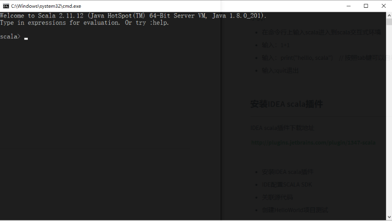

- 在scala命令提示窗口中执行`:quit`，即可退出解释器

### 10.3、scala的基本语法


#### 10.3.1、声明变量

在scala中，可以使用`val`或者`var`来定义变量，语法格式如下:

```scala
val/var 变量标识:变量类型 = 初始值
```

其中

- `val`定义的是不可重新赋值的变量
- `var`定义的是可重新赋值的变量

> [!NOTE]
>
> - scala中定义变量类型写在变量名后面
> - scala的语句最后不需要添加分号

**问题**：val 和 var修饰的变量有什么区别？


#### 10.3.2、字符串

scala提供多种定义字符串的方式，将来我们可以根据需要来选择最方便的定义方式。

- 使用双引号

  ```scala
  val/var 变量名 = “字符串”
  ```

- 使用插值表达式

  ```scala
  val/var 变量名 = s"${变量/表达式}字符串"
  ```

- 使用三引号

  ```scala
  val/var 变量名 = """字符串1
  字符串2"""    
  ```

  ​

#### 10.3.3、数据类型

| 基础类型    | 类型说明            |
| ------- | --------------- |
| Byte    | 8位带符号整数         |
| Short   | 16位带符号整数        |
| **Int** | 32位带符号整数        |
| Long    | 64位带符号整数        |
| Char    | 16位无符号Unicode字符 |
| String  | Char类型的序列（字符串）  |
| Float   | 32位单精度浮点数       |
| Double  | 64位双精度浮点数       |
| Boolean | true或false      |

注意下 scala类型与Java的区别

> [!NOTE]
>
> 1. scala中所有的类型都使用**大写字母**开头
> 2. 整形使用`Int`而不是Integer
> 3. scala中定义变量可以不写类型，让scala编译器自动推断


##### 10.3.3.1、scala类型层次结构

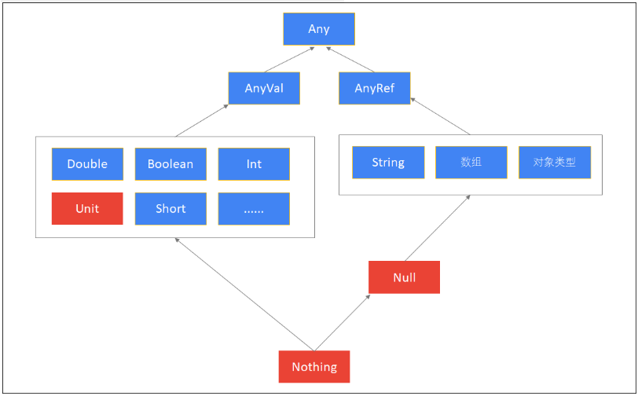


#### 10.3.4、表达式

##### 10.3.4.1、条件表达式

条件表达式就是if表达式，if表达式可以根据给定的条件是否满足，根据条件的结果（真或假）决定执行对应的操作。

scala条件表达式的语法和Java一样。与Java不一样的是，

> [!NOTE]
>
> - 在scala中，条件表达式也是有返回值的
> - 在scala中，没有三元表达式，可以使用if表达式替代三元表达式


##### 10.3.4.2、块表达式

- scala中，使用{}表示一个块表达式
- 和if表达式一样，块表达式也是有值的
- 值就是最后一个表达式的值

**问题**

请问以下代码，变量a的值是什么？

```scala
scala> val a = {
     | println("1 + 1")
     | 1 + 1
     | }
```


#### 10.3.5、循环

在scala中，可以使用for和while，但一般推荐使用for表达式，因为for表达式语法更简洁

##### 10.3.5、for循环

语法

```scala
for(i <- 表达式/数组/集合) {
    // 表达式
}
```

###### 10.3.5.1、嵌套for循环

使用for表达式，打印以下字符

```scala
*****
*****
*****
```


**步骤**

1. 使用for表达式打印3行，5列星星
2. 每打印5个星星，换行

**参考代码**

```scala
for(i <- 1 to 3; j <- 1 to 5) {print("*");if(j == 5) println("")}
```


##### 10.3.5、while循环

scala中while循环和Java中是一致的


**示例**

打印1-10的数字


**参考代码**

```scala
scala> var i = 1
i: Int = 1

scala> while(i <= 10) {
     | println(i)
     | i = i+1
     | }
```


#### 10.3.6、方法

**语法**

```scala
def methodName (参数名:参数类型, 参数名:参数类型) : [return type] = {
    // 方法体：一系列的代码
}
```

> [!NOTE]
>
> - 参数列表的参数类型不能省略
> - 返回值类型可以省略，由scala编译器自动推断
> - 返回值可以不写return，默认就是{}块表达式的值

**示例**

1. 定义一个方法，实现两个整形数值相加，返回相加后的结果
2. 调用该方法

**参考代码**

```scala
scala> def add(a:Int, b:Int) = a + b
m1: (x: Int, y: Int)Int

scala> add(1,2)
res10: Int = 3
```


##### 10.3.6.1、方法参数

scala中的方法参数，使用比较灵活。它支持以下几种类型的参数：

- 默认参数
- 带名参数
- 变长参数


**默认参数**

在定义方法时可以给参数定义一个默认值。

**示例**

1. 定义一个计算两个值相加的方法，这两个值默认为0
2. 调用该方法，不传任何参数

**参考代码**

```scala
// x，y带有默认值为0 
def add(x:Int = 0, y:Int = 0) = x + y
add()
```


**带名参数**

在调用方法时，可以指定参数的名称来进行调用。

**示例**

1. 定义一个计算两个值相加的方法，这两个值默认为0
2. 调用该方法，只设置第一个参数的值

**参考代码**

```scala
def add(x:Int = 0, y:Int = 0) = x + y
add(x=1)
```


**变长参数**

如果方法的参数是不固定的，可以定义一个方法的参数是变长参数。

语法格式：

```scala
def 方法名(参数名:参数类型*):返回值类型 = {
    方法体
}
```

> [!NOTE]
>
> 在参数类型后面加一个`*`号，表示参数可以是0个或者多个

**示例**

1. 定义一个计算若干个值相加的方法
2. 调用方法，传入以下数据：1,2,3,4,5

**参考代码**

```scala
scala> def add(num:Int*) = num.sum
add: (num: Int*)Int

scala> add(1,2,3,4,5)
res1: Int = 15
```


#### 10.3.7、函数

**语法**

```scala
val 函数变量名 = (参数名:参数类型, 参数名:参数类型....) => 函数体
```


> [!TIP]
>
> - 函数是一个**对象**（变量）
> - 类似于方法，函数也有输入参数和返回值
> - 函数定义不需要使用`def`定义
> - 无需指定返回值类型


**示例**

1. 定义一个两个数值相加的函数
2. 调用该函数

**参考代码**

```scala
scala> val add = (x:Int, y:Int) => x + y
add: (Int, Int) => Int = <function2>

scala> add(1,2)
res3: Int = 3
```


### 10.4、数据结构

#### 10.4.1、数组

**定长数组**

- 定长数组指的是数组的**长度**是**不允许改变**的
- 数组的**元素**是**可以改变**的

**语法**

```scala
// 通过指定长度定义数组
val/var 变量名 = new Array[元素类型](数组长度)

// 用元素直接初始化数组
val/var 变量名 = Array(元素1, 元素2, 元素3...)
```

> [!NOTE]
>
> - 在scala中，数组的泛型使用`[]`来指定
> - 使用`()`来获取元素


**变长数组**

创建变长数组，需要提前导入ArrayBuffer类`import scala.collection.mutable.ArrayBuffer`

**语法**

- 创建空的ArrayBuffer变长数组，语法结构：

  ```scala
  val/var a = ArrayBuffer[元素类型]()
  ```

- 创建带有初始元素的ArrayBuffer

  ```scala
  val/var a = ArrayBuffer(元素1，元素2，元素3....)
  ```

**数组的相关操作**

- 使用`+=`添加元素
- 使用`-=`删除元素
- 使用`++=`追加一个数组到变长数组
- 使用for遍历数组

#### 10.4.1、元组

元组可以用来包含一组不同类型的值。例如：姓名，年龄，性别，出生年月。元组的元素是不可变的。

**语法**

使用括号来定义元组

```scala
val/var 元组 = (元素1, 元素2, 元素3....)
```

使用箭头来定义元组（元组只有两个元素）

```scala
val/var 元组 = 元素1->元素2
```

**示例**

定义一个元组，包含一个学生的以下数据

| id   | 姓名       | 年龄   | 地址      |
| ---- | -------- | ---- | ------- |
| 1    | zhangsan | 20   | beijing |

**参考代码**

```scala
scala> val a = (1, "zhangsan", 20, "beijing")
a: (Int, String, Int, String) = (1,zhangsan,20,beijing)
```


**访问元组**

使用\_1、\_2、\_3....来访问元组中的元素，_1表示访问第一个元素，依次类推


**示例**

- 定义一个元组，包含一个学生的姓名和性别，"zhangsan",  "male"
- 分别获取该学生的姓名和性别

**参考代码**

```scala
scala> val a = "zhangsan" -> "male"
a: (String, String) = (zhangsan,male)

// 获取第一个元素
scala> a._1
res41: String = zhangsan

// 获取第二个元素
scala> a._2
res42: String = male
```


#### 10.4.2、列表

**不可变列表**


**语法**

使用`List(元素1, 元素2, 元素3, ...)`来创建一个不可变列表，语法格式：

```scala
val/var 变量名 = List(元素1, 元素2, 元素3...)
```


使用`Nil`创建一个不可变的空列表

```scala
val/var 变量名 = Nil
```


使用`::`方法创建一个不可变列表

```scala
val/var 变量名 = 元素1 :: 元素2 :: Nil
```

> [!TIP]
>
> 使用**::**拼接方式来创建列表，必须在最后添加一个**Nil


**可变列表**

可变列表就是列表的元素、长度都是可变的。

要使用可变列表，先要导入`import scala.collection.mutable.ListBuffer`


> [!NOTE]
>
> - 可变集合都在`mutable`包中
> - 不可变集合都在`immutable`包中（默认导入）

**定义**

使用ListBuffer\[元素类型\]()创建空的可变列表，语法结构：

```scala
val/var 变量名 = ListBuffer[Int]()
```


使用ListBuffer(元素1, 元素2, 元素3...)创建可变列表，语法结构：

```scala
val/var 变量名 = ListBuffer(元素1，元素2，元素3...)
```


**可变列表的操作**

- 获取元素（使用括号访问`(索引值)`）
- 添加元素（`+=`）
- 追加一个列表（`++=`）
- 更改元素（`使用括号获取元素，然后进行赋值`）
- 删除元素（`-=`）
- 转换为List（`toList`）
- 转换为Array（`toArray`）


#### 10.4.1、set

Set(集)是代表没有重复元素的集合。Set具备以下性质：

1. 元素不重复
2. 不保证插入顺序

scala中的集也分为两种，一种是不可变集，另一种是可变集。

**不可变集**

**语法**

创建一个空的不可变集，语法格式：

```scala
val/var 变量名 = Set[类型]()
```


给定元素来创建一个不可变集，语法格式：

```scala
val/var 变量名 = Set(元素1, 元素2, 元素3...)
```


**可变集**

**定义**

可变集合不可变集的创建方式一致，只不过需要提前导入一个可变集类。

手动导入：`import scala.collection.mutable.Set`


#### 10.4.1、映射

Map可以称之为映射。它是由键值对组成的集合。在scala中，Map也分为不可变Map和可变Map。


**不可变Map**

**定义**

语法

```scala
val/var map = Map(键->值, 键->值, 键->值...)	// 推荐，可读性更好
val/var map = Map((键, 值), (键, 值), (键, 值), (键, 值)...)
```

示例

1. 定义一个映射，包含以下学生姓名和年龄数据

   ```scala
   "zhangsan", 30
   "lisi", 40
   ```

2. 获取zhangsan的年龄

**可变Map**

**定义**

定义语法与不可变Map一致。但定义可变Map需要手动导入`import scala.collection.mutable.Map`

**示例**

1. 定义一个映射，包含以下学生姓名和年龄数据

   ```scala
   "zhangsan", 30
   "lisi", 40
   ```

2. 修改zhangsan的年龄为20

```scala
scala> val map = Map("zhangsan"->30, "lisi"->40)
map: scala.collection.mutable.Map[String,Int] = Map(lisi -> 40, zhangsan -> 30)

// 修改value
scala> map("zhangsan") = 20
```


### 10.5、函数式编程

- 遍历（`foreach`）
- 映射（`map`）
- 映射扁平化（`flatmap`）
- 过滤（`filter`）
- 是否存在（`exists`）
- 排序（`sorted`、`sortBy`、`sortWith`）
- 分组（`groupBy`）
- 聚合计算（`reduce`）
- 折叠（`fold`）

### 10.6、伴生对象

一个class和object具有同样的名字。这个object称为**伴生对象**，这个class称为**伴生类**

- 伴生对象必须要和伴生类一样的名字
- 伴生对象和伴生类在同一个scala源文件中
- 伴生对象和伴生类可以互相访问private属性

**参考代码**

```scala
object _11ObjectDemo {

  class CustomerService {
    def save() = {
      println(s"${CustomerService.SERVICE_NAME}:保存客户")
    }
  }

  // CustomerService的伴生对象
  object CustomerService {
    private val SERVICE_NAME = "CustomerService"
  }

  def main(args: Array[String]): Unit = {
    val customerService = new CustomerService()
    customerService.save()
  }
}
```

### 10.7、样例类

样例类是一种特殊类，它可以用来快速定义一个用于**保存数据**的类（类似于Java POJO类）

**语法格式**

```scala
case class 样例类名(var/val 成员变量名1:类型1, 成员变量名2:类型2, 成员变量名3:类型3)
```

- 如果要实现某个成员变量可以被修改，可以添加var
- 默认为val，可以省略

**需求**

- 定义一个Person样例类，包含姓名和年龄成员变量
- 创建样例类的对象实例（"张三"、20），并打印它

**参考代码**

```scala
object _01CaseClassDemo {
  case class Person(name:String, age:Int)

  def main(args: Array[String]): Unit = {
    val zhangsan = Person("张三", 20)

    println(zhangsan)
  }
}
```


### 10.8、样例对象

它主要用在两个地方：

1. 作为没有任何参数的消息传递

使用case object可以创建样例对象。样例对象是单例的，而且它**没有主构造器**

**语法格式**

```scala
case object 样例对象名
```


### 10.9、模式匹配

#### 10.9.1、 简单模式匹配

**语法格式**

```scala
变量 match {
    case "常量1" => 表达式1
    case "常量2" => 表达式2
    case "常量3" => 表达式3
    case _ => 表达式4		// 默认配
}
```

**示例**

**需求说明**

1. 从控制台输入一个单词（使用StdIn.readLine方法）
2. 判断该单词是否能够匹配以下单词，如果能匹配，返回一句话
3. 打印这句话

| 单词        | 返回            |
| --------- | ------------- |
| hadoop    | 大数据分布式存储和计算框架 |
| zookeeper | 大数据分布式协调服务框架  |
| spark     | 大数据分布式内存计算框架  |
| 未匹配       | 未匹配           |

**参考代码**

```scala
println("请输出一个词：")
// StdIn.readLine表示从控制台读取一行文本
val name = StdIn.readLine()

val result = name match {
    case "hadoop" => "大数据分布式存储和计算框架"
    case "zookeeper" => "大数据分布式协调服务框架"
    case "spark" => "大数据分布式内存计算框架"
    case _ => "未匹配"
}

println(result)
```


#### 10.9.2、匹配样例类

scala可以使用模式匹配来匹配样例类，从而可以快速获取样例类中的成员数据。后续，我们在开发Akka案例时，还会用到。

**示例**

**需求说明**

- 创建两个样例类Customer、Order
  - Customer包含姓名、年龄字段
  - Order包含id字段
- 分别定义两个案例类的对象，并指定为Any类型
- 使用模式匹配这两个对象，并分别打印它们的成员变量值

**参考代码**

```scala
// 1. 创建两个样例类
case class Person(name:String, age:Int)
case class Order(id:String)

def main(args: Array[String]): Unit = {
    // 2. 创建样例类对象，并赋值为Any类型
    val zhangsan:Any = Person("张三", 20)
    val order1:Any = Order("001")

    // 3. 使用match...case表达式来进行模式匹配
    // 获取样例类中成员变量
    order1 match {
        case Person(name, age) => println(s"姓名：${name} 年龄：${age}")
        case Order(id1) => println(s"ID为：${id1}")
        case _ => println("未匹配")
    }
}
```


### 10.10、高阶函数

高阶函数包含

- 作为值的函数
- 匿名函数
- 闭包
- 柯里化等等

**作为值的函数**

**示例说明**

将一个整数列表中的每个元素转换为对应个数的小星星

```html
List(1, 2, 3...) => *, **, *** 
```

**步骤**

1. 创建一个函数，用于将数字装换为指定个数的小星星
2. 创建一个列表，调用map方法
3. 打印转换为的列表

**参考代码**

```scala
val func = (num:Int) => "*" * num

println((1 to 10).map(func))
```


**匿名函数**

没有赋值给变量的函数就是**匿名函数**

**参考代码**

```scala
println((1 to 10).map(num => "*" * num))
// 因为此处num变量只使用了一次，而且只是进行简单的计算，所以可以省略参数列表，使用_替代参数
println((1 to 10).map("*" * _))
```


**闭包**

闭包其实就是一个函数，只不过这个函数的返回值依赖于声明在函数外部的变量。

可以简单认为，就是可以访问不在当前作用域范围的一个函数。

**示例**

定义一个闭包

```scala
val y=10

val add=(x:Int)=>{
    x+y
}

println(add(5)) // 结果15
```

add函数就是一个闭包


**柯里化**

柯里化（Currying）是指将原先接受多个参数的方法转换为多个参数列表的过程。

**示例**

**示例说明**

- 编写一个方法，用来完成两个Int类型数字的计算
- 具体如何计算封装到函数中
- 使用柯里化来实现上述操作

**参考代码**

```scala
// 柯里化：实现对两个数进行计算
def calc_carried(x:Double, y:Double)(func_calc:(Double, Double)=>Double) = {
    func_calc(x, y)
}

def main(args: Intrray[String]): Unit = {
    println(calc_carried(10.1, 10.2){
        (x,y) => x + y
    })
    println(calc_carried(10, 10)(_ + _))
    println(calc_carried(10.1, 10.2)(_ * _))
    println(calc_carried(100.2, 10)(_ - _))
}
```


## 11、spark

### 11.1、spark介绍

Apache Spark是用于大规模数据处理的统一分析计算引擎

Spark基于内存计算，提高了在大数据环境下数据处理的实时性，同时保证了高容错性和高可伸缩性，允许用户将Spark部署在大量硬件之上，形成集群。


### 11.2、spark与Hadoop的区别

​	尽管Spark相对于Hadoop而言具有较大优势，但Spark并不能完全替代Hadoop，Spark主要用于替代Hadoop中的MapReduce计算模型。存储依然可以使用HDFS，但是中间结果可以存放在内存中；调度可以使用Spark内置的，也可以使用更成熟的调度系统YARN等

​	实际上，Spark已经很好地融入了Hadoop生态圈，并成为其中的重要一员，它可以借助于YARN实现资源调度管理，借助于HDFS实现分布式存储。

​	此外，Hadoop可以使用廉价的、异构的机器来做分布式存储与计算，但是，Spark对硬件的要求稍高一些，对内存与CPU有一定的要求。


### 11.3、spark的特点

- 快

  与Hadoop的MapReduce相比，Spark基于内存的运算要快100倍以上，基于硬盘的运算也要快10倍以上。Spark实现了高效的DAG执行引擎，可以通过基于内存来高效处理数据流。

- 易用

  Spark支持Java、Python、R和Scala的API，还支持超过80种高级算法，使用户可以快速构建不同的应用。而且Spark支持交互式的Python和Scala的shell，可以非常方便地在这些shell中使用Spark集群来验证解决问题的方法。

- 通用

  Spark提供了统一的解决方案。Spark可以用于批处理、交互式查询(Spark SQL)、实时流处理(Spark Streaming)、机器学习(Spark MLlib)和图计算(GraphX)。这些不同类型的处理都可以在同一个应用中无缝使用。Spark统一的解决方案非常具有吸引力，毕竟任何公司都想用统一的平台去处理遇到的问题，减少开发和维护的人力成本和部署平台的物力成本。

- 兼容性

  Spark可以非常方便地与其他的开源产品进行融合。比如，Spark可以使用Hadoop的YARN和Apache Mesos作为它的资源管理和调度器，并且可以处理所有Hadoop支持的数据，包括HDFS、HBase和Cassandra等。这对于已经部署Hadoop集群的用户特别重要，因为不需要做任何数据迁移就可以使用Spark的强大处理能力。Spark也可以不依赖于第三方的资源管理和调度器，它实现了Standalone作为其内置的资源管理和调度框架，这样进一步降低了Spark的使用门槛，使得所有人都可以非常容易地部署和使用Spark。


### 11.4、spark的运行模式

#### 1.local本地模式(单机)--开发测试使用

​	分为local单线程和local-cluster多线程

#### 2.standalone独立集群模式--开发测试使用

​	典型的Mater/slave模式

#### 3.standalone-HA高可用模式--生产环境使用

​	基于standalone模式，使用zk搭建高可用，避免Master是有单点故障的

#### 4.on yarn集群模式--生产环境使用

- 运行在 yarn 集群之上，由 yarn 负责资源管理，Spark 负责任务调度和计算，

  好处：计算资源按需伸缩，集群利用率高，共享底层存储，避免数据跨集群迁移。

  FIFO

  Fair

  Capacity

#### 5.on mesos集群模式--国内使用较少

​	运行在 mesos 资源管理器框架之上，由 mesos 负责资源管理，Spark 负责任务调度和计算

#### 6.on cloud集群模式--中小公司未来会更多的使用云服务

​	比如 AWS 的 EC2，使用这个模式能很方便的访问 Amazon的 S3


### 11.5、spark-shell 

●引入

​	之前我们使用提交任务都是使用spark-shell提交，spark-shell是Spark自带的交互式Shell程序，方便用户进行交互式编程，用户可以在该命令行下可以用scala编写spark程序，适合学习测试时使用！

●示例

spark-shell可以携带参数

spark-shell --master local[N] 数字N表示在本地模拟N个线程来运行当前任务

spark-shell --master local[*]  *表示使用当前机器上所有可用的资源

默认不携带参数就是--master local[*]

spark-shell --master spark://node01:7077,node02:7077 表示运行在集群上


### 11.6、spark-submit

* **提交到standalone集群**

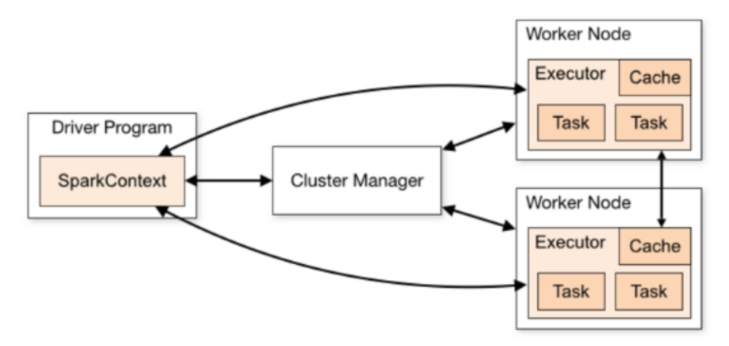

~~~shell 
/export/servers/spark/bin/spark-submit \
--class org.apache.spark.examples.SparkPi \
--master spark://node01:7077 \
--executor-memory 1g \
--total-executor-cores 2 \
/export/servers/spark/examples/jars/spark-examples_2.11-2.2.0.jar \
10
~~~

* **提交到standalone-HA集群**

~~~shell
/export/servers/spark/bin/spark-submit \
--class org.apache.spark.examples.SparkPi \
--master spark://node01:7077,node02:7077 \
--executor-memory 1g \
--total-executor-cores 2 \
/export/servers/spark/examples/jars/spark-examples_2.11-2.2.0.jar \
10
~~~

* **提交到yarn集群（cluster）**生产环境中大部分都是cluster部署模式运行Spark应用

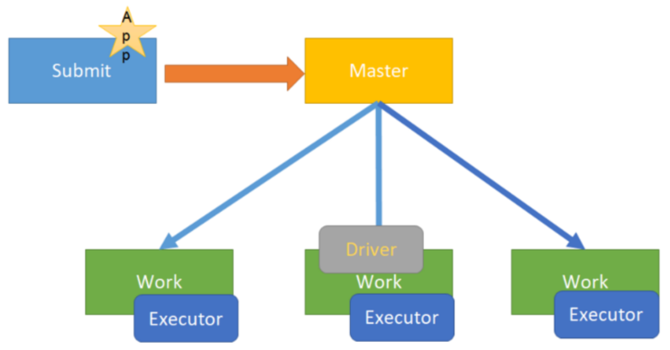

~~~shell
/export/servers/spark/bin/spark-submit \
--class org.apache.spark.examples.SparkPi \
--master yarn \
--deploy-mode cluster \
--driver-memory 1g \
--executor-memory 1g \
--executor-cores 2 \
--queue default \
/export/servers/spark/examples/jars/spark-examples_2.11-2.2.0.jar \
10
~~~

* **提交到yarn集群（client）**  学习测试时使用，开发不用

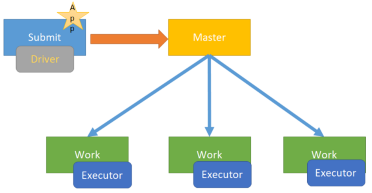

~~~shell
/export/servers/spark/bin/spark-submit \
--class org.apache.spark.examples.SparkPi \
--master yarn \
--deploy-mode client \
--driver-memory 1g \
--executor-memory 1g \
--executor-cores 2 \
--queue default \
/export/servers/spark/examples/jars/spark-examples_2.11-2.2.0.jar \
10
~~~


### 11.7、会写Wordcount

~~~scala
package cn.itcast.sparkhello

import org.apache.spark.rdd.RDD
import org.apache.spark.{SparkConf, SparkContext}


object WordCount {
  def main(args: Array[String]): Unit = {
    //1.创建SparkContext
    val config = new SparkConf().setAppName("Wordcount").setMaster("local[*]")
    val sc = new SparkContext(config)
	sc.setLogLevel("WARN")
    //2.读取文件
    //A Resilient Distributed Dataset (RDD)弹性分布式数据集
    //可以简单理解为分布式的集合,但是spark对它做了很多的封装,
    //让程序员使用起来就像操作本地集合一样简单,这样大家就很happy了
    val fileRDD: RDD[String] = sc.textFile("D:\\授课\\190429\\资料\\data\\words.txt")
    //3.处理数据
    //3.1对每一行按空切分并压平形成一个新的集合中装的一个个的单词
    //flatMap是对集合中的每一个元素进行操作,再进行压平
    val wordRDD: RDD[String] = fileRDD.flatMap(_.split(" "))
    //3.2每个单词记为1
    val wordAndOneRDD: RDD[(String, Int)] = wordRDD.map((_,1))
    //3.3根据key进行聚合,统计每个单词的数量
    //wordAndOneRDD.reduceByKey((a,b)=>a+b)
    //第一个_:之前累加的结果
    //第二个_:当前进来的数据
    val wordAndCount: RDD[(String, Int)] = wordAndOneRDD.reduceByKey(_+_)
    //4.收集结果
    val result: Array[(String, Int)] = wordAndCount.collect()
    result.foreach(println)
  }
}
~~~

* **集群运行需要改那些东西？**


### 11.8、rdd是什么

​	RDD(Resilient Distributed Dataset)叫做弹性分布式数据集，是Spark中最基本的数据抽象，代表一个不可变、可分区、里面的元素可并行计算的集合。

**单词拆解**

\- Dataset: 它是一个集合，可以存放很多元素

\- Distributed ：它里面的元素是分布式存储的，可以用于分布式计算

\- Resilient ：它是弹性的，RDD里面的中的数据可以保存在内存中或者磁盘里面


### 11.9、rdd的五大属性

1.A list of partitions ：

一组分片(Partition)/一个分区(Partition)列表，即数据集的基本组成单位。

对于RDD来说，每个分片都会被一个计算任务处理，分片数决定并行度。

 

2.A function for computing each split ：

一个函数会被作用在每一个分区。

 

3.A list of dependencies on other RDDs：

一个RDD会依赖于其他多个RDD。

   RDD的每次转换都会生成一个新的RDD，所以RDD之间就会形成类似于流水线一样的前后依赖关系。在部分分区数据丢失时，Spark可以通过这个依赖关系重新计算丢失的分区数据，而不是对RDD的所有分区进行重新计算。(Spark的容错机制)

 

4.Optionally, a Partitioner for key-value RDDs (e.g. to say that the RDD is hash-partitioned)：

可选项,对于KV类型的RDD会有一个Partitioner，即RDD的分区函数

当前Spark中实现了两种类型的分片函数，一个是基于哈希的HashPartitioner，另外一个是基于范围的RangePartitioner。只有对于于key-value的RDD，才会有Partitioner，非key-value的RDD的Parititioner的值是None。Partitioner函数不但决定了RDD本身的分片数量，也决定了parent RDD Shuffle输出时的分片数量。

 

5.Optionally, a list of preferred locations to compute each split on (e.g. block locations for an HDFS file)：

可选项,一个列表，存储存取每个Partition的优先位置(preferred location)。

对于一个HDFS文件来说，这个列表保存的就是每个Partition所在的块的位置。按照"移动数据不如移动计算"的理念，Spark在进行任务调度的时候，会尽可能选择那些存有数据的worker节点来进行任务计算。


### 11.10、创建rdd的方式

1.由外部存储系统的数据集创建，包括本地的文件系统，还有所有Hadoop支持的数据集，比如HDFS、Cassandra、HBase等

val rdd1 = sc.textFile("hdfs://node01:8020/wordcount/input/words.txt")

 

2.通过已有的RDD经过算子转换生成新的RDD

val rdd2=rdd1.flatMap(_.split(" "))

 

3.由一个已经存在的Scala集合创建

val rdd3 = sc.parallelize(Array(1,2,3,4,5,6,7,8))

或者

val rdd4 = sc.makeRDD(List(1,2,3,4,5,6,7,8))

**makeRDD方法底层调用了parallelize方法**


### 11.11、RDD的方法/算子

RDD的算子分为两类:

1.Transformation转换操作:返回一个新的RDD

2.Action动作操作:返回值不是RDD(无返回值或返回其他的)


#### 1、transformation算子

| 转换                                       | 含义                                       |
| ---------------------------------------- | ---------------------------------------- |
| map(func)                                | 返回一个新的RDD，该RDD由每一个输入元素经过func函数转换后组成      |
| filter(func)                             | 返回一个新的RDD，该RDD由经过func函数计算后返回值为true的输入元素组成 |
| flatMap(func)                            | 类似于map，但是每一个输入元素可以被映射为0或多个输出元素(所以func应该返回一个序列，而不是单一元素) |
| mapPartitions(func)                      | 类似于map，但独立地在RDD的每一个分片上运行，因此在类型为T的RDD上运行时，func的函数类型必须是Iterator[T] => Iterator[U] |
| mapPartitionsWithIndex(func)             | 类似于mapPartitions，但func带有一个整数参数表示分片的索引值，因此在类型为T的RDD上运行时，func的函数类型必须是(Int, Interator[T]) => Iterator[U] |
| sample(withReplacement, fraction, seed)  | 根据fraction指定的比例对数据进行采样，可以选择是否使用随机数进行替换，seed用于指定随机数生成器种子 |
| union(otherDataset)                      | 对源RDD和参数RDD求并集后返回一个新的RDD                 |
| intersection(otherDataset)               | 对源RDD和参数RDD求交集后返回一个新的RDD                 |
| distinct([numTasks]))                    | 对源RDD进行去重后返回一个新的RDD                      |
| groupByKey([numTasks])                   | 在一个(K,V)的RDD上调用，返回一个(K, Iterator[V])的RDD |
| reduceByKey(func, [numTasks])            | 在一个(K,V)的RDD上调用，返回一个(K,V)的RDD，使用指定的reduce函数，将相同key的值聚合到一起，与groupByKey类似，reduce任务的个数可以通过第二个可选的参数来设置 |
| aggregateByKey(zeroValue)(seqOp, combOp, [numTasks]) |                                          |
| sortByKey([ascending], [numTasks])       | 在一个(K,V)的RDD上调用，K必须实现Ordered接口，返回一个按照key进行排序的(K,V)的RDD |
| sortBy(func,[ascending], [numTasks])     | 与sortByKey类似，但是更灵活                       |
| join(otherDataset, [numTasks])           | 在类型为(K,V)和(K,W)的RDD上调用，返回一个相同key对应的所有元素对在一起的(K,(V,W))的RDD |
| cogroup(otherDataset, [numTasks])        | 在类型为(K,V)和(K,W)的RDD上调用，返回一个(K,(Iterable<V>,Iterable<W>))类型的RDD |
| cartesian(otherDataset)                  | 笛卡尔积                                     |
| pipe(command, [envVars])                 | 对rdd进行管道操作                               |
| coalesce(numPartitions)                  | 减少 RDD 的分区数到指定值。在过滤大量数据之后，可以执行此操作        |
| repartition(numPartitions)               | 重新给 RDD 分区                               |


####  2、action算子

| 动作                                      | 含义                                       |
| --------------------------------------- | ---------------------------------------- |
| reduce(func)                            | 通过func函数聚集RDD中的所有元素，这个功能必须是可交换且可并联的      |
| collect()                               | 在驱动程序中，以数组的形式返回数据集的所有元素                  |
| count()                                 | 返回RDD的元素个数                               |
| first()                                 | 返回RDD的第一个元素(类似于take(1))                  |
| take(n)                                 | 返回一个由数据集的前n个元素组成的数组                      |
| takeSample(withReplacement,num, [seed]) | 返回一个数组，该数组由从数据集中随机采样的num个元素组成，可以选择是否用随机数替换不足的部分，seed用于指定随机数生成器种子 |
| takeOrdered(n, [ordering])              | 返回自然顺序或者自定义顺序的前 n 个元素                    |
| saveAsTextFile(path)                    | 将数据集的元素以textfile的形式保存到HDFS文件系统或者其他支持的文件系统，对于每个元素，Spark将会调用toString方法，将它装换为文件中的文本 |
| saveAsSequenceFile(path)                | 将数据集中的元素以Hadoop sequencefile的格式保存到指定的目录下，可以使HDFS或者其他Hadoop支持的文件系统。 |
| saveAsObjectFile(path)                  | 将数据集的元素，以 Java 序列化的方式保存到指定的目录下           |
| countByKey()                            | 针对(K,V)类型的RDD，返回一个(K,Int)的map，表示每一个key对应的元素个数。 |
| foreach(func)                           | 在数据集的每一个元素上，运行函数func进行更新。                |
| foreachPartition(func)                  | 在数据集的每一个分区上，运行函数func                     |


### 11.12、spark中的checkpoint

​	持久化/缓存可以把数据放在内存中，虽然是快速的，但是也是最不可靠的；也可以把数据放在磁盘上，也不是完全可靠的！例如磁盘会损坏等。

​	Checkpoint的产生就是为了更加可靠的数据持久化，在Checkpoint的时候一般把数据放在在HDFS上，这就天然的借助了HDFS天生的高容错、高可靠来实现数据最大程度上的安全，实现了RDD的容错和高可用。

**具体用法**：

~~~scala 
sc.setCheckpointDir("hdfs://node01:8020/ckpdir") 
//设置检查点目录,会立即在HDFS上创建一个空目录
val rdd1 = sc.textFile("hdfs://node01:8020/wordcount/input/words.txt").flatMap(_.split(" ")).map((_,1)).reduceByKey(_+_)
rdd1.checkpoint //对rdd1进行检查点保存
rdd1.collect //Action操作才会真正执行checkpoint
//后续如果要使用到rdd1可以从checkpoint中读取
~~~


### 11.13、持久化和Checkpoint的区别

1.**位置**

Persist 和 Cache 只能保存在本地的磁盘和内存中(或者堆外内存--实验中)

Checkpoint 可以保存数据到 HDFS 这类可靠的存储上

 

2.**生命周期**

Cache和Persist的RDD会在程序结束后会被清除或者手动调用unpersist方法

Checkpoint的RDD在程序结束后依然存在，不会被删除

 

3.**Lineage(血统、依赖链--其实就是依赖关系)**

Persist和Cache，不会丢掉RDD间的依赖链/依赖关系，因为这种缓存是不可靠的，如果出现了一些错误(例如 Executor 宕机)，需要通过回溯依赖链重新计算出来

Checkpoint会斩断依赖链，因为Checkpoint会把结果保存在HDFS这类存储中，更加的安全可靠，一般不需要回溯依赖链


### 11.14、rdd的依赖关系

**窄依赖**:父RDD的一个分区只会被子RDD的一个分区依赖

**宽依赖**:父RDD的一个分区会被子RDD的多个分区依赖(涉及到shuffle)

* 设计宽窄依赖的作用

  * 1.对于窄依赖

    * Spark可以并行计算
    * 如果有一个分区数据丢失，只需要从父RDD的对应1个分区重新计算即可，不需要重新计算整个任务，提高容错。

    2.对于宽依赖

    * 是划分Stage的依据


* 特殊：join（既能是宽依赖，又能是窄依赖）


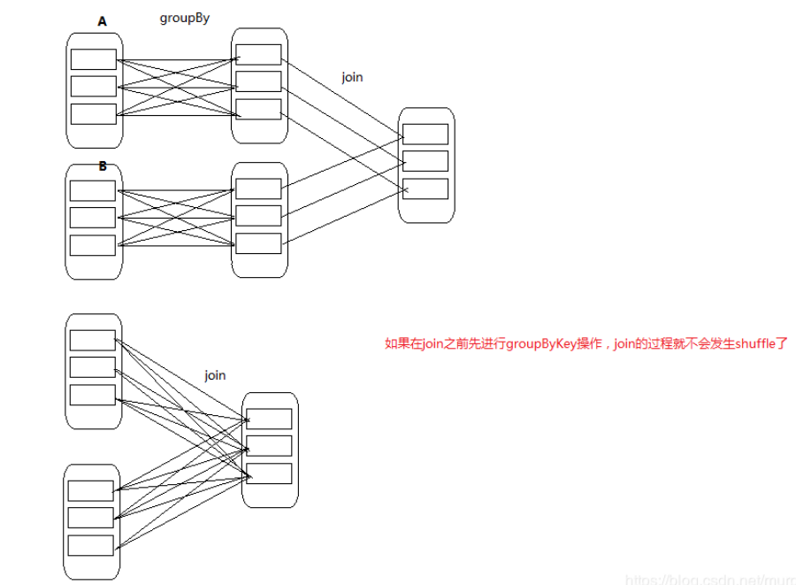

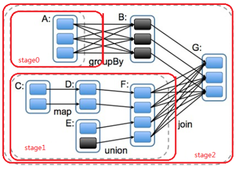


### 11.15、DAG

​	DAG(Directed Acyclic Graph有向无环图)指的是数据转换执行的过程，有方向，无闭环(其实就是RDD执行的流程)

​	原始的RDD通过一系列的转换操作就形成了DAG有向无环图，任务执行时，可以按照DAG的描述，执行真正的计算(数据被操作的一个过程)。一个Spark应用中可以有一到多个DAG，取决于触发了多少次Action。


### 11.16、stage的划分

●为什么要划分Stage? --并行计算

​	一个复杂的业务逻辑如果有shuffle，那么就意味着前面阶段产生结果后，才能执行下一个阶段，即下一个阶段的计算要依赖上一个阶段的数据。那么我们按照shuffle进行划分(也就是按照宽依赖就行划分)，就可以将一个DAG划分成多个Stage/阶段，在同一个Stage中，会有多个算子操作，可以形成一个pipeline流水线，流水线内的多个平行的分区可以并行执行。

●如何划分DAG的stage

​	Spark会根据shuffle/宽依赖使用回溯算法来对DAG进行Stage划分，从后往前，遇到宽依赖就断开，遇到窄依赖就把当前的RDD加入到当前的stage/阶段中。

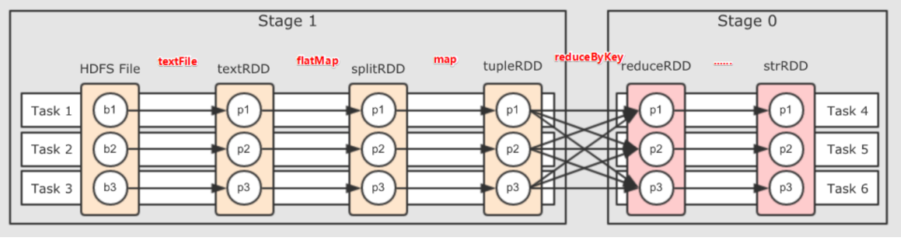


### 11.17、spark程序的运行流程

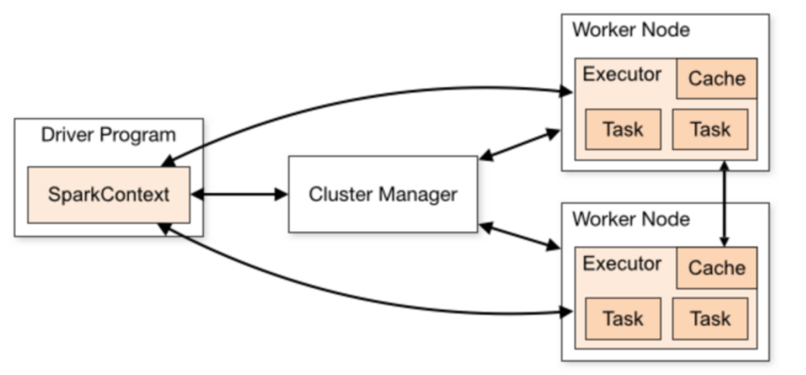


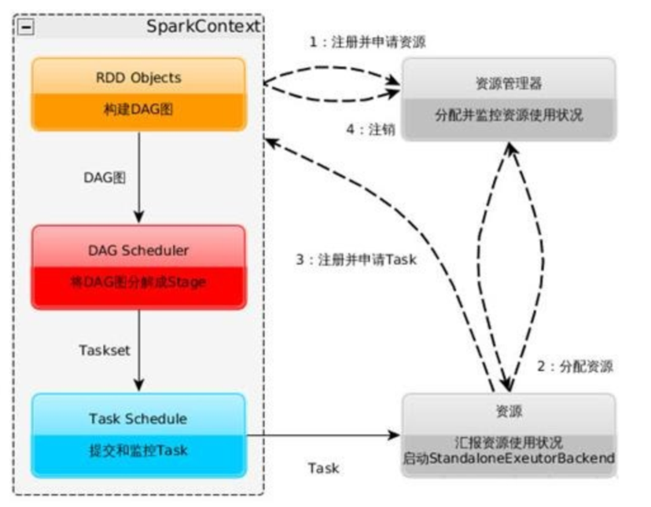


* **详细流程**

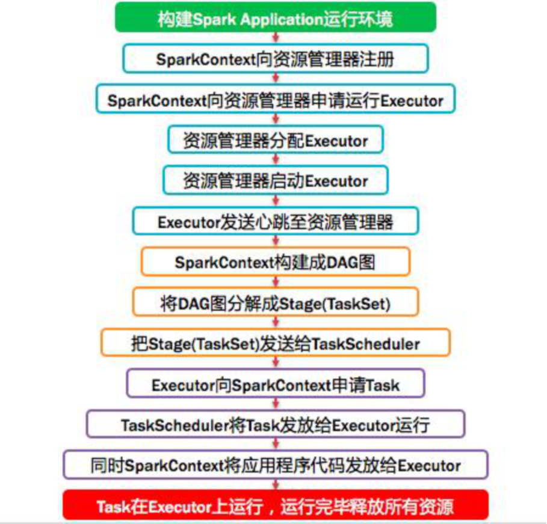


### 11.18、DataFrame & DataSet

* **dataframe**

  DataFrame的前身是SchemaRDD，从Spark 1.3.0开始SchemaRDD更名为DataFrame。并不再直接继承自RDD，而是自己实现了RDD的绝大多数功能。

  **DataFrame是一种以RDD为基础的分布式数据集，类似于传统数据库的二维表格，带有Schema元信息(可以理解为数据库的列名和类型)**


* **dataSet**

DataSet是在**Spark1.6**中添加的新的接口。

**与RDD相比**，保存了更多的描述信息，概念上等同于关系型数据库中的二维表。

**与DataFrame相比**，保存了类型信息，是强类型的，提供了编译时类型检查。

​	DataSet包含了DataFrame的功能，**Spark2.0**中两者统一，DataFrame表示为DataSet[Row]，即DataSet的子集。DataFrame其实就是Dateset[Row]。

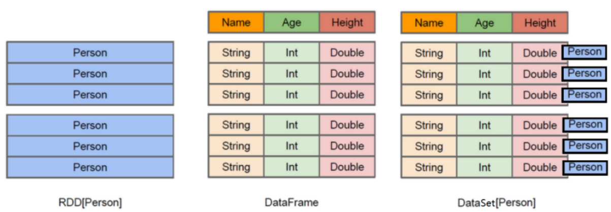

**总结**

DataFrame = RDD - 泛型  +  Schema  + SQL + 优化

DataFrame = DataSet[Row]

DataSet = DataFrame  + 泛型

DataSet  =  RDD   +  Schema  + SQL + 优化


### 11.19、初识dataframe

#### 1、读取文本文件

~~~scala
创建RDD
val lineRDD= sc.textFile("hdfs://node01:8020/person.txt").map(_.split(" ")) //RDD[Array[String]]

3.定义case class(相当于表的schema)
case class Person(id:Int, name:String, age:Int)

4.将RDD和case class关联
val personRDD = lineRDD.map(x => Person(x(0).toInt, x(1), x(2).toInt)) //RDD[Person]

5.将RDD转换成DataFrame
val personDF = personRDD.toDF //DataFrame

6.查看数据和schema
personDF.show
+---+--------+---+
| id|    name|age|
+---+--------+---+
|  1|zhangsan| 20|
|  2|    lisi| 29|
|  3|  wangwu| 25|
|  4| zhaoliu| 30|
|  5|  tianqi| 35|
|  6|    kobe| 40|
+---+--------+---+
personDF.printSchema

7.注册表
personDF.createOrReplaceTempView("t_person")
 
8.执行SQL
spark.sql("select id,name from t_person where id > 3").show

9.也可以通过SparkSession构建DataFrame
val dataFrame=spark.read.text("hdfs://node01:8020/person.txt") 
dataFrame.show //注意：直接读取的文本文件没有完整schema信息
dataFrame.printSchema 
~~~


#### 2、读取json文件

~~~scala
1.在spark shell执行下面命令，读取数据
val jsonDF= spark.read.json("file:///export/servers/spark/examples/src/main/resources/people.json")
 
2.接下来就可以使用DataFrame的函数操作      
jsonDF.show 
~~~


#### 3、读取parquet文件

~~~scala
1.在spark shell执行下面命令，读取数据
val parquetDF=spark.read.parquet("file:///export/servers/spark/examples/src/main/resources/users.parquet")
 
2.接下来就可以使用DataFrame的函数操作
parquetDF.show 
~~~


### 11.20、创建dataframe的几种方式

#### 1、指定列名添加Schema 

~~~scala
package cn.itcast.sql

import org.apache.spark.SparkContext
import org.apache.spark.rdd.RDD
import org.apache.spark.sql.{DataFrame, SparkSession}


object CreateDFDS {
  def main(args: Array[String]): Unit = {
    //1.创建SparkSession
    val spark: SparkSession = SparkSession.builder().master("local[*]").appName("SparkSQL").getOrCreate()
    val sc: SparkContext = spark.sparkContext
    sc.setLogLevel("WARN")
    //2.读取文件
    val fileRDD: RDD[String] = sc.textFile("D:\\data\\person.txt")
    val linesRDD: RDD[Array[String]] = fileRDD.map(_.split(" "))
    val rowRDD: RDD[(Int, String, Int)] = linesRDD.map(line =>(line(0).toInt,line(1),line(2).toInt))
    //3.将RDD转成DF
    //注意:RDD中原本没有toDF方法,新版本中要给它增加一个方法,可以使用隐式转换
    import spark.implicits._
    val personDF: DataFrame = rowRDD.toDF("id","name","age")
    personDF.show(10)
    personDF.printSchema()
    sc.stop()
    spark.stop()
  }
}
~~~


#### **2、反射推断Schema--掌握**

~~~scala
package cn.itcast.sql

import org.apache.spark.SparkContext
import org.apache.spark.rdd.RDD
import org.apache.spark.sql.{DataFrame, SparkSession}


object CreateDFDS3 {
  def main(args: Array[String]): Unit = {
    //1.创建SparkSession
    val spark: SparkSession = SparkSession.builder().master("local[*]").appName("SparkSQL")
.getOrCreate()
    val sc: SparkContext = spark.sparkContext
    sc.setLogLevel("WARN")
    //2.读取文件
    val fileRDD: RDD[String] = sc.textFile("D:\\data\\person.txt")
    val linesRDD: RDD[Array[String]] = fileRDD.map(_.split(" "))
    val rowRDD: RDD[Person] = linesRDD.map(line =>Person(line(0).toInt,line(1),line(2).toInt))
    //3.将RDD转成DF
    //注意:RDD中原本没有toDF方法,新版本中要给它增加一个方法,可以使用隐式转换
    import spark.implicits._
    //注意:上面的rowRDD的泛型是Person,里面包含了Schema信息
    //所以SparkSQL可以通过反射自动获取到并添加给DF
    val personDF: DataFrame = rowRDD.toDF
    personDF.show(10)
    personDF.printSchema()
    sc.stop()
    spark.stop()
  }
  case class Person(id:Int,name:String,age:Int)
}
~~~


#### **3、StructType指定Schema-了解**

~~~scala
package cn.itcast.sql

import org.apache.spark.SparkContext
import org.apache.spark.rdd.RDD
import org.apache.spark.sql.types._
import org.apache.spark.sql.{DataFrame, Row, SparkSession}


object CreateDFDS2 {
  def main(args: Array[String]): Unit = {
    //1.创建SparkSession
    val spark: SparkSession = SparkSession.builder().master("local[*]").appName("SparkSQL").getOrCreate()
    val sc: SparkContext = spark.sparkContext
    sc.setLogLevel("WARN")
    //2.读取文件
    val fileRDD: RDD[String] = sc.textFile("D:\\data\\person.txt")
    val linesRDD: RDD[Array[String]] = fileRDD.map(_.split(" "))
    val rowRDD: RDD[Row] = linesRDD.map(line =>Row(line(0).toInt,line(1),line(2).toInt))
    //3.将RDD转成DF
    //注意:RDD中原本没有toDF方法,新版本中要给它增加一个方法,可以使用隐式转换
    //import spark.implicits._
    val schema: StructType = StructType(Seq(
      StructField("id", IntegerType, true),//允许为空
      StructField("name", StringType, true),
      StructField("age", IntegerType, true))
    )
    val personDF: DataFrame = spark.createDataFrame(rowRDD,schema)
    personDF.show(10)
    personDF.printSchema()
    sc.stop()
    spark.stop()
  }
}
~~~


### 11.21、sparkStreaming的原理

​	Spark Streaming是一个基于Spark Core之上的实时计算框架，可以从很多数据源消费数据并对数据进行实时的处理，具有高吞吐量和容错能力强等特点。


##### 11.21.1、数据抽象

​	Spark Streaming的基础抽象是DStream(Discretized Stream，离散化数据流，连续不断的数据流)，代表持续性的数据流和经过各种Spark算子操作后的结果数据流。

* 1.DStream本质上就是一系列时间上连续的RDD
* 对DStream的数据的进行操作也是按照RDD为单位来进行的。

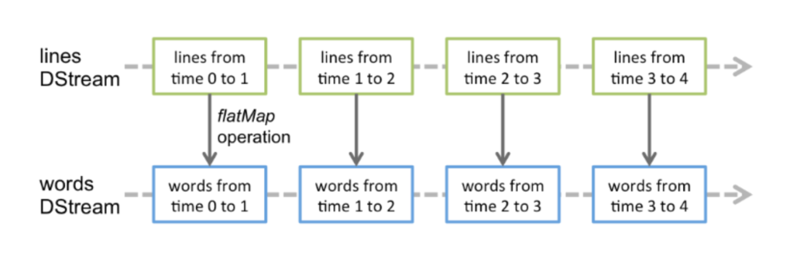


### 11.22、使用updateStateByKey(func)进行累加

~~~scala
package cn.itcast.streaming

import org.apache.spark.streaming.dstream.{DStream, ReceiverInputDStream}
import org.apache.spark.streaming.{Seconds, StreamingContext}
import org.apache.spark.{SparkConf, SparkContext}


object WordCount2 {
  def main(args: Array[String]): Unit = {
    //1.创建StreamingContext
    //spark.master should be set as local[n], n > 1
    val conf = new SparkConf().setAppName("wc").setMaster("local[*]")
    val sc = new SparkContext(conf)
    sc.setLogLevel("WARN")
    val ssc = new StreamingContext(sc,Seconds(5))//5表示5秒中对数据进行切分形成一个RDD
    //requirement failed: ....Please set it by StreamingContext.checkpoint().
    //注意:我们在下面使用到了updateStateByKey对当前数据和历史数据进行累加
    //那么历史数据存在哪?我们需要给他设置一个checkpoint目录
    ssc.checkpoint("./wc")//开发中HDFS
    //2.监听Socket接收数据
    //ReceiverInputDStream就是接收到的所有的数据组成的RDD,封装成了DStream,接下来对DStream进行操作就是对RDD进行操作
    val dataDStream: ReceiverInputDStream[String] = ssc.socketTextStream("node01",9999)
    //3.操作数据
    val wordDStream: DStream[String] = dataDStream.flatMap(_.split(" "))
    val wordAndOneDStream: DStream[(String, Int)] = wordDStream.map((_,1))
    //val wordAndCount: DStream[(String, Int)] = wordAndOneDStream.reduceByKey(_+_)
    //====================使用updateStateByKey对当前数据和历史数据进行累加====================
    val wordAndCount: DStream[(String, Int)] =wordAndOneDStream.updateStateByKey(updateFunc)
    wordAndCount.print()
    ssc.start()//开启
    ssc.awaitTermination()//等待优雅停止
  }
  //currentValues:当前批次的value值,如:1,1,1 (以测试数据中的hadoop为例)
  //historyValue:之前累计的历史值,第一次没有值是0,第二次是3
  //目标是把当前数据+历史数据返回作为新的结果(下次的历史数据)
  def updateFunc(currentValues:Seq[Int], historyValue:Option[Int] ):Option[Int] ={
    val result: Int = currentValues.sum + historyValue.getOrElse(0)
    Some(result)
  }
}
~~~


### 11.23、reduceByKeyAndWindow

~~~scala
package cn.itcast.streaming

import org.apache.spark.streaming.dstream.{DStream, ReceiverInputDStream}
import org.apache.spark.streaming.{Seconds, StreamingContext}
import org.apache.spark.{SparkConf, SparkContext}

object WordCount3 {
  def main(args: Array[String]): Unit = {
    //1.创建StreamingContext
    //spark.master should be set as local[n], n > 1
    val conf = new SparkConf().setAppName("wc").setMaster("local[*]")
    val sc = new SparkContext(conf)
    sc.setLogLevel("WARN")
    val ssc = new StreamingContext(sc,Seconds(5))//5表示5秒中对数据进行切分形成一个RDD
    //2.监听Socket接收数据
    //ReceiverInputDStream就是接收到的所有的数据组成的RDD,封装成了DStream,接下来对DStream进行操作就是对RDD进行操作
    val dataDStream: ReceiverInputDStream[String] = ssc.socketTextStream("node01",9999)
    //3.操作数据
    val wordDStream: DStream[String] = dataDStream.flatMap(_.split(" "))
    val wordAndOneDStream: DStream[(String, Int)] = wordDStream.map((_,1))
    //4.使用窗口函数进行WordCount计数
    //reduceFunc: (V, V) => V,集合函数
    //windowDuration: Duration,窗口长度/宽度
    //slideDuration: Duration,窗口滑动间隔
    //注意:windowDuration和slideDuration必须是batchDuration的倍数
    //windowDuration=slideDuration:数据不会丢失也不会重复计算==开发中会使用
    //windowDuration>slideDuration:数据会重复计算==开发中会使用
    //windowDuration<slideDuration:数据会丢失
    //下面的代码表示:
    //windowDuration=10
    //slideDuration=5
    //那么执行结果就是每隔5s计算最近10s的数据
    //比如开发中让你统计最近1小时的数据,每隔1分钟计算一次,那么参数该如何设置?
    //windowDuration=Minutes(60)
    //slideDuration=Minutes(1)
    val wordAndCount: DStream[(String, Int)] = wordAndOneDStream.reduceByKeyAndWindow((a:Int,b:Int)=>a+b,Seconds(10),Seconds(5))
    wordAndCount.print()
    ssc.start()//开启
    ssc.awaitTermination()//等待优雅停止
  }
}
~~~

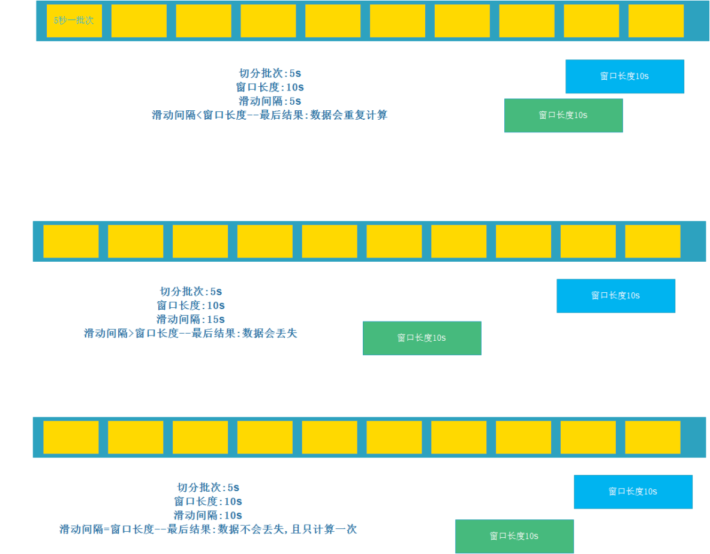


### 11.24、sparkStreaming整合kafka

##### 11.24.1、Receiver接收方式（不常用）

* KafkaUtils.createDstream(开发中不用，了解即可，但是面试可能会问)
* Receiver作为常驻的Task运行在Executor等待数据，但是一个Receiver效率低，需要开启多个，再手动合并数据(union)，再进行处理，很麻烦
* Receiver那台机器挂了，可能会丢失数据，所以需要开启WAL(预写日志)保证数据安全，那么效率又会降低!
* Receiver方式是通过zookeeper来连接kafka队列，调用Kafka高阶API，offset存储在zookeeper，由Receiver维护，
* spark在消费的时候为了保证数据不丢也会在Checkpoint中存一份offset，可能会出现数据不一致
* 所以不管从何种角度来说，Receiver模式都不适合在开发中使用了,已经淘汰了

~~~scala
package cn.itcast.streaming

import org.apache.spark.streaming.dstream.{DStream, ReceiverInputDStream}
import org.apache.spark.streaming.kafka.KafkaUtils
import org.apache.spark.streaming.{Seconds, StreamingContext}
import org.apache.spark.{SparkConf, SparkContext}

import scala.collection.immutable

object SparkKafka {
  def main(args: Array[String]): Unit = {
    //1.创建StreamingContext
    val config: SparkConf = 
new SparkConf().setAppName("SparkStream").setMaster("local[*]")
      .set("spark.streaming.receiver.writeAheadLog.enable", "true")
//开启WAL预写日志，保证数据源端可靠性
    val sc = new SparkContext(config)
    sc.setLogLevel("WARN")
    val ssc = new StreamingContext(sc,Seconds(5))
    ssc.checkpoint("./kafka")
//==============================================
    //2.准备配置参数
    val zkQuorum = "node01:2181,node02:2181,node03:2181"
    val groupId = "spark"
    val topics = Map("spark_kafka" -> 2)//2表示每一个topic对应分区都采用2个线程去消费,
//ssc的rdd分区和kafka的topic分区不一样，增加消费线程数，并不增加spark的并行处理数据数量
    //3.通过receiver接收器获取kafka中topic数据，可以并行运行更多的接收器读取kafak topic中的数据，这里为3个
    val receiverDStream: immutable.IndexedSeq[ReceiverInputDStream[(String, String)]] = (1 to 3).map(x => {
      val stream: ReceiverInputDStream[(String, String)] = KafkaUtils.createStream(ssc, zkQuorum, groupId, topics)
      stream
    })
    //4.使用union方法，将所有receiver接受器产生的Dstream进行合并
    val allDStream: DStream[(String, String)] = ssc.union(receiverDStream)
    //5.获取topic的数据(String, String) 第1个String表示topic的名称，第2个String表示topic的数据
    val data: DStream[String] = allDStream.map(_._2)
//==============================================
    //6.WordCount
    val words: DStream[String] = data.flatMap(_.split(" "))
    val wordAndOne: DStream[(String, Int)] = words.map((_, 1))
    val result: DStream[(String, Int)] = wordAndOne.reduceByKey(_ + _)
    result.print()
    ssc.start()
    ssc.awaitTermination()
  }
}
~~~


##### 11.24.2、Direct直连方式（常用）

* KafkaUtils.createDirectStream(开发中使用，要求掌握)
* Direct方式是直接连接kafka分区来获取数据，从每个分区直接读取数据大大提高了并行能力
  * Direct方式调用Kafka低阶API(底层API)，offset自己存储和维护，默认由Spark维护在checkpoint中，消除了与zk不一致的情况
* 当然也可以自己手动维护，把offset存在mysql、redis中
* 所以基于Direct模式可以在开发中使用，且借助Direct模式的特点+手动操作可以保证数据的Exactly once 精准一次

~~~scala
package cn.itcast.streaming

import kafka.serializer.StringDecoder
import org.apache.spark.streaming.dstream.{DStream, InputDStream}
import org.apache.spark.streaming.kafka.KafkaUtils
import org.apache.spark.streaming.{Seconds, StreamingContext}
import org.apache.spark.{SparkConf, SparkContext}


object SparkKafka2 {
  def main(args: Array[String]): Unit = {
    //1.创建StreamingContext
    val config: SparkConf = 
new SparkConf().setAppName("SparkStream").setMaster("local[*]")
    val sc = new SparkContext(config)
    sc.setLogLevel("WARN")
    val ssc = new StreamingContext(sc,Seconds(5))
    ssc.checkpoint("./kafka")
    //==============================================
    //2.准备配置参数
    val kafkaParams = Map("metadata.broker.list" -> "node01:9092,node02:9092,node03:9092", "group.id" -> "spark")
    val topics = Set("spark_kafka")
    val allDStream: InputDStream[(String, String)] = KafkaUtils.createDirectStream[String, String, StringDecoder, StringDecoder](ssc, kafkaParams, topics)
    //3.获取topic的数据
    val data: DStream[String] = allDStream.map(_._2)
    //==============================================
    //WordCount
    val words: DStream[String] = data.flatMap(_.split(" "))
    val wordAndOne: DStream[(String, Int)] = words.map((_, 1))
    val result: DStream[(String, Int)] = wordAndOne.reduceByKey(_ + _)
    result.print()
    ssc.start()
    ssc.awaitTermination()
  }
}
~~~


### 11.25、shuffle

#### spark shuffle 演进的历史

- Spark 0.8及以前 Hash Based Shuffle
- Spark 0.8.1 为Hash Based Shuffle引入File Consolidation机制
- Spark 0.9 引入ExternalAppendOnlyMap
- Spark 1.1 引入Sort Based Shuffle，但默认仍为Hash Based Shuffle
- Spark 1.2 默认的Shuffle方式改为Sort Based Shuffle
- Spark 1.4 引入Tungsten-Sort Based Shuffle
- Spark 1.6 Tungsten-sort并入Sort Based Shuffle
- Spark 2.0 Hash Based Shuffle退出历史舞台


#### 1、未经优化的HashShuffleManager

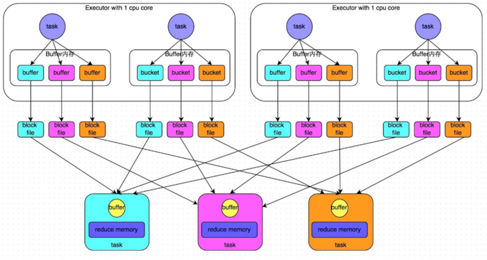


#### 2、优化后的HashShuffleManager

​	开启consolidate机制之后，在shuffle write过程中，task就不是为下游stage的每个task创建一个磁盘文件了，此时会出现**shuffleFileGroup**的概念，每个shuffleFileGroup会对应一批磁盘文件，磁盘文件的数量与下游stage的task数量是相同的。

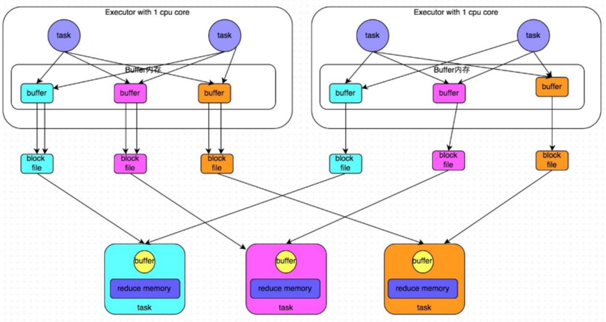


#### 3、SortShuffle

​	后面就引入了  Sort Based Shuffle， map端的任务会按照Partition id以及key对记录进行排序。同时将全部结果写到一个数据文件中，同时生成一个索引文件。

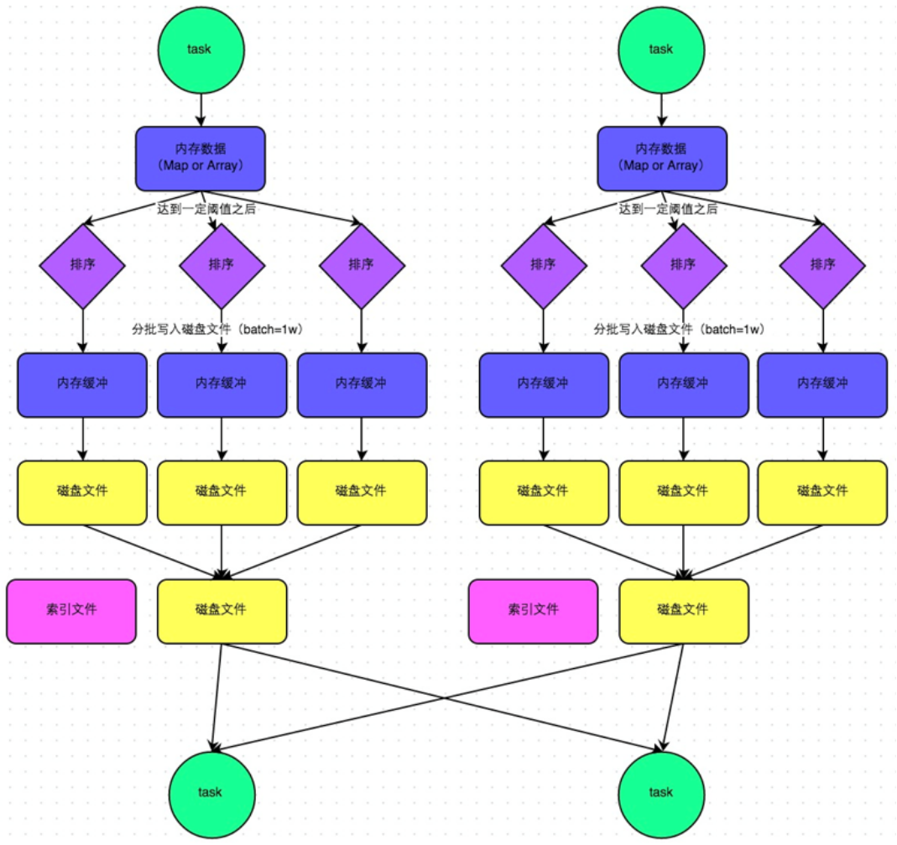


#### 4、sortshuffle的bypass运行机制

bypass运行机制的触发条件如下：

* shuffle map task数量小于spark.shuffle.sort.bypassMergeThreshold=200参数的值。

* 不是聚合类的shuffle算子。

  ​	每个task会为每个下游task都创建一个临时磁盘文件，并将数据按key进行hash然后根据key的hash值，将key写入对应的磁盘文件之中。当然，写入磁盘文件时也是先写入内存缓冲，缓冲写满之后再溢写到磁盘文件的。最后，同样会将所有临时磁盘文件都合并成一个磁盘文件，并创建一个单独的索引文件。

  ​	该过程的磁盘写机制其实跟未经优化的HashShuffleManager是一模一样的，因为都要创建数量惊人的磁盘文件，只是在最后会做一个磁盘文件的合并而已。因此少量的最终磁盘文件，也让该机制相对未经优化的HashShuffleManager来说，shuffle read的性能会更好

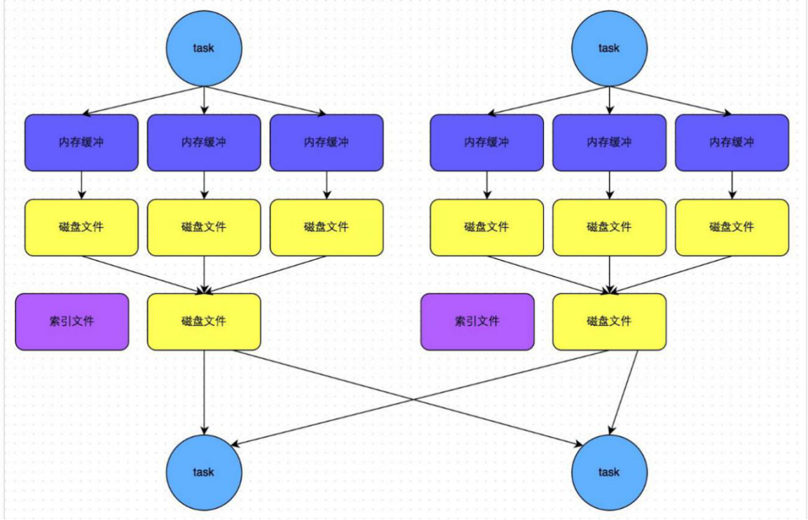


#### 5、Tungsten-Sort Based Shuffle

​	后面就引入了 Tungsten-Sort Based Shuffle， 这个是直接使用堆外内存和新的内存管理模型，节省了内存空间和大量的gc， 是为了提升性能。


### 11.26、spark性能调优

#### 1、基础调优

##### 1.1、资源参数设置

​	Spark性能调优的第一步，就是为任务分配更多的资源，在一定范围内，增加资源的分配与性能的提升是成正比的，实现了最优的资源配置后，在此基础上再考虑进行后面论述的性能调优策略。

```shell
/opt/soft/spark/bin/spark-submit \
--class com.bigdata.spark.Analysis \
--num-executors 80 \ 
--driver-memory 6g \
--executor-memory 6g \
--executor-cores 3 \
/opt/soft/spark/jar/spark.jar \
```

| **名称**                | **说明**                         |
| --------------------- | ------------------------------ |
| **--num-executors**   | 配置Executor的数量默认Executor 数为2    |
| **--driver-memory**   | 配置Driver内存（影响不大）默认1G           |
| **--executor-memory** | 配置每个Executor的内存大小默认1G          |
| **--executor-cores**  | 配置每个Executor的CPU core数量默认是1 个核 |

**调节原则：尽量将任务分配的资源调节到可以使用的资源的最大限度。**

| **名称**                      | **解析**                                   |
| --------------------------- | ---------------------------------------- |
| **增加Executor·个数**           | 在资源允许的情况下，增加Executor的个数可以提高执行task的并行度。比如有4个Executor，每个Executor有2个CPU core，那么可以并行执行8个task，如果将Executor的个数增加到8个（资源允许的情况下），那么可以并行执行16个task，此时的并行能力提升了一倍。 |
| **增加每个Executor的CPU core个数** | 在资源允许的情况下，增加每个Executor的Cpu core个数，可以提高执行task的并行度。比如有4个Executor，每个Executor有2个CPU core，那么可以并行执行8个task，如果将每个Executor的CPU core个数增加到4个（资源允许的情况下），那么可以并行执行16个task，此时的并行能力提升了一倍。 |
| **增加每个Executor的内存量**        | 在资源允许的情况下，增加每个Executor的内存量以后，对性能的提升有三点：1. 可以缓存更多的数据（即对RDD进行cache），写入磁盘的数据相应减少，甚至可以不写入磁盘，减少了可能的磁盘IO；2. 可以为shuffle操作提供更多内存，即有更多空间来存放reduce端拉取的数据，写入磁盘的数据相应减少，甚至可以不写入磁盘，减少了可能的磁盘IO；3. 可以为task的执行提供更多内存，在task的执行过程中可能创建很多对象，内存较小时会引发频繁的GC，增加内存后，可以避免频繁的GC，提升整体性能。 |


##### 1.2、并行度设置

​	Spark作业中的并行度指各个stage的task的数量。

​	如果并行度设置不合理而导致并行度过低，会导致资源的极大浪费。

​	例如，20个Executor，每个Executor分配3个CPU core，而Spark作业有40个task，这样每个Executor分配到的task个数是2个，这就使得每个Executor有一个CPU core空闲，导致资源的浪费。

​	Spark官方推荐，task数量应该设置为Spark作业总CPU core数量的2~3倍。之所以没有推荐task数量与CPU core总数相等，是因为task的执行时间不同，有的task执行速度快而有的task执行速度慢，如果task数量与CPU core总数相等，那么执行快的task执行完成后，会出现CPU core空闲的情况。如果task数量设置为CPU core总数的2~3倍，那么一个task执行完毕后，CPU core会立刻执行下一个task，降低了资源的浪费，同时提升了Spark作业运行的效率。

~~~properties
val conf = new SparkConf().set("spark.default.parallelism", "500")
~~~


##### 3、使用缓存和checkpoint

​	Spark持久化在大部分情况下是没有问题的，但是有时数据可能会丢失，如果数据一旦丢失，就需要对丢失的数据重新进行计算，计算完后再缓存和使用，为了避免数据的丢失，可以选择对这个RDD进行checkpoint，也就是将数据持久化一份到容错的文件系统上（比如HDFS）。

一个RDD缓存并checkpoint后，如果一旦发现缓存丢失，就会优先查看checkpoint数据存不存在，如果有，就会使用checkpoint数据，而不用重新计算。也即是说，checkpoint可以视为cache的保障机制，如果cache失败，就使用checkpoint的数据。

​	使用checkpoint的优点在于提高了Spark作业的可靠性，一旦缓存出现问题，不需要重新计算数据，缺点在于，checkpoint时需要将数据写入HDFS等文件系统，对性能的消耗较大。

~~~scala
sc.setCheckpointDir(‘HDFS’)
rdd.cache/persist(memory_and_disk)
rdd.checkpoint
~~~


##### 4、使用广播变量

​	假设当前任务配置了20个Executor，指定500个task，有一个20M的变量被所有task共用，此时会在500个task中产生500个副本，耗费集群10G的内存，如果使用了广播变量， 那么每个Executor保存一个副本，一共消耗400M内存，内存消耗减少了5倍。}

~~~scala
val 广播变量名= sc.broadcast(会被各个Task用到的变量,即需要广播的变量)
广播变量名.value//获取广播变量
~~~


##### 5、使用kryo序列化

​	默认情况下，Spark使用**Java的序列化机制**。Spark官方宣称Kryo序列化机制比Java序列化机制性能提高10倍左右，Spark之所以没有默认使用Kryo作为序列化类库，是因为它不支持所有对象的序列化，同时Kryo需要用户在使用前注册需要序列化的类型，不够方便，但从Spark 2.0.0版本开始，简单类型、简单类型数组、字符串类型的Shuffling RDDs 已经默认使用Kryo序列化方式了。

~~~scala
//创建SparkConf对象
val conf = new SparkConf().setMaster(…).setAppName(…)
//使用Kryo序列化库
conf.set("spark.serializer", "org.apache.spark.serializer.KryoSerializer");  
//在Kryo序列化库中注册自定义的类集合
conf.set("spark.kryo.registrator", "bigdata.com.MyKryoRegistrator"); 
~~~


##### 6、本地化等待时长设置

| **名称**            | **解析**                                   |
| ----------------- | ---------------------------------------- |
| **PROCESS_LOCAL** | 进程本地化，task和数据在同一个Executor中，性能最好。         |
| **NODE_LOCAL**    | 节点本地化，task和数据在同一个节点中，但是task和数据不在同一个Executor中，数据需要在进程间进行传输。 |
| **RACK_LOCAL**    | 机架本地化，task和数据在同一个机架的两个节点上，数据需要通过网络在节点之间进行传输。 |
| **NO_PREF**       | 对于task来说，从哪里获取都一样，没有好坏之分。                |
| **ANY**           | task和数据可以在集群的任何地方，而且不在一个机架中，性能最差。        |

​	在Spark项目开发阶段，可以使用client模式对程序进行测试，此时，可以在本地看到比较全的日志信息，日志信息中有明确的task数据本地化的级别，如果大部分都是PROCESS_LOCAL，那么就无需进行调节，但是如果发现很多的级别都是NODE_LOCAL、ANY，那么需要对本地化的等待时长进行调节，通过延长本地化等待时长，看看task的本地化级别有没有提升，并观察Spark作业的运行时间有没有缩短。

注意，过犹不及，不要将本地化等待时长延长地过长，导致因为大量的等待时长，使得Spark作业的运行时间反而增加了。

~~~scala
val conf = new SparkConf().set("spark.locality.wait", "6")
~~~


#### 2、算子调优

##### 2.1、rdd的复用

在对RDD进行算子时，要避免相同的算子和计算逻辑之下对RDD进行重复的计算，如图2-1所示：

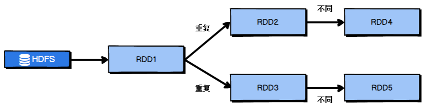

对图2-1中的RDD计算架构进行修改，得到如图2-2所示的优化结果：

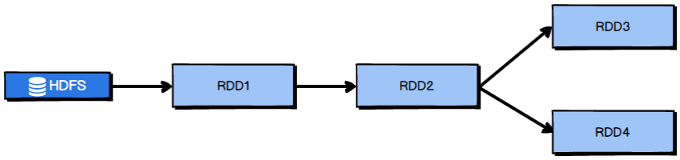


##### 2.2、尽早的filter

​	获取到初始RDD后，应该考虑尽早地过滤掉不需要的数据，进而减少对内存的占用，从而提升Spark作业的运行效率。


##### 2.3、foreachpartition

rrd.foreache(_....)//_表示每一个元素

rrd.forPartitions(_....)//_表示每个分区的数据组成的迭代器

foreachPartition是将RDD的每个分区作为遍历对象，一次处理一个分区的数据，也就是说，如果涉及数据库的相关操作，一个分区的数据只需要创建一次数据库连接。


##### 2.4、filter+coalesce减少分区

​	在Spark任务中我们经常会使用filter算子完成RDD中数据的过滤，在任务初始阶段，从各个分区中加载到的数据量是相近的，但是一旦进过filter过滤后，每个分区的数据量有可能会存在较大差异，如图2-6所示：

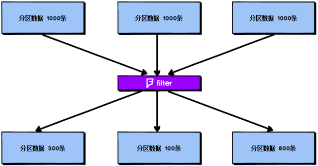

根据图2-6我们可以发现两个问题：

1. 每个partition的数据量变小了，如果还按照之前与partition相等的task个数去处理当前数据，有点浪费task的计算资源；


2. 每个partition的数据量不一样，会导致后面的每个task处理每个partition数据的时候，每个task要处理的数据量不同，这很有可能导致数据倾斜问题。


针对上述的两个问题，我们分别进行分析：

1. 针对第一个问题，既然分区的数据量变小了，我们希望可以对分区数据进行重新分配，比如将原来4个分区的数据转化到2个分区中，这样只需要用后面的两个task进行处理即可，避免了资源的浪费。
2. 针对第二个问题，解决方法和第一个问题的解决方法非常相似，对分区数据重新分配，让每个partition中的数据量差不多，这就避免了数据倾斜问题。


##### 2.5、reducebykey本地预聚合

​	reduceByKey相较于普通的shuffle操作一个显著的特点就是会进行map端的本地聚合，map端会先对本地的数据进行combine操作，然后将数据写入给下个stage的每个task创建的文件中。

​	基于reduceByKey的本地聚合特征，我们应该考虑使用reduceByKey代替其他的shuffle算子，例如groupByKey。reduceByKey与groupByKey的运行原理如图2-9和图2-10所示：

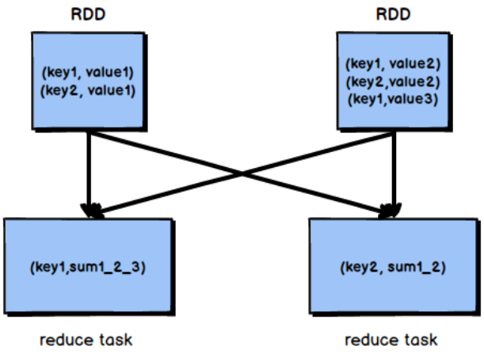

​							图2-9 groupByKey原理


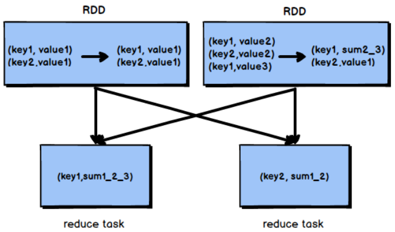

​						图2-10 reduceByKey原理

​	根据上图可知，groupByKey不会进行map端的聚合，而是将所有map端的数据shuffle到reduce端，然后在reduce端进行数据的聚合操作。由于reduceByKey有map端聚合的特性，使得网络传输的数据量减小，因此效率要明显高于groupByKey。


#### 3、shuffle调优

​	在划分stage时，最后一个stage称为finalStage，它本质上是一个ResultStage对象，前面的所有stage被称为ShuffleMapStage。ShuffleMapStage的结束伴随着shuffle文件的写磁盘。

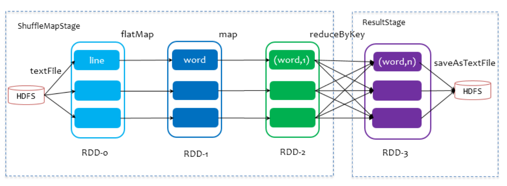


##### 1、map和reduce端缓冲区大小

###### map端

​	在Spark任务运行过程中，如果shuffle的map端处理的数据量比较大，但是map端缓冲的大小是固定的，可能会出现map端缓冲数据频繁spill溢写到磁盘文件中的情况，使得性能非常低下，通过调节map端缓冲的大小，可以避免频繁的磁盘IO操作，进而提升Spark任务的整体性能。

​	map端缓冲的默认配置是32KB，如果每个task处理640KB的数据，那么会发生640/32 = 20次溢写，如果每个task处理64000KB的数据，机会发生64000/32=2000此溢写，这对于性能的影响是非常严重的。

map端缓冲的配置方法如代码清单2-7所示：

~~~scala
val conf = new SparkConf()
  .set("spark.shuffle.file.buffer", "64")
~~~


###### reduce端

​	Spark Shuffle过程中，shuffle reduce task的buffer缓冲区大小决定了reduce task每次能够缓冲的数据量，也就是每次能够拉取的数据量，如果内存资源较为充足，适当增加拉取数据缓冲区的大小，可以减少拉取数据的次数，也就可以减少网络传输的次数，进而提升性能。

​	reduce端数据拉取缓冲区的大小可以通过spark.reducer.maxSizeInFlight参数进行设置，默认为48MB，该参数的设置方法如代码清单2-8所示：

~~~scala
val conf = new SparkConf()
  .set("spark.reducer.maxSizeInFlight", "96")
~~~


##### 2、reduce端重试次数和等待时间间隔

###### 重试次数

​	Spark Shuffle过程中，reduce task拉取属于自己的数据时，如果因为网络异常等原因导致失败会自动进行重试。对于那些包含了特别耗时的shuffle操作的作业，建议增加重试最大次数（默认3次），以避免由于JVM的full gc或者网络不稳定等因素导致的数据拉取失败。在实践中发现，对于针对超大数据量（数十亿~上百亿）的shuffle过程，调节该参数可以大幅度提升稳定性。

~~~scala
//reduce端拉取数据重试次数配置
val conf = new SparkConf()
  .set("spark.shuffle.io.maxRetries", "6")
~~~

###### 等待时间间隔

Spark Shuffle过程中，reduce task拉取属于自己的数据时，如果因为网络异常等原因导致失败会自动进行重试，在一次失败后，会等待一定的时间间隔再进行重试，可以通过加大间隔时长（默认5s），以增加shuffle操作的稳定性。

~~~scala
val conf = new SparkConf()
  .set("spark.shuffle.io.retryWait", "60s")
~~~


##### 3、bypass机制开启阈值

​	当你使用SortShuffleManager时，如果的确不需要排序操作，那么建议将这个参数调大一些，大于shuffle read task的数量，那么此时map-side就不会进行排序了，减少了排序的性能开销。

~~~scala
val conf = new SparkConf()
  .set("spark.shuffle.sort.bypassMergeThreshold", "400")
~~~


#### 4、数据倾斜

##### 4.1、预处理导致倾斜的key

●1.过滤

如果在Spark作业中允许丢弃某些数据，那么可以考虑将可能导致数据倾斜的key进行过滤，滤除可能导致数据倾斜的key对应的数据，这样，在Spark作业中就不会发生数据倾斜了。

 

●2.使用随机key

当使用了类似于groupByKey、reduceByKey这样的算子时，可以考虑使用随机key实现双重聚合，如图3-1所示：

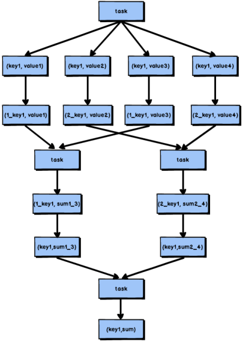

##### 4.2、提高reduce并行度

​	reduce端并行度的提高就增加了reduce端task的数量，那么每个task分配到的数据量就会相应减少，由此缓解数据倾斜问题。

​	1. reduce端并行度的设置

​	在大部分的shuffle算子中，都可以传入一个并行度的设置参数，比如reduceByKey(500)，这个参数会决定shuffle过程中reduce端的并行度，在进行shuffle操作的时候，就会对应着创建指定数量的reduce task。对于Spark SQL中的shuffle类语句，比如group by、join等，需要设置一个参数，即spark.sql.shuffle.partitions，该参数代表了shuffle read task的并行度，该值默认是200，对于很多场景来说都有点过小。

**使用场景有限制**：

​	该方案通常无法彻底解决数据倾斜，因为如果出现一些极端情况，比如某个key对应的数据量有100万，那么无论你的task数量增加到多少，这个对应着100万数据的key肯定还是会分配到一个task中去处理，因此注定还是会发生数据倾斜的。


##### 4.3、使用mapjoin

​	普通的join是会走shuffle过程的，而一旦shuffle，就相当于会将相同key的数据拉取到一个shuffle read task中再进行join，此时就是reduce join。但是如果一个RDD是比较小的，则可以采用广播小RDD全量数据+map算子来实现与join同样的效果，也就是map join，此时就不会发生shuffle操作，也就不会发生数据倾斜。

**核心思路**

​	不使用join算子进行连接操作，而使用Broadcast变量与map类算子实现join操作，进而完全规避掉shuffle类的操作，彻底避免数据倾斜的发生和出现。将较小RDD中的数据直接通过collect算子拉取到Driver端的内存中来，然后对其创建一个Broadcast变量；接着对另外一个RDD执行map类算子，在算子函数内，从Broadcast变量中获取较小RDD的全量数据，与当前RDD的每一条数据按照连接key进行比对，如果连接key相同的话，那么就将两个RDD的数据用你需要的方式连接起来。

根据上述思路，根本不会发生shuffle操作，从根本上杜绝了join操作可能导致的数据倾斜问题。

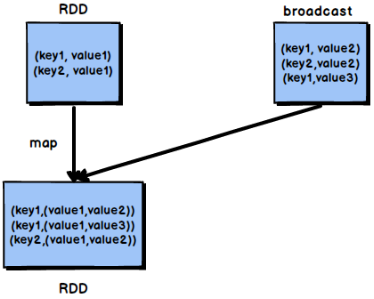


### 11.27、spark开发常见问题

#### 1、内存溢出

​	**spark常见的问题不外乎oom**
​	我们首先看一下Spark 的内存模型：
 	SparkExecutor中内存分三块，一块是execution内存，其他是storage内存和other内存。

* **execution内存**是执行内存，文档中说join，aggregate都在这部分内存中执行，shuffle的数据也会先缓存在这个内存中，满了再写入磁盘，能够减少IO。其实map过程也是在这个内存中执行的。

* **storage内存**是存储broadcast，cache，persist数据的地方。

* **other内存**是程序执行时预留给自己的内存。

  OOM的问题通常出现在execution这块内存中，因为storage这块内存在存放数据满了之后，会直接丢弃内存中旧的数据，对性能有影响但是不会有OOM的问题。

**Spark中的OOM问题不外乎以下三种情况**

* map执行中内存溢出
* shuffle后内存溢出
* driver内存溢出


##### 1、Driver heap OOM

###### 场景一：用户在Driver端口生成大对象, 比如创建了一个大的集合数据结构

**解决思路**：

1.1. 考虑将该大对象转化成Executor端加载. 例如调用sc.textFile/sc.hadoopFile等
1.2. 如若无法避免, 自我评估该大对象占用的内存, 相应增加driver-memory的值


###### 场景二：.从Executor端收集数据回Driver端

**解决思路**:
2.1. 本身不建议将大的数据从Executor端, collect回来. 建议将Driver端对collect回来的数据所做的操作, 转化成Executor端RDD操作.
2.2. 如若无法避免, 自我评collect需要的内存, 相应增加driver-memory的值


###### 场景三：Spark本身框架的数据消耗

* 现在在Spark1.6版本之后主要由Spark UI数据消耗, 取决于作业的累计Task个数.

**解决思路**:
3.1. partition个数, 例如从HDFS load的partitions一般自动计算, 但是后续用户的操作中做了过滤等操作已经大大减少数据量, 此时可以缩小Parititions。
3.2. 通过参数spark.ui.retainedStages(默认1000)/spark.ui.retainedJobs(默认1000)控制.
3.3. 实在没法避免, 相应增加内存.


##### 2、map task所运行的executor内存溢出

解决方法：
1.增大Executor内存(即堆内内存) ，申请的堆外内存也会随之增加

~~~shell
--executor-memory 5G
~~~


2.增大堆外内存 --conf spark.yarn.executor.memoryoverhead 2048M

~~~shell
--conf spark.executor.memoryoverhead 2048M
~~~

(默认申请的堆外内存是Executor内存的10%，真正处理大数据的时候，这里都会出现问题，导致spark作业反复崩溃，无法运行；此时就会去调节这个参数，到至少1G（1024M），甚至说2G、4G）


##### 3、shuffle（reduce）阶段的内存溢出

* reduce task去map拉数据，reduce 一边拉数据一边聚合 reduce段有一块聚合内存（executor memory * 0.2）

**解决办法**：

1、增加reduce 聚合的内存的比例 设置spark.shuffle.memoryFraction
2、 增加executor memory的大小 --executor-memory 5G
3、减少reduce task每次拉取的数据量 设置spark.reducer.maxSizeInFlight 24m


#### 2、gc导致的shuffle文件拉取失败

​	在Spark作业中，有时会出现shuffle file not found的错误，这是非常常见的一个报错，有时出现这种错误以后，选择重新执行一遍，就不再报出这种错误。

​	出现上述问题可能的原因是Shuffle操作中，后面stage的task想要去上一个stage的task所在的Executor拉取数据，结果对方正在执行GC，执行GC会导致Executor内所有的工作现场全部停止，比如BlockManager、基于netty的网络通信等，这就会导致后面的task拉取数据拉取了半天都没有拉取到，就会报出shuffle file not found的错误，而第二次再次执行就不会再出现这种错误。

​	可以通过调整reduce端拉取数据重试次数和reduce端拉取数据时间间隔这两个参数来对Shuffle性能进行调整，增大参数值，使得reduce端拉取数据的重试次数增加，并且每次失败后等待的时间间隔加长。

~~~scala
val conf = new SparkConf()
  .set("spark.shuffle.io.maxRetries", "6")
  .set("spark.shuffle.io.retryWait", "60s")
~~~


#### 3、yarn_cluster模式JVM栈内存溢出

​	YARN-client模式下，Driver是运行在本地机器上的，Spark使用的JVM的PermGen的配置，是本地机器上的spark-class文件，JVM永久代的大小是128MB，运行在client上进行测试时候是没有问题的。

​	在cluster模式下，Driver运行在YARN集群的某个节点上，使用的是没有经过配置的默认设置，PermGen永久代大小为82MB。运行报出OOM错误。

​	解决上述问题的方法时增加PermGen的容量，需要在spark-submit脚本中对相关参数进行设置。

~~~shell
--conf spark.driver.extraJavaOptions="-XX:PermSize=128M -XX:MaxPermSize=256M"
~~~


